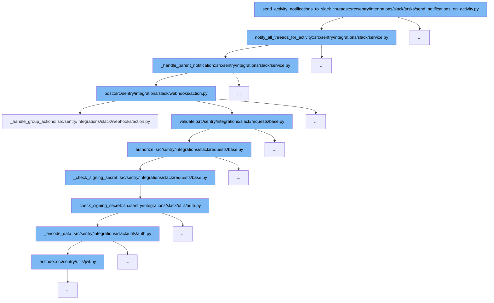

This document will explore the functionality of the `send_activity_notifications_to_slack_threads` function and its related flow within the Sentry codebase. We'll cover:

1. The initiation of the notification process.
2. Notification validation and authorization steps.
3. Final notification dispatch.



<SwmSnippet path="/src/sentry/integrations/slack/tasks/send_notifications_on_activity.py" line="1">

---

# Initiation of Notification Process

The function `send_activity_notifications_to_slack_threads` initiates the process by determining which Slack threads need to be notified based on the activity in Sentry issues.

```python
import logging

from django.db import router, transaction

from sentry import features
from sentry.integrations.slack.service import SlackService
from sentry.models.activity import Activity
from sentry.models.organization import Organization
from sentry.silo.base import SiloMode
from sentry.tasks.base import instrumented_task
```

---

</SwmSnippet>

<SwmSnippet path="/src/sentry/integrations/slack/requests/base.py" line="193">

---

# Notification Validation and Authorization

In the validation step, the `authorize` function checks the Slack request's authenticity using signing secrets or verification tokens, ensuring that the request is coming from a trusted source.

```python
    def authorize(self) -> None:
        # XXX(meredith): Signing secrets are the preferred way
        # but self-hosted could still have an older slack bot
        # app that just has the verification token.
        signing_secret = options.get("slack.signing-secret")
        verification_token = options.get("slack.verification-token")

        if signing_secret:
            if self._check_signing_secret(signing_secret):
                return
        elif verification_token and self._check_verification_token(verification_token):
            return

        # unfortunately, we can't know which auth was supposed to succeed
        self._error("slack.action.auth")
        raise SlackRequestError(status=status_.HTTP_401_UNAUTHORIZED)
```

---

</SwmSnippet>

<SwmSnippet path="/src/sentry/integrations/slack/webhooks/action.py" line="781">

---

# Final Notification Dispatch

After validation, the `post` function handles the dispatch of the notification to the appropriate Slack channel, completing the notification flow.

```python
    def post(self, request: Request) -> Response:
        try:
            slack_request = self.slack_request_class(request)
            slack_request.validate()
        except SlackRequestError as e:
            logger.info(
                "slack.action.request-error", extra={"error": str(e), "status_code": e.status}
            )
            return self.respond(status=e.status)

        logger.info(
            "slack.action.request",
            extra={
                "trigger_id": slack_request.data.get("trigger_id"),
                "integration_id": slack_request.integration.id,
                "request_data": slack_request.data,
            },
        )

        # Set organization scope

```

---

</SwmSnippet>

&nbsp;

*This is an auto-generated document by Swimm AI 🌊 and has not yet been verified by a human*

<SwmMeta version="3.0.0" repo-id="Z2l0aHViJTNBJTNBc2VudHJ5JTNBJTNBZ2V0c2VudHJ5" repo-name="sentry"><sup>Powered by [Swimm](/)</sup></SwmMeta>
