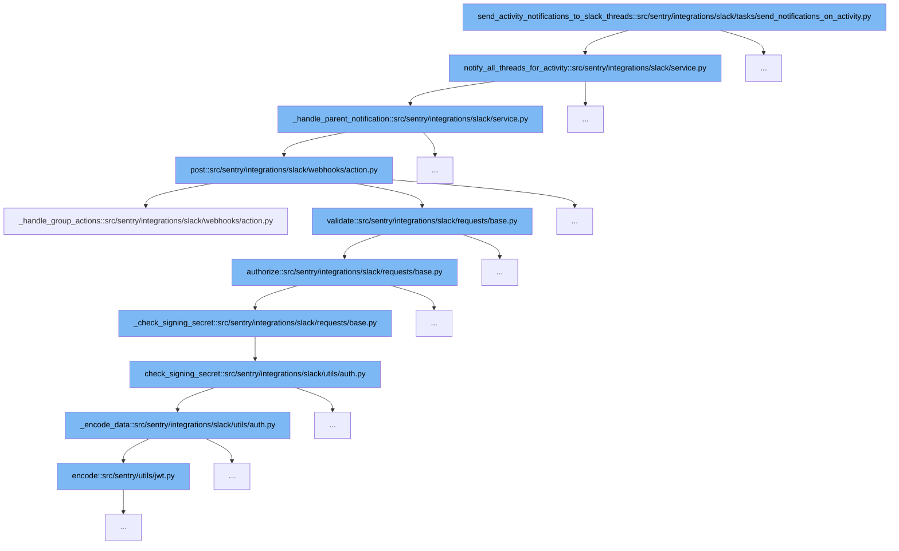

This document outlines the flow of sending activity notifications to Slack threads in Sentry. We'll explore:

1. How the notification process starts with an activity.
2. The steps involved in notifying all threads for a given activity.
3. The validation and authorization process for Slack requests.
4. The final posting of the notification to Slack.



<SwmSnippet path="/src/sentry/integrations/slack/tasks/send_notifications_on_activity.py" line="1">

---

# Starting the Notification Process

The function `send_activity_notifications_to_slack_threads` initiates the process by determining if there are any Slack threads that need to be notified based on the activity in Sentry.

```python
import logging

from django.db import router, transaction

from sentry import features
from sentry.integrations.slack.service import SlackService
from sentry.models.activity import Activity
from sentry.models.organization import Organization
from sentry.silo.base import SiloMode
from sentry.tasks.base import instrumented_task
```

---

</SwmSnippet>

<SwmSnippet path="/src/sentry/integrations/slack/service.py" line="86">

---

# Notifying All Threads for Activity

The function `notify_all_threads_for_activity` is called next. It checks if the activity is associated with a group and a user, and if so, it proceeds to gather all parent notifications for the group to prepare messages for each Slack thread.

```python
    def notify_all_threads_for_activity(self, activity: Activity) -> None:
        """
        For an activity related to an issue group, send notifications in a Slack thread to all parent notifications for
        that specific group and project.

        If the group is not associated with an activity, return early as there's nothing to do.
        If the user is not associated with an activity, return early as we only care about user activities.
        """
        if activity.group is None:
            self._logger.info(
                "no group associated on the activity, nothing to do",
                extra={
                    "activity_id": activity.id,
                },
            )
            return None

        if activity.user_id is None:
            self._logger.info(
                "machine/system updates are ignored at this time, nothing to do",
                extra={
```

---

</SwmSnippet>

<SwmSnippet path="/src/sentry/integrations/slack/requests/base.py" line="193">

---

# Validating and Authorizing Slack Requests

The `authorize` function ensures that the request to send a notification is valid and authorized. This involves checking Slack's signing secrets to confirm the request's authenticity.

```python
    def authorize(self) -> None:
        # XXX(meredith): Signing secrets are the preferred way
        # but self-hosted could still have an older slack bot
        # app that just has the verification token.
        signing_secret = options.get("slack.signing-secret")
        verification_token = options.get("slack.verification-token")

        if signing_secret:
            if self._check_signing_secret(signing_secret):
                return
        elif verification_token and self._check_verification_token(verification_token):
            return

        # unfortunately, we can't know which auth was supposed to succeed
        self._error("slack.action.auth")
        raise SlackRequestError(status=status_.HTTP_401_UNAUTHORIZED)
```

---

</SwmSnippet>

<SwmSnippet path="/src/sentry/integrations/slack/webhooks/action.py" line="781">

---

# Posting Notification to Slack

Finally, the `post` function is used to send the prepared notification message to the appropriate Slack channel and thread. This step completes the notification process by interfacing directly with Slack's API.

```python
    def post(self, request: Request) -> Response:
        try:
            slack_request = self.slack_request_class(request)
            slack_request.validate()
        except SlackRequestError as e:
            logger.info(
                "slack.action.request-error", extra={"error": str(e), "status_code": e.status}
            )
            return self.respond(status=e.status)

        logger.info(
            "slack.action.request",
            extra={
                "trigger_id": slack_request.data.get("trigger_id"),
                "integration_id": slack_request.integration.id,
                "request_data": slack_request.data,
            },
        )

        # Set organization scope

```

---

</SwmSnippet>

&nbsp;

*This is an auto-generated document by Swimm AI 🌊 and has not yet been verified by a human*

<SwmMeta version="3.0.0" repo-id="Z2l0aHViJTNBJTNBc2VudHJ5JTNBJTNBZ2V0c2VudHJ5" repo-name="sentry"><sup>Powered by [Swimm](/)</sup></SwmMeta>
