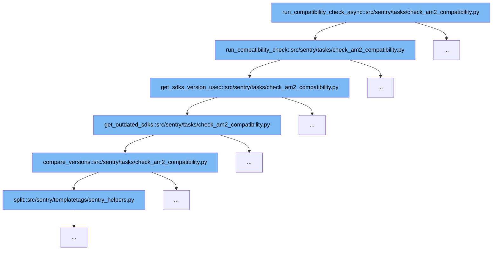

This document will explore the flow of the `run_compatibility_check_async` function in the Sentry codebase, specifically focusing on how it checks for AM2 compatibility across various SDKs and projects. We'll cover:

1. The initiation of the compatibility check.
2. Retrieval and analysis of SDK versions used in projects.
3. Identification of outdated SDKs.
4. Comparison of SDK versions.



<SwmSnippet path="/src/sentry/tasks/check_am2_compatibility.py" line="579">

---

# Initiation of the Compatibility Check

The `run_compatibility_check` function initiates the compatibility check process by first gathering all projects within an organization and then checking each widget and alert for compatibility based on metrics and on-demand data. This is the starting point for determining AM2 compatibility across the organization's projects.

```python
    def run_compatibility_check(cls, org_id):
        organization = Organization.objects.get(id=org_id)

        all_projects = list(Project.objects.using_replica().filter(organization=organization))

        unsupported_widgets = defaultdict(list)
        ondemand_supported_widgets = defaultdict(list)
        ondemand_widget_ids = cls.get_ondemand_widget_ids(org_id)

        for (
            widget_id,
            dashboard_id,
            dashboard_title,
            fields,
            conditions,
        ) in cls.get_all_widgets_of_organization(organization.id):
            # We run this query by selecting all projects, so that the widget query should never fail in case the
            # `query` contains "project:something".
            supports_metrics = cls.is_metrics_data(organization.id, all_projects, conditions)

            supports_ondemand = widget_id in ondemand_widget_ids
```

---

</SwmSnippet>

<SwmSnippet path="/src/sentry/tasks/check_am2_compatibility.py" line="471">

---

# Retrieval and Analysis of SDK Versions

The `get_sdks_version_used` function retrieves SDK versions used across projects by executing a discovery query. This step is crucial for identifying the specific SDKs in use and preparing the data for further compatibility checks.

```python
    def get_sdks_version_used(cls, organization_id, project_objects):
        # We use the count() operation in order to group by project, sdk.name and sdk.version.
        selected_columns = ["count()", "project", "sdk.name", "sdk.version"]
        params = {
            "organization_id": organization_id,
            "project_objects": project_objects,
            "start": datetime.now(tz=timezone.utc) - timedelta(days=QUERY_TIME_RANGE_IN_DAYS),
            "end": datetime.now(tz=timezone.utc),
        }

        try:
            results = discover_query(
                selected_columns=selected_columns,
                query="event.type:transaction",
                params=params,
                referrer="api.organization-events",
            )

            found_sdks_per_project = cls.extract_sdks_from_data(results.get("data"))
            outdated_sdks_per_project = cls.get_outdated_sdks(found_sdks_per_project)
            return outdated_sdks_per_project
```

---

</SwmSnippet>

<SwmSnippet path="/src/sentry/tasks/check_am2_compatibility.py" line="430">

---

# Identification of Outdated SDKs

In the `get_outdated_sdks` function, SDK versions retrieved from the previous step are compared against a list of supported SDK versions to identify any outdated ones. This step filters out SDKs that do not support the required performance features.

```python
    def get_outdated_sdks(cls, found_sdks_per_project):
        outdated_sdks_per_project: Mapping[
            str, Mapping[str, set[tuple[str, str | None]]]
        ] = defaultdict(lambda: defaultdict(set))

        for project, found_sdks in found_sdks_per_project.items():
            for sdk_name, sdk_versions in found_sdks.items():
                # If the SDK is not supporting performance, we don't want to try and check dynamic sampling
                # compatibility, and we also don't return it as unsupported since it will create noise.
                if sdk_name not in SDKS_SUPPORTING_PERFORMANCE:
                    continue

                sdk_versions_set: set[tuple[str, str | None]] = set()
                found_supported_version = False
                min_sdk_version = SUPPORTED_SDK_VERSIONS.get(sdk_name)

                for sdk_version in sdk_versions:
                    if min_sdk_version is None:
                        # If we didn't find the SDK, we suppose it doesn't support dynamic sampling.
                        sdk_versions_set.add((sdk_version, None))
                    else:
```

---

</SwmSnippet>

<SwmSnippet path="/src/sentry/tasks/check_am2_compatibility.py" line="312">

---

# Comparison of SDK Versions

The `compare_versions` function is used to compare two SDK versions. It splits the version strings and compares them numerically to determine if one is greater than, less than, or equal to the other. This function is essential for determining the compatibility of SDK versions.

```python
    def compare_versions(cls, version1, version2):
        # Split the version strings into individual numbers
        nums1 = version1.split(".")
        nums2 = version2.split(".")

        # Pad the shorter version with zeros to ensure equal length
        length = max(len(nums1), len(nums2))
        nums1 = (["0"] * (length - len(nums1))) + nums1
        nums2 = (["0"] * (length - len(nums2))) + nums2

        # Compare the numbers from left to right
        for num1, num2 in zip(nums1, nums2):
            if int(num1) > int(num2):
                return 1
            elif int(num1) < int(num2):
                return -1

        # All numbers are equal
        return 0
```

---

</SwmSnippet>

&nbsp;

*This is an auto-generated document by Swimm AI 🌊 and has not yet been verified by a human*

<SwmMeta version="3.0.0" repo-id="Z2l0aHViJTNBJTNBc2VudHJ5JTNBJTNBZ2V0c2VudHJ5" repo-name="sentry"><sup>Powered by [Swimm](/)</sup></SwmMeta>
