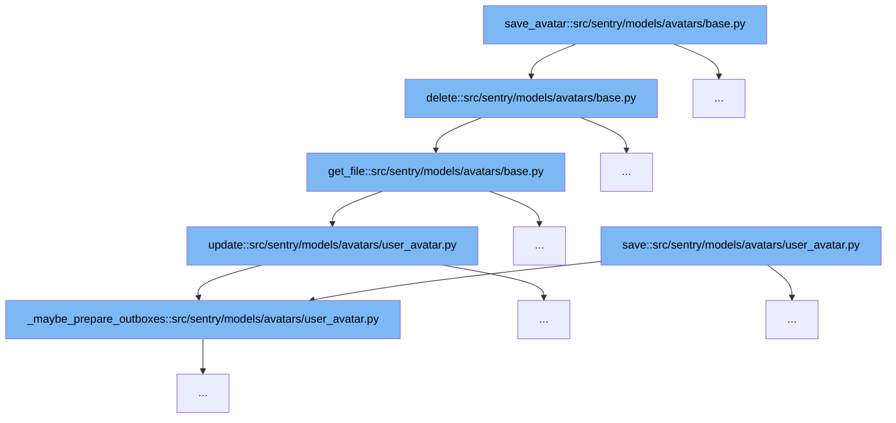

This document outlines the flow of avatar management in the Sentry codebase, specifically focusing on the `save_avatar` function and its interactions. The flow involves several key operations:



<SwmSnippet path="/src/sentry/models/avatars/base.py" line="62">

---

# Avatar Deletion Process

The `delete` function is responsible for removing an avatar. It retrieves the file associated with the avatar using `get_file`, deletes the file if it exists, and then proceeds with the superclass deletion process. This step is crucial for ensuring that all associated data is cleaned up when an avatar is deleted.

```python
    def delete(self, *args, **kwargs):
        file = self.get_file()
        if file:
            file.delete()
        return super().delete(*args, **kwargs)
```

---

</SwmSnippet>

<SwmSnippet path="/src/sentry/models/avatars/base.py" line="50">

---

# Retrieving Avatar File

The `get_file` function fetches the file associated with an avatar based on the file ID. If the file does not exist, it sets the file foreign key to `None`, mimicking the behavior of a foreign key set with `on_delete=models.SET_NULL`. This function is essential for managing file references in avatar objects.

```python
    def get_file(self):
        file_id = getattr(self, self.file_write_fk(), None)
        file_class = self.file_class()
        try:
            return file_class.objects.get(pk=file_id)
        except ObjectDoesNotExist:
            # Best effort replication of previous behaviour with foreign key
            # which was set with on_delete=models.SET_NULL
            update = {self.file_fk(): None}
            self.update(**update)
            return None
```

---

</SwmSnippet>

<SwmSnippet path="/src/sentry/models/avatars/user_avatar.py" line="81">

---

# Avatar Update Process

The `update` function in `user_avatar.py` is wrapped in a context manager `_maybe_prepare_outboxes` that handles transaction atomicity and outbox preparation. This ensures that any changes to the avatar are properly managed and that related outbox items are updated or saved as needed.

```python
    def update(self, *args: Any, **kwds: Any) -> int:
        with self._maybe_prepare_outboxes(outbox_before_super=False):
            return super().update(*args, **kwds)
```

---

</SwmSnippet>

&nbsp;

*This is an auto-generated document by Swimm AI 🌊 and has not yet been verified by a human*

<SwmMeta version="3.0.0" repo-id="Z2l0aHViJTNBJTNBc2VudHJ5JTNBJTNBZ2V0c2VudHJ5" repo-name="sentry"><sup>Powered by [Swimm](/)</sup></SwmMeta>
