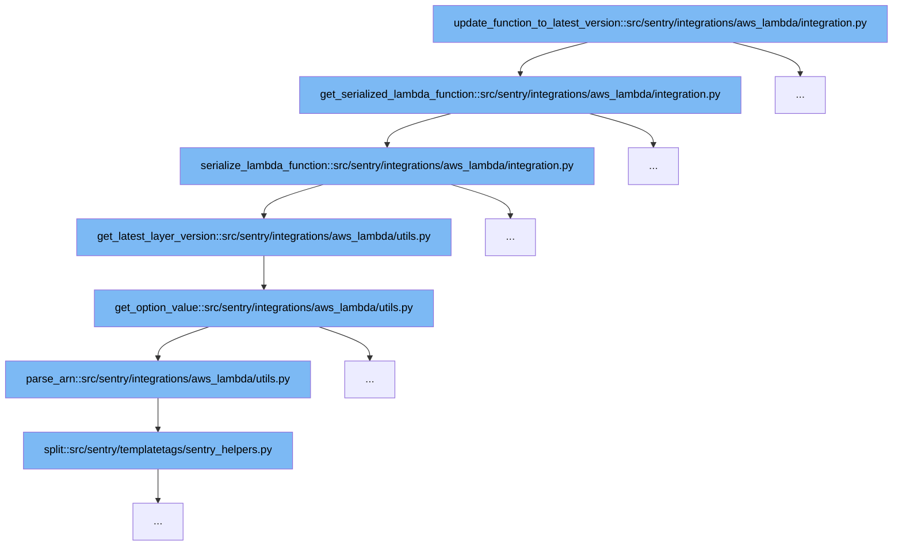

This document will explore the function `update_function_to_latest_version` and its role in updating AWS Lambda functions to the latest version within Sentry's integration. We'll cover:

1. The initial function call and its purpose.
2. The sequence of function calls and their contributions to the update process.



<SwmSnippet path="/src/sentry/integrations/aws_lambda/integration.py" line="105">

---

# Initial Function Call

The function `update_function_to_latest_version` begins by calling `get_serialized_lambda_function`, which fetches and serializes the Lambda function's details. This is the first step in the process of checking and updating the Lambda function to ensure it is using the latest Sentry layer version.

```python
    def get_serialized_lambda_function(self, name):
        function = self.get_one_lambda_function(name)
        return self.serialize_lambda_function(function)
```

---

</SwmSnippet>

<SwmSnippet path="/src/sentry/integrations/aws_lambda/integration.py" line="109">

---

# Serialization and Version Check

Within `serialize_lambda_function`, multiple helper functions like `get_latest_layer_version` and `get_option_value` are called to determine the current and latest available versions of the Sentry layer. This step is crucial for identifying if the Lambda function's Sentry layer is outdated and needs an update.

```python
    def serialize_lambda_function(self, function):
        layers = get_function_layer_arns(function)
        layer_arn = get_latest_layer_for_function(function)
        function_runtime = function["Runtime"]

        # find our sentry layer
        sentry_layer_index = get_index_of_sentry_layer(layers, layer_arn)

        if sentry_layer_index > -1:
            sentry_layer = layers[sentry_layer_index]

            # determine the version and if it's out of date
            latest_version = get_latest_layer_version(function)
            current_version = get_version_of_arn(sentry_layer)
            out_of_date = latest_version > current_version

            if function_runtime.startswith("python"):
                # If env variable "SENTRY_INITIAL_HANDLER" is not present, then
                # it is should be assumed that this function is not enabled!
                env_variables = function.get("Environment", {}).get("Variables", {})
                if "SENTRY_INITIAL_HANDLER" not in env_variables:
```

---

</SwmSnippet>

&nbsp;

*This is an auto-generated document by Swimm AI 🌊 and has not yet been verified by a human*

<SwmMeta version="3.0.0" repo-id="Z2l0aHViJTNBJTNBc2VudHJ5JTNBJTNBZ2V0c2VudHJ5" repo-name="sentry"><sup>Powered by [Swimm](/)</sup></SwmMeta>
