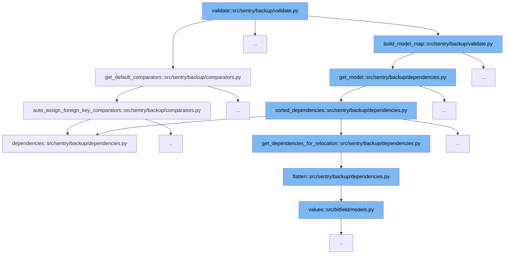

This document will cover the validation process in Sentry's backup system, specifically focusing on the function `validate` in `src/sentry/backup/validate.py`. We'll explore:

1. The initialization of default comparators.
2. Building a model map for validation.



<SwmSnippet path="/src/sentry/backup/comparators.py" line="783">

---

# Initialization of Default Comparators

The function `get_default_comparators` initializes a set of default comparators used in the validation process. These comparators are essential for determining how different data types are compared during the backup validation.

```python
def get_default_comparators() -> dict[str, list[JSONScrubbingComparator]]:
    """Helper function executed at startup time which builds the static default comparators map."""

    from sentry.models.actor import Actor
    from sentry.models.organization import Organization

    # Some comparators (like `DateAddedComparator`) we can automatically assign by inspecting the
    # `Field` type on the Django `Model` definition. Others, like the ones in this map, we must
    # assign manually, since there is no clever way to derive them automatically.
    default_comparators: ComparatorMap = defaultdict(
        list,
        {
            "sentry.apitoken": [
                HashObfuscatingComparator("refresh_token", "token"),
                # TODO: when we get rid of token/refresh_token for their hashed versions, and are
                # sure that none of the originals are left, we can compare these above. Until then,
                # just ignore them.
                IgnoredComparator("hashed_token", "hashed_refresh_token", "token_last_characters"),
                UnorderedListComparator("scope_list"),
            ],
            "sentry.apiapplication": [HashObfuscatingComparator("client_id", "client_secret")],
```

---

</SwmSnippet>

<SwmSnippet path="/src/sentry/backup/validate.py" line="190">

---

# Building a Model Map

The function `build_model_map` leverages the `get_model` function to construct a map of models that are used in the validation process. This map is crucial for ensuring that all necessary models are accounted for and correctly validated.

```python

    # If there are mismatches in the number of or ordering of models, something is seriously wrong,
    # so abort ASAP.
    if not findings.empty():
        return findings

    # As models are compared, we will add their pk mapping to separate `PrimaryKeyMaps`. Then, when
    # a foreign keyed field into the specific model is encountered, we will be able to ensure that
```

---

</SwmSnippet>

&nbsp;

*This is an auto-generated document by Swimm AI 🌊 and has not yet been verified by a human*

<SwmMeta version="3.0.0" repo-id="Z2l0aHViJTNBJTNBc2VudHJ5JTNBJTNBZ2V0c2VudHJ5" repo-name="sentry"><sup>Powered by [Swimm](/)</sup></SwmMeta>
