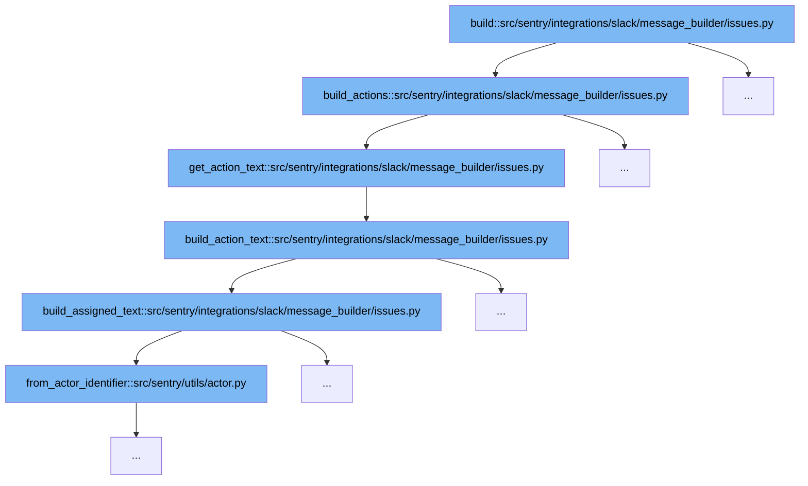

This document outlines the flow of building Slack message actions for issues in Sentry, specifically detailing how actions like assigning and resolving issues are handled within Slack notifications. The steps include:



<SwmSnippet path="/src/sentry/integrations/slack/message_builder/issues.py" line="374">

---

# Initial Message Construction

The `build_actions` function initiates the process by setting up the structure for Slack message actions based on the issue's status and available actions. It prepares the message format and determines which action buttons (ignore, resolve, assign) to display based on the issue's current state and project settings.

```python
def build_actions(
    group: Group,
    project: Project,
    text: str,
    color: str,
    actions: Sequence[MessageAction] | None = None,
    identity: RpcIdentity | None = None,
) -> tuple[Sequence[MessageAction], str, str]:
    """Having actions means a button will be shown on the Slack message e.g. ignore, resolve, assign."""
    if actions and identity:
        text = get_action_text(text, actions, identity)
        return [], text, "_actioned_issue"

    status = group.get_status()

    def _ignore_button() -> MessageAction | None:
        if group.issue_category == GroupCategory.FEEDBACK:
            return None
        if status == GroupStatus.IGNORED:
            return MessageAction(name="status", label="Mark as Ongoing", value="unresolved:ongoing")

```

---

</SwmSnippet>

<SwmSnippet path="/src/sentry/integrations/slack/message_builder/issues.py" line="363">

---

# Action Text Composition

Following the setup of action buttons, `get_action_text` function is called to compose the text that will accompany the action buttons in the Slack message. This function aggregates the text for each action by calling `build_action_text` for each action.

```python
def get_action_text(text: str, actions: Sequence[Any], identity: RpcIdentity) -> str:
    action_text = "\n".join(
        [
            action_text
            for action_text in [build_action_text(identity, action) for action in actions]
            if action_text
        ]
    )
    return action_text
```

---

</SwmSnippet>

<SwmSnippet path="/src/sentry/integrations/slack/message_builder/issues.py" line="131">

---

# Detailed Action Text Building

The `build_action_text` function generates the specific text for each action, such as 'Issue resolved by user' or 'Issue assigned to user'. It handles different types of actions like assigning and resolving, formatting the message based on the action type and the identity of the user performing the action.

```python
def build_action_text(identity: RpcIdentity, action: MessageAction) -> str | None:
    if action.name == "assign":
        selected_options = action.selected_options or []
        if not len(selected_options):
            return None
        assignee = selected_options[0]["value"]
        return build_assigned_text(identity, assignee)

    # Resolve actions have additional 'parameters' after ':'
    status = STATUSES.get((action.value or "").split(":", 1)[0])
    status = "archived" if status == "ignored" else status
    # Action has no valid action text, ignore
    if not status:
        return None

    return f"*Issue {status} by <@{identity.external_id}>*"
```

---

</SwmSnippet>

<SwmSnippet path="/src/sentry/integrations/slack/message_builder/issues.py" line="103">

---

# Assignee Text Construction

For assign actions, `build_assigned_text` further refines the text by resolving the assignee's identity and formatting the 'assigned to' message accordingly. This involves fetching the assignee's details and constructing a personalized message indicating the assignment.

```python
def build_assigned_text(identity: RpcIdentity, assignee: str) -> str | None:
    actor = ActorTuple.from_actor_identifier(assignee)

    try:
        assigned_actor = actor.resolve()
    except actor.type.DoesNotExist:
        return None

    if actor.type == Team:
        assignee_text = f"#{assigned_actor.slug}"
    elif actor.type == User:
        assignee_identity = identity_service.get_identity(
            filter={
                "provider_id": identity.idp_id,
                "user_id": assigned_actor.id,
            }
        )
        assignee_text = (
            assigned_actor.get_display_name()
            if assignee_identity is None
            else f"<@{assignee_identity.external_id}>"
```

---

</SwmSnippet>

<SwmSnippet path="/src/sentry/utils/actor.py" line="1">

---

# Actor Identification

The `from_actor_identifier` function from the `actor.py` utility file is used within `build_assigned_text` to translate an assignee identifier into an actor object, which is crucial for resolving the actual entity (user or team) assigned to the issue.

```python
from __future__ import annotations

from collections import defaultdict, namedtuple
from collections.abc import Sequence
from typing import TYPE_CHECKING, overload

from rest_framework import serializers

from sentry.services.hybrid_cloud.user import RpcUser

if TYPE_CHECKING:
    from sentry.models.actor import Actor
    from sentry.models.team import Team
    from sentry.models.user import User


class ActorTuple(namedtuple("Actor", "id type")):
    @property
    def identifier(self):
        return f"{self.type.__name__.lower()}:{self.id}"

```

---

</SwmSnippet>

&nbsp;

*This is an auto-generated document by Swimm AI 🌊 and has not yet been verified by a human*

<SwmMeta version="3.0.0" repo-id="Z2l0aHViJTNBJTNBc2VudHJ5JTNBJTNBZ2V0c2VudHJ5" repo-name="sentry"><sup>Powered by [Swimm](/)</sup></SwmMeta>
