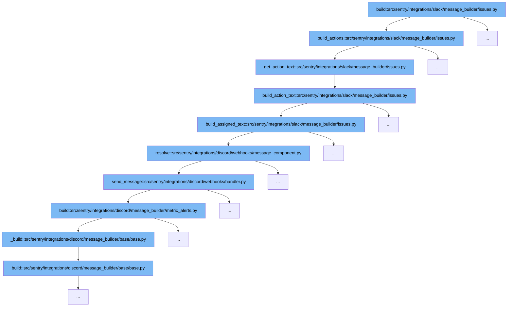

This document will explore the flow of building Slack message actions for issue management in Sentry, specifically within the Slack integration. We'll cover:

1. How the initial action setup is constructed.
2. The process of generating action text based on the actions.
3. The creation of specific action texts for assignment and resolution.
4. How these actions integrate with Discord services for message handling.



<SwmSnippet path="/src/sentry/integrations/slack/message_builder/issues.py" line="374">

---

# Initial Action Setup

The `build_actions` function initializes the action setup for a Slack message related to an issue. It determines which actions (like ignore, resolve, assign) to display based on the issue's status and the project settings.

```python
def build_actions(
    group: Group,
    project: Project,
    text: str,
    color: str,
    actions: Sequence[MessageAction] | None = None,
    identity: RpcIdentity | None = None,
) -> tuple[Sequence[MessageAction], str, str]:
    """Having actions means a button will be shown on the Slack message e.g. ignore, resolve, assign."""
    if actions and identity:
        text = get_action_text(text, actions, identity)
        return [], text, "_actioned_issue"

    status = group.get_status()

    def _ignore_button() -> MessageAction | None:
        if group.issue_category == GroupCategory.FEEDBACK:
            return None
        if status == GroupStatus.IGNORED:
            return MessageAction(name="status", label="Mark as Ongoing", value="unresolved:ongoing")

```

---

</SwmSnippet>

<SwmSnippet path="/src/sentry/integrations/slack/message_builder/issues.py" line="363">

---

# Generating Action Text

The `get_action_text` function compiles the text for each action by calling `build_action_text` for each action in the sequence. This text will be displayed as part of the Slack message buttons.

```python
def get_action_text(text: str, actions: Sequence[Any], identity: RpcIdentity) -> str:
    action_text = "\n".join(
        [
            action_text
            for action_text in [build_action_text(identity, action) for action in actions]
            if action_text
        ]
    )
    return action_text
```

---

</SwmSnippet>

<SwmSnippet path="/src/sentry/integrations/slack/message_builder/issues.py" line="131">

---

# Creating Specific Action Texts

The `build_action_text` function creates the text for individual actions such as assigning and resolving issues. It uses the identity of the user performing the action and the specific action details.

```python
def build_action_text(identity: RpcIdentity, action: MessageAction) -> str | None:
    if action.name == "assign":
        selected_options = action.selected_options or []
        if not len(selected_options):
            return None
        assignee = selected_options[0]["value"]
        return build_assigned_text(identity, assignee)

    # Resolve actions have additional 'parameters' after ':'
    status = STATUSES.get((action.value or "").split(":", 1)[0])
    status = "archived" if status == "ignored" else status
    # Action has no valid action text, ignore
    if not status:
        return None

    return f"*Issue {status} by <@{identity.external_id}>*"
```

---

</SwmSnippet>

<SwmSnippet path="/src/sentry/integrations/discord/webhooks/message_component.py" line="180">

---

# Integration with Discord Services

After processing in Slack, the `resolve` function in Discord's integration handles the resolution status and sends a message back to Discord. This demonstrates cross-service interaction within Sentry's integrations.

```python
    def resolve(self) -> Response:
        status: dict[str, object] = {
            "status": STATUS_TO_STRING_LOOKUP[GroupHistoryStatus.RESOLVED],
        }
        message = RESOLVED

        selected_option = ""
        if self.request.is_select_component():
            selected_option = self.request.get_selected_options()[0]

        if selected_option == "inNextRelease":
            status["statusDetails"] = {"inNextRelease": True}
            message = RESOLVED_IN_NEXT_RELEASE
        elif selected_option == "inCurrentRelease":
            status["statusDetails"] = {"inRelease": "latest"}
            message = RESOLVED_IN_CURRENT_RELEASE

        self.update_group(status)
        return self.send_message(message, update=self.request.is_select_component())
```

---

</SwmSnippet>

&nbsp;

*This is an auto-generated document by Swimm AI 🌊 and has not yet been verified by a human*

<SwmMeta version="3.0.0" repo-id="Z2l0aHViJTNBJTNBc2VudHJ5JTNBJTNBZ2V0c2VudHJ5" repo-name="sentry"><sup>Powered by [Swimm](/)</sup></SwmMeta>
