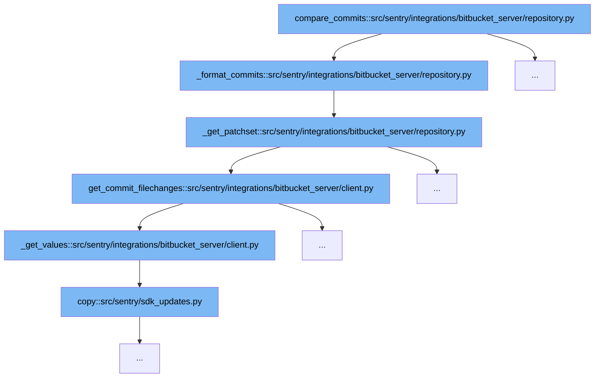

This document will explore the function `compare_commits` and its related call flow within the Bitbucket Server integration in Sentry. We'll cover:

1. The purpose of the `compare_commits` function.
2. The sequence of function calls initiated by `compare_commits`.
3. How each function contributes to the overall functionality.



<SwmSnippet path="/src/sentry/integrations/bitbucket_server/repository.py" line="87">

---

# Purpose of `compare_commits`

The `compare_commits` function is designed to format commit data fetched from Bitbucket Server into a structured format that Sentry can utilize for further processing. This function acts as the starting point for a series of data transformations.

```python
    def _format_commits(self, client, repo, commit_list):
        return [
            {
                "id": c["id"],
                "repository": repo.name,
                "author_email": c["author"]["emailAddress"],
                "author_name": c["author"].get("displayName", c["author"]["name"]),
                "message": c["message"],
                "timestamp": datetime.fromtimestamp(c["authorTimestamp"] / 1000, timezone.utc),
                "patch_set": self._get_patchset(
                    client, repo.config["project"], repo.config["repo"], c["id"]
                ),
            }
            for c in commit_list
        ]
```

---

</SwmSnippet>

# Function Call Flow

The `compare_commits` function initiates a sequence of calls to other functions to achieve its goal of formatting commit data.

<SwmSnippet path="/src/sentry/integrations/bitbucket_server/repository.py" line="87">

---

## Step 1: Calling `_format_commits`

`_format_commits` is called by `compare_commits` to start processing the raw commit data. It structures each commit's details and prepares to fetch additional data like patch sets.

```python
    def _format_commits(self, client, repo, commit_list):
        return [
            {
                "id": c["id"],
                "repository": repo.name,
                "author_email": c["author"]["emailAddress"],
                "author_name": c["author"].get("displayName", c["author"]["name"]),
                "message": c["message"],
                "timestamp": datetime.fromtimestamp(c["authorTimestamp"] / 1000, timezone.utc),
                "patch_set": self._get_patchset(
                    client, repo.config["project"], repo.config["repo"], c["id"]
                ),
            }
            for c in commit_list
        ]
```

---

</SwmSnippet>

<SwmSnippet path="/src/sentry/integrations/bitbucket_server/repository.py" line="121">

---

## Step 2: Calling `_get_patchset`

`_get_patchset` is tasked with retrieving the set of changes (patch set) for each commit. It plays a crucial role in gathering detailed file change information from the Bitbucket Server.

```python
    def _get_patchset(self, client, project, repo, sha):
        """
        Get the modified files for a commit
        """

        key = f"get_changelist:{md5_text(project + repo).hexdigest()}:{sha}"
        commit_files = cache.get(key)
        if commit_files is None:
            commit_files = client.get_commit_filechanges(project, repo, sha)
            cache.set(key, commit_files, 900)

        return self._transform_patchset(commit_files)
```

---

</SwmSnippet>

<SwmSnippet path="/src/sentry/integrations/bitbucket_server/client.py" line="196">

---

## Step 3: Calling `get_commit_filechanges`

This function fetches the file changes for each commit from the Bitbucket Server API. It is a direct call made from `_get_patchset` to gather the necessary data to complete the patch set information.

```python
    def get_commit_filechanges(self, project, repo, commit, limit=1000):
        logger.info(
            "load.filechanges",
            extra={
                "bitbucket_repo": repo,
                "bitbucket_project": project,
                "bitbucket_commit": commit,
            },
        )

        return self._get_values(
            BitbucketServerAPIPath.commit_changes.format(project=project, repo=repo, commit=commit),
            {"limit": limit},
        )
```

---

</SwmSnippet>

<SwmSnippet path="/src/sentry/integrations/bitbucket_server/client.py" line="211">

---

## Step 4: Calling `_get_values`

`_get_values` handles the pagination and aggregation of API response data. It ensures that all necessary data is collected from the Bitbucket Server API, especially when responses are paginated.

```python
    def _get_values(self, uri, params, max_pages=1000000):
        values = []
        start = 0

        logger.info(
            "load.paginated_uri",
            extra={
                "bitbucket_uri": uri,
                "bitbucket_max_pages": max_pages,
                "bitbucket_params": params,
            },
        )

        for i in range(max_pages):
            new_params = dict.copy(params)
            new_params["start"] = start
            logger.debug(
                "Loading values for paginated uri starting from %s",
                start,
                extra={"uri": uri, "params": new_params},
            )
```

---

</SwmSnippet>

<SwmSnippet path="/src/sentry/sdk_updates.py" line="1">

---

## Step 5: Calling `copy`

The `copy` function is utilized here to manage data copying operations, ensuring that data integrity is maintained during the transfer of values between functions.

```python
from __future__ import annotations
```

---

</SwmSnippet>

&nbsp;

*This is an auto-generated document by Swimm AI 🌊 and has not yet been verified by a human*

<SwmMeta version="3.0.0" repo-id="Z2l0aHViJTNBJTNBc2VudHJ5JTNBJTNBZ2V0c2VudHJ5" repo-name="sentry"><sup>Powered by [Swimm](/)</sup></SwmMeta>
