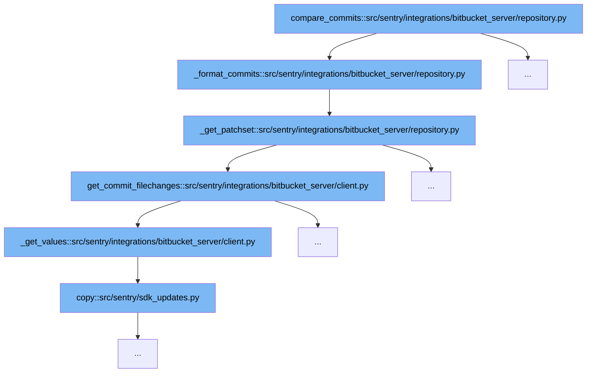

This document outlines the flow of comparing commits in the Bitbucket Server integration within Sentry. The process involves several steps, each crucial for gathering and formatting commit data to be used within Sentry's systems. We'll cover:

1. Initiating the commit comparison
2. Formatting the commit data
3. Retrieving patch sets for commits
4. Fetching file changes for commits
5. Extracting values from paginated Bitbucket Server API responses



<SwmSnippet path="/src/sentry/integrations/bitbucket_server/repository.py" line="87">

---

# Initiating the Commit Comparison

The `compare_commits` function initiates the process of comparing commits. It calls `_format_commits` to format the data of each commit fetched from Bitbucket Server.

```python
    def _format_commits(self, client, repo, commit_list):
        return [
            {
                "id": c["id"],
                "repository": repo.name,
                "author_email": c["author"]["emailAddress"],
                "author_name": c["author"].get("displayName", c["author"]["name"]),
                "message": c["message"],
                "timestamp": datetime.fromtimestamp(c["authorTimestamp"] / 1000, timezone.utc),
                "patch_set": self._get_patchset(
                    client, repo.config["project"], repo.config["repo"], c["id"]
                ),
            }
            for c in commit_list
        ]
```

---

</SwmSnippet>

<SwmSnippet path="/src/sentry/integrations/bitbucket_server/repository.py" line="87">

---

# Formatting the Commit Data

Within `_format_commits`, each commit's data is structured into a readable format, including details like commit ID, author, message, and timestamp. It also initiates fetching the patch set for each commit by calling `_get_patchset`.

```python
    def _format_commits(self, client, repo, commit_list):
        return [
            {
                "id": c["id"],
                "repository": repo.name,
                "author_email": c["author"]["emailAddress"],
                "author_name": c["author"].get("displayName", c["author"]["name"]),
                "message": c["message"],
                "timestamp": datetime.fromtimestamp(c["authorTimestamp"] / 1000, timezone.utc),
                "patch_set": self._get_patchset(
                    client, repo.config["project"], repo.config["repo"], c["id"]
                ),
            }
            for c in commit_list
        ]
```

---

</SwmSnippet>

<SwmSnippet path="/src/sentry/integrations/bitbucket_server/repository.py" line="121">

---

# Retrieving Patch Sets for Commits

The `_get_patchset` function retrieves the patch set for each commit, which includes the list of files changed in that commit. This function calls `get_commit_filechanges` to fetch these changes from the Bitbucket Server.

```python
    def _get_patchset(self, client, project, repo, sha):
        """
        Get the modified files for a commit
        """

        key = f"get_changelist:{md5_text(project + repo).hexdigest()}:{sha}"
        commit_files = cache.get(key)
        if commit_files is None:
            commit_files = client.get_commit_filechanges(project, repo, sha)
            cache.set(key, commit_files, 900)

        return self._transform_patchset(commit_files)
```

---

</SwmSnippet>

<SwmSnippet path="/src/sentry/integrations/bitbucket_server/client.py" line="196">

---

# Fetching File Changes for Commits

The `get_commit_filechanges` function fetches the file changes for each commit from the Bitbucket Server API. It constructs the API path and queries the server, handling up to 1000 file changes per commit.

```python
    def get_commit_filechanges(self, project, repo, commit, limit=1000):
        logger.info(
            "load.filechanges",
            extra={
                "bitbucket_repo": repo,
                "bitbucket_project": project,
                "bitbucket_commit": commit,
            },
        )

        return self._get_values(
            BitbucketServerAPIPath.commit_changes.format(project=project, repo=repo, commit=commit),
            {"limit": limit},
        )
```

---

</SwmSnippet>

<SwmSnippet path="/src/sentry/integrations/bitbucket_server/client.py" line="211">

---

# Extracting Values from Paginated Bitbucket Server API Responses

The `_get_values` function handles the extraction of data from paginated API responses from Bitbucket Server. It iteratively fetches data until all pages are processed or the maximum page limit is reached, ensuring complete data retrieval.

```python
    def _get_values(self, uri, params, max_pages=1000000):
        values = []
        start = 0

        logger.info(
            "load.paginated_uri",
            extra={
                "bitbucket_uri": uri,
                "bitbucket_max_pages": max_pages,
                "bitbucket_params": params,
            },
        )

        for i in range(max_pages):
            new_params = dict.copy(params)
            new_params["start"] = start
            logger.debug(
                "Loading values for paginated uri starting from %s",
                start,
                extra={"uri": uri, "params": new_params},
            )
```

---

</SwmSnippet>

&nbsp;

*This is an auto-generated document by Swimm AI 🌊 and has not yet been verified by a human*

<SwmMeta version="3.0.0" repo-id="Z2l0aHViJTNBJTNBc2VudHJ5JTNBJTNBZ2V0c2VudHJ5" repo-name="sentry"><sup>Powered by [Swimm](/)</sup></SwmMeta>
