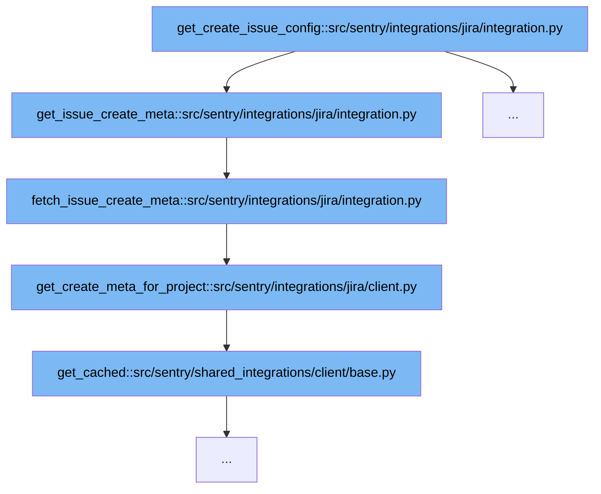

This document outlines the process involved in configuring issue creation in Jira through Sentry's integration. We'll explore:



<SwmSnippet path="/src/sentry/integrations/jira/integration.py" line="583">

---

# Initiate Issue Configuration

The function `get_create_issue_config` initiates the process of configuring issue creation in Jira. It attempts to fetch metadata for a specific project or iterates through available projects to find usable metadata.

```python
    def get_issue_create_meta(self, client, project_id, jira_projects):
        meta = None
        if project_id:
            meta = self.fetch_issue_create_meta(client, project_id)
        if meta is not None:
            return meta

        # If we don't have a jira projectid (or we couldn't fetch the metadata from the given project_id),
        # iterate all projects and find the first project that has metadata.
        # We only want one project as getting all project metadata is expensive and wasteful.
        # In the first run experience, the user won't have a 'last used' project id
        # so we need to iterate available projects until we find one that we can get metadata for.
        attempts = 0
        if len(jira_projects):
            for fallback in jira_projects:
                attempts += 1
                meta = self.fetch_issue_create_meta(client, fallback["id"])
                if meta:
                    logger.info(
                        "jira.get-issue-create-meta.attempts",
                        extra={"organization_id": self.organization_id, "attempts": attempts},
```

---

</SwmSnippet>

<SwmSnippet path="/src/sentry/integrations/jira/integration.py" line="624">

---

# Fetch Issue Creation Metadata

The function `fetch_issue_create_meta` is called to retrieve metadata from Jira for a given project. It handles exceptions related to authorization and API errors, ensuring robust error handling.

```python
    def fetch_issue_create_meta(self, client, project_id):
        try:
            meta = client.get_create_meta_for_project(project_id)
        except ApiUnauthorized:
            logger.info(
                "jira.fetch-issue-create-meta.unauthorized",
                extra={"organization_id": self.organization_id, "jira_project": project_id},
            )
            raise IntegrationError(
                "Jira returned: Unauthorized. " "Please check your configuration settings."
            )
        except ApiError as e:
            logger.info(
                "jira.fetch-issue-create-meta.error",
                extra={
                    "integration_id": self.model.id,
                    "organization_id": self.organization_id,
                    "jira_project": project_id,
                    "error": str(e),
                },
            )
```

---

</SwmSnippet>

<SwmSnippet path="/src/sentry/integrations/jira/client.py" line="134">

---

# Retrieve Project Specific Metadata

The function `get_create_meta_for_project` in the Jira client is responsible for fetching detailed metadata for a specific project. It uses caching to optimize the retrieval process.

```python
    def get_create_meta_for_project(self, project):
        params = {"expand": "projects.issuetypes.fields", "projectIds": project}
        metas = self.get_cached(self.META_URL, params=params)
        # We saw an empty JSON response come back from the API :(
        if not metas:
            logger.info(
                "jira.get-create-meta.empty-response",
                extra={"base_url": self.base_url, "project": project},
            )
            return None

        # XXX(dcramer): document how this is possible, if it even is
        if len(metas["projects"]) > 1:
            raise ApiError(f"More than one project found matching {project}.")

        try:
            return metas["projects"][0]
        except IndexError:
            logger.info(
                "jira.get-create-meta.key-error",
                extra={"base_url": self.base_url, "project": project},
```

---

</SwmSnippet>

<SwmSnippet path="/src/sentry/shared_integrations/client/base.py" line="1">

---

# Utilize Cached Data

The function `get_cached` is utilized to fetch data efficiently, reducing the number of API calls by storing and reusing previously fetched data.

```python
from __future__ import annotations

from collections.abc import Callable, Mapping, Sequence
from typing import Any, Literal, Self, Union, overload

import sentry_sdk
from django.core.cache import cache
from requests import PreparedRequest, Request, Response
from requests.adapters import RetryError
from requests.exceptions import ConnectionError, HTTPError, Timeout

from sentry import audit_log, features
from sentry.constants import ObjectStatus
from sentry.exceptions import RestrictedIPAddress
from sentry.http import build_session
from sentry.integrations.notify_disable import notify_disable
from sentry.integrations.request_buffer import IntegrationRequestBuffer
from sentry.models.integrations.utils import is_response_error, is_response_success
from sentry.net.http import SafeSession
from sentry.services.hybrid_cloud.integration import integration_service
from sentry.services.hybrid_cloud.organization import organization_service
```

---

</SwmSnippet>

&nbsp;

*This is an auto-generated document by Swimm AI 🌊 and has not yet been verified by a human*

<SwmMeta version="3.0.0" repo-id="Z2l0aHViJTNBJTNBc2VudHJ5JTNBJTNBZ2V0c2VudHJ5" repo-name="sentry"><sup>Powered by [Swimm](/)</sup></SwmMeta>
