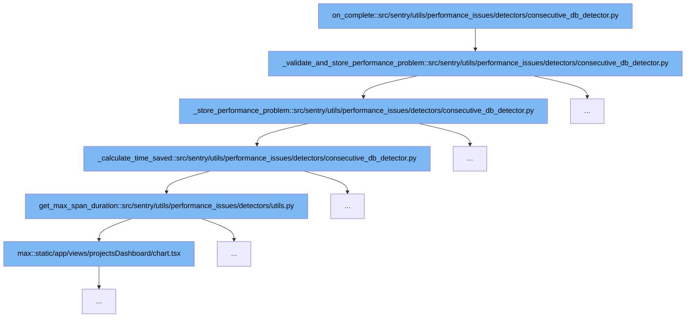

This document outlines the flow of detecting and storing performance issues related to consecutive database queries in Sentry. The flow involves several steps, each crucial for identifying and documenting performance problems effectively:



<SwmSnippet path="/src/sentry/utils/performance_issues/detectors/consecutive_db_detector.py" line="86">

---

# Initial Completion Handler

The `on_complete` function initiates the process by calling `_validate_and_store_performance_problem`. This function sets up the necessary data and checks if the detected database spans meet certain thresholds such as count and duration, which are essential for identifying significant performance issues.

```python
    def _validate_and_store_performance_problem(self):
        self._set_independent_spans(self.consecutive_db_spans)
        if not len(self.independent_db_spans):
            return

        exceeds_count_threshold = len(self.consecutive_db_spans) >= self.settings.get(
            "consecutive_count_threshold"
        )
        exceeds_span_duration_threshold = all(
            get_span_duration(span).total_seconds() * 1000
            > self.settings.get("span_duration_threshold")
            for span in self.independent_db_spans
        )

        time_saved = self._calculate_time_saved(self.independent_db_spans)
        total_time = get_total_span_duration(self.consecutive_db_spans)

        exceeds_time_saved_threshold = time_saved >= self.settings.get("min_time_saved")

        exceeds_time_saved_threshold_ratio = False
        if total_time > 0:
```

---

</SwmSnippet>

<SwmSnippet path="/src/sentry/utils/performance_issues/detectors/consecutive_db_detector.py" line="86">

---

# Validation and Storage Decision

Within `_validate_and_store_performance_problem`, the system validates the performance problem based on predefined settings like consecutive count threshold and span duration threshold. If all conditions are met, it proceeds to store the performance problem.

```python
    def _validate_and_store_performance_problem(self):
        self._set_independent_spans(self.consecutive_db_spans)
        if not len(self.independent_db_spans):
            return

        exceeds_count_threshold = len(self.consecutive_db_spans) >= self.settings.get(
            "consecutive_count_threshold"
        )
        exceeds_span_duration_threshold = all(
            get_span_duration(span).total_seconds() * 1000
            > self.settings.get("span_duration_threshold")
            for span in self.independent_db_spans
        )

        time_saved = self._calculate_time_saved(self.independent_db_spans)
        total_time = get_total_span_duration(self.consecutive_db_spans)

        exceeds_time_saved_threshold = time_saved >= self.settings.get("min_time_saved")

        exceeds_time_saved_threshold_ratio = False
        if total_time > 0:
```

---

</SwmSnippet>

<SwmSnippet path="/src/sentry/utils/performance_issues/detectors/consecutive_db_detector.py" line="119">

---

# Problem Storage

The `_store_performance_problem` function is responsible for storing the identified performance issue. It creates a unique fingerprint for the problem, gathers necessary span IDs, and constructs a `PerformanceProblem` object which is then stored for further analysis and notification.

```python
    def _store_performance_problem(self) -> None:
        fingerprint = self._fingerprint()
        offender_span_ids = [span.get("span_id", None) for span in self.independent_db_spans]
        cause_span_ids = [span.get("span_id", None) for span in self.consecutive_db_spans]
        query: str = self.independent_db_spans[0].get("description", None)

        self.stored_problems[fingerprint] = PerformanceProblem(
            fingerprint,
            "db",
            desc=query,  # TODO - figure out which query to use for description
            type=PerformanceConsecutiveDBQueriesGroupType,
            cause_span_ids=cause_span_ids,
            parent_span_ids=None,
            offender_span_ids=offender_span_ids,
            evidence_data={
                "op": "db",
                "cause_span_ids": cause_span_ids,
                "parent_span_ids": None,
                "offender_span_ids": offender_span_ids,
                "transaction_name": self._event.get("transaction", ""),
                "span_evidence_key_value": [
```

---

</SwmSnippet>

<SwmSnippet path="/src/sentry/utils/performance_issues/detectors/consecutive_db_detector.py" line="208">

---

# Time Savings Calculation

The `_calculate_time_saved` function calculates the potential time saved if the detected consecutive database queries were optimized. This calculation helps in quantifying the impact of the performance issue.

```python
    def _calculate_time_saved(self, independent_spans: list[Span]) -> float:
        """
        Calculates the cost saved by running spans in parallel,
        this is the maximum time saved of running all independent queries in parallel
        note, maximum means it does not account for db connection times and overhead associated with parallelization,
        this is where thresholds come in
        """
        consecutive_spans = self.consecutive_db_spans
        total_duration = get_total_span_duration(consecutive_spans)
        max_independent_span_duration = get_max_span_duration(independent_spans)

        sum_of_dependent_span_durations = 0.0
        for span in consecutive_spans:
            if span not in independent_spans:
                sum_of_dependent_span_durations += get_span_duration(span).total_seconds() * 1000

        return total_duration - max(max_independent_span_duration, sum_of_dependent_span_durations)
```

---

</SwmSnippet>

<SwmSnippet path="/src/sentry/utils/performance_issues/detectors/utils.py" line="16">

---

# Maximum Span Duration Retrieval

The `get_max_span_duration` function from the utils module is used to determine the duration of the longest span among the detected spans. This information is crucial for the time savings calculation in `_calculate_time_saved`.

```python
def get_max_span_duration(spans: list[Span]) -> float:
    "Given a list of spans, return the duration of the longest span in milliseconds"
    return max([get_span_duration(span).total_seconds() * 1000 for span in spans])
```

---

</SwmSnippet>

&nbsp;

*This is an auto-generated document by Swimm AI 🌊 and has not yet been verified by a human*

<SwmMeta version="3.0.0" repo-id="Z2l0aHViJTNBJTNBc2VudHJ5JTNBJTNBZ2V0c2VudHJ5" repo-name="sentry"><sup>Powered by [Swimm](/)</sup></SwmMeta>
