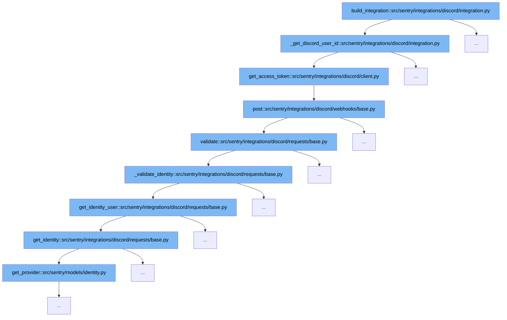

This document outlines the process of integrating Discord with Sentry, specifically focusing on the user authentication and identity validation flow. We'll cover:

1. Initiating the OAuth2 flow to obtain a Discord access token.
2. Validating the Discord request and user identity.



<SwmSnippet path="/src/sentry/integrations/discord/integration.py" line="227">

---

# Initiating the OAuth2 Flow

The function `_get_discord_user_id` initiates the OAuth2 flow by requesting an access token from Discord using the provided authorization code. This is the first step in linking the user's Discord identity with Sentry.

```python
    def _get_discord_user_id(self, auth_code: str, url: str) -> str:
        """
        Helper function for completing the oauth2 flow and grabbing the
        installing user's Discord user id so we can link their identities.

        We don't keep the granted token beyond this function because we don't
        need it.

        If something goes wrong with this we will throw an error because we
        need an initial identity to configure the identity provider for this
        integration.

        """
        try:
            access_token = self.client.get_access_token(auth_code, url)
        except ApiError:
            raise IntegrationError("Failed to get Discord access token from API.")
        except KeyError:
            raise IntegrationError("Failed to get Discord access token from key.")
        try:
            user_id = self.client.get_user_id(access_token)
```

---

</SwmSnippet>

<SwmSnippet path="/src/sentry/integrations/discord/requests/base.py" line="149">

---

# Validating Discord Request and User Identity

After obtaining the access token, the `validate` function is called to ensure the integrity of the Discord request and to validate the user's identity. This step is crucial for securing the integration and confirming the user's identity.

```python
    def validate(self) -> None:
        self._log_request()
        self._get_context()
        self.authorize()
        self.validate_integration()
        self._validate_identity()
```

---

</SwmSnippet>

&nbsp;

*This is an auto-generated document by Swimm AI 🌊 and has not yet been verified by a human*

<SwmMeta version="3.0.0" repo-id="Z2l0aHViJTNBJTNBc2VudHJ5JTNBJTNBZ2V0c2VudHJ5" repo-name="sentry"><sup>Powered by [Swimm](/)</sup></SwmMeta>
