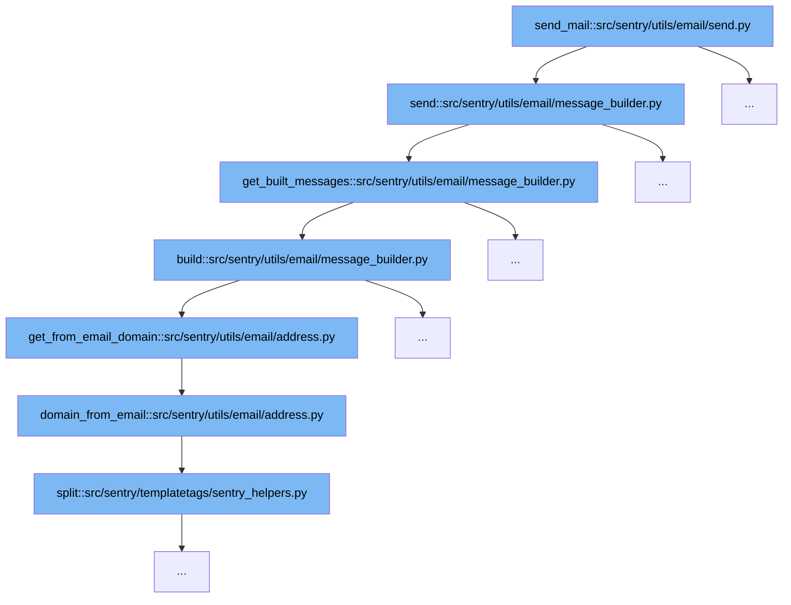

This document outlines the process involved in sending an email through Sentry's codebase, specifically starting from the `send_mail` function. The steps include:

1. Initiating the email sending process.
2. Building the email message.
3. Determining the email domain.



<SwmSnippet path="/src/sentry/utils/email/send.py" line="221">

---

# Initiating the Email Sending Process

The `send` function in `send.py` initiates the email sending process by calling `send_messages` with the built messages. This is the entry point for sending emails, where various parameters like `to`, `cc`, and `bcc` are set up.

```python

```

---

</SwmSnippet>

<SwmSnippet path="/src/sentry/utils/email/message_builder.py" line="199">

---

# Building the Email Message

The `get_built_messages` function in `message_builder.py` handles the construction of email messages. It iterates over the recipients and builds individual messages using the `build` function, ensuring that each message is correctly formatted and contains all necessary headers and content.

```python
    def get_built_messages(
        self,
        to: Iterable[str] | None = None,
        cc: Sequence[str] | None = None,
        bcc: Sequence[str] | None = None,
    ) -> Sequence[EmailMultiAlternatives]:
        send_to = set(to or ())
        send_to.update(self._send_to)
        results = [
            self.build(to=email, reply_to=send_to, cc=cc, bcc=bcc) for email in send_to if email
        ]
        if not results:
            logger.debug("Did not build any messages, no users to send to.")
        return results
```

---

</SwmSnippet>

<SwmSnippet path="/src/sentry/utils/email/address.py" line="22">

---

# Determining the Email Domain

The `get_from_email_domain` function in `address.py` retrieves the domain part of the email address from the configuration. This domain is crucial for constructing the `Message-ID` header in the email, which is used to uniquely identify the message across email systems.

```python
def get_from_email_domain() -> str:
    global _from_email_domain_cache
    from_ = options.get("mail.from")
    if _from_email_domain_cache is None or not _from_email_domain_cache[0] == from_:
        _from_email_domain_cache = (from_, domain_from_email(from_))
    return _from_email_domain_cache[1]
```

---

</SwmSnippet>

&nbsp;

*This is an auto-generated document by Swimm AI 🌊 and has not yet been verified by a human*

<SwmMeta version="3.0.0" repo-id="Z2l0aHViJTNBJTNBc2VudHJ5JTNBJTNBZ2V0c2VudHJ5" repo-name="sentry"><sup>Powered by [Swimm](/)</sup></SwmMeta>
