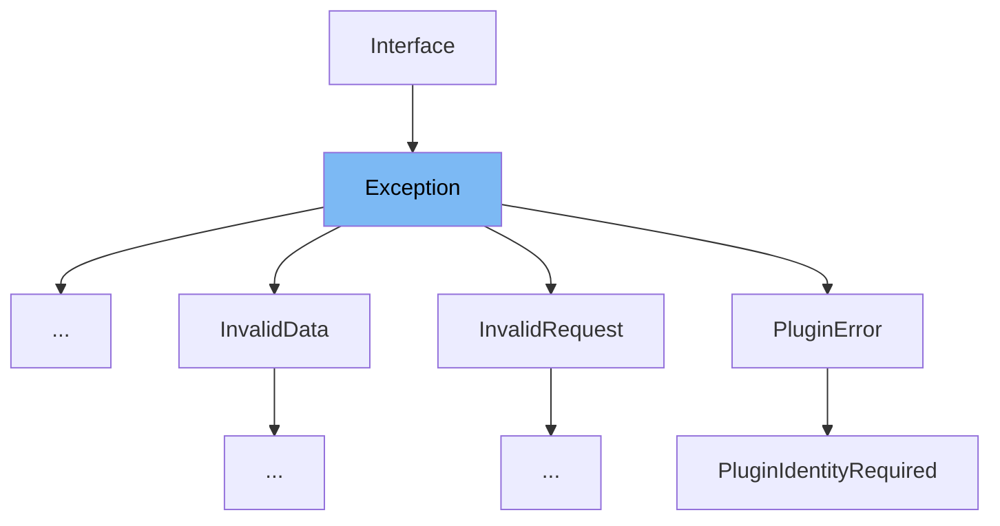

This document will cover the `Exception` class in `src/sentry/interfaces/exception.py`. We'll explore:

1. What is `Exception`?
2. Details on variables and functions within the `Exception` class.
3. How to use `Exception` in `ApiError`.



# What is Exception

The `Exception` class in `src/sentry/interfaces/exception.py` is designed to handle exceptions within the Sentry application. It provides a structured way to capture and manage exception data, including type, value, and module, and optionally binds a stacktrace to the exception for better error tracking and debugging.

<SwmSnippet path="/src/sentry/interfaces/exception.py" line="351">

---

# Variables and functions

The `Exception` class defines several methods and properties to manage exception data. It includes methods like `to_python`, `to_json`, `get_api_context`, and `get_api_meta` to serialize and manage exception data across different parts of the application.

```python
class Exception(Interface):
    """
    An exception consists of a list of values. In most cases, this list
    contains a single exception, with an optional stacktrace interface.

    Each exception has a mandatory ``value`` argument and optional ``type`` and
    ``module`` arguments describing the exception class type and module
    namespace.

    You can also optionally bind a stacktrace interface to an exception. The
    spec is identical to ``stacktrace``.

    >>> {
    >>>     "values": [{
    >>>         "type": "ValueError",
    >>>         "value": "My exception value",
    >>>         "module": "__builtins__",
    >>>         "mechanism": {
    >>>             # see sentry.interfaces.Mechanism
    >>>         },
    >>>         "stacktrace": {
```

---

</SwmSnippet>

<SwmSnippet path="/src/sentry/api/client.py" line="15">

---

# Usage example

The `ApiError` class in `src/sentry/api/client.py` is an example of how the `Exception` class is used. It extends `Exception` to handle API-specific errors, providing methods to format the error message and represent it as a string.

```python
class ApiError(Exception):
    def __init__(self, status_code, body):
        self.status_code = status_code
        self.body = body

    def __str__(self):
        return f"status={self.status_code} body={self.body}"

    def __repr__(self):
        return f"<ApiError: {self}>"
```

---

</SwmSnippet>

&nbsp;

*This is an auto-generated document by Swimm AI 🌊 and has not yet been verified by a human*

<SwmMeta version="3.0.0" repo-id="Z2l0aHViJTNBJTNBc2VudHJ5JTNBJTNBZ2V0c2VudHJ5" repo-name="sentry"><sup>Powered by [Swimm](/)</sup></SwmMeta>
