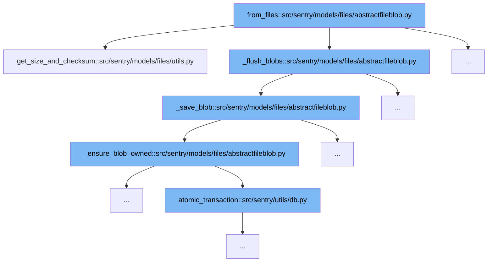

This document will explore the file handling and blob management process in Sentry, specifically through the `from_files` function in `abstractfileblob.py`. We'll cover:

1. How file size and checksum are determined.
2. The process of flushing blobs.
3. Saving blobs and ensuring blob ownership.
4. Handling database transactions during blob ownership assurance.



<SwmSnippet path="/src/sentry/models/files/utils.py" line="38">

---

# Determining File Size and Checksum

The `get_size_and_checksum` function calculates the size and SHA1 checksum of a file. This is the initial step in handling file uploads, ensuring that each file's content is accurately represented and verified.

```python
def get_size_and_checksum(fileobj: IO[bytes]) -> tuple[int, str]:
    size = 0
    checksum = sha1()
    while True:
        chunk = fileobj.read(65536)
        if not chunk:
            break
        size += len(chunk)
        checksum.update(chunk)
    fileobj.seek(0)

    return size, checksum.hexdigest()
```

---

</SwmSnippet>

<SwmSnippet path="/src/sentry/models/files/abstractfileblob.py" line="101">

---

# Flushing Blobs

The `_flush_blobs` function calls `_save_blob` to persist file blobs. This step is crucial for managing file storage and avoiding data duplication through integrity checks.

```python
        def _save_blob(blob):
            logger.debug("FileBlob.from_files._save_blob.start", extra={"path": blob.path})
            try:
                blob.save()
            except IntegrityError:
                # this means that there was a race inserting a blob
                # with this checksum. we will fetch the other blob that was
                # saved, and delete our backing storage to not leave orphaned
                # chunks behind.
                # we also won't have to worry about concurrent deletes, as deletions
                # are only happening for blobs older than 24h.
                metrics.incr("filestore.upload_race", sample_rate=1.0)
                saved_path = blob.path
                blob = cls.objects.get(checksum=blob.checksum)
                storage = get_storage(cls._storage_config())
                storage.delete(saved_path)

            _ensure_blob_owned(blob)
            logger.debug("FileBlob.from_files._save_blob.end", extra={"path": blob.path})
```

---

</SwmSnippet>

<SwmSnippet path="/src/sentry/models/files/abstractfileblob.py" line="90">

---

# Saving Blobs and Ensuring Ownership

After saving a blob, `_ensure_blob_owned` ensures that the blob is associated with the correct organization. This involves a database transaction managed by `atomic_transaction` to maintain data integrity.

```python
        def _ensure_blob_owned(blob):
            if organization is None:
                return
            try:
                with atomic_transaction(using=router.db_for_write(cls.FILE_BLOB_OWNER_MODEL)):
                    cls.FILE_BLOB_OWNER_MODEL.objects.create(
                        organization_id=organization.id, blob=blob
                    )
            except IntegrityError:
                pass
```

---

</SwmSnippet>

&nbsp;

*This is an auto-generated document by Swimm AI 🌊 and has not yet been verified by a human*

<SwmMeta version="3.0.0" repo-id="Z2l0aHViJTNBJTNBc2VudHJ5JTNBJTNBZ2V0c2VudHJ5" repo-name="sentry"><sup>Powered by [Swimm](/)</sup></SwmMeta>
