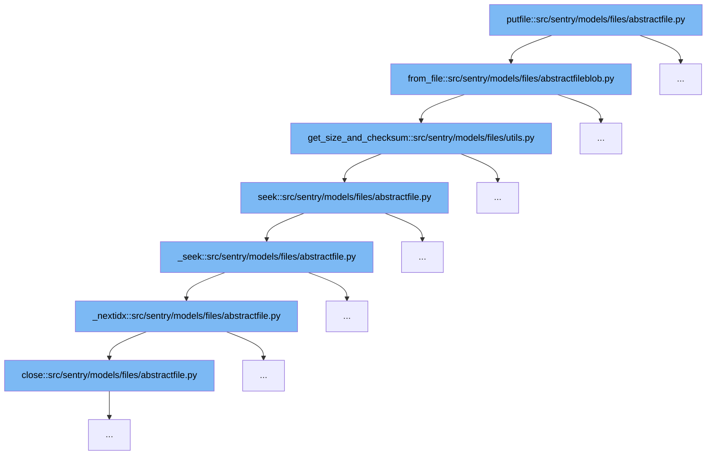

This document will explain the file handling and blob storage process in Sentry, specifically focusing on the `putfile` function and its related flow. We'll cover:

1. The initiation of file handling through `putfile`
2. The process of creating or retrieving a file blob with `from_file`
3. Calculating file size and checksum in `get_size_and_checksum`
4. The sequence of seeking operations within a file



<SwmSnippet path="/src/sentry/models/files/abstractfile.py" line="1">

---

# Initiation of File Handling

The `putfile` function in `abstractfile.py` serves as the entry point for handling file operations, initiating the process of file storage or retrieval.

```python
from __future__ import annotations
```

---

</SwmSnippet>

<SwmSnippet path="/src/sentry/models/files/abstractfileblob.py" line="174">

---

# Creating or Retrieving a File Blob

The `from_file` method in `abstractfileblob.py` is responsible for either creating a new file blob or retrieving an existing one based on the checksum. It handles the logic of checking if a blob with the same checksum already exists and either returns the existing blob or creates a new one and saves it.

```python
    def from_file(cls, fileobj, logger=nooplogger) -> Self:
        """
        Retrieve a single FileBlob instances for the given file.
        """
        logger.debug("FileBlob.from_file.start")

        size, checksum = get_size_and_checksum(fileobj)

        existing = get_and_optionally_update_blob(cls, checksum)
        if existing is not None:
            return existing

        blob = cls(size=size, checksum=checksum)
        blob.path = cls.generate_unique_path()
        storage = get_storage(cls._storage_config())
        storage.save(blob.path, fileobj)
        try:
            blob.save()
        except IntegrityError:
            # see `_save_blob` above
            metrics.incr("filestore.upload_race", sample_rate=1.0)
```

---

</SwmSnippet>

<SwmSnippet path="/src/sentry/models/files/utils.py" line="38">

---

# Calculating File Size and Checksum

The `get_size_and_checksum` function in `utils.py` calculates the size and SHA1 checksum of the file. This information is crucial for determining whether a file blob already exists and for creating new blobs.

```python
def get_size_and_checksum(fileobj: IO[bytes]) -> tuple[int, str]:
    size = 0
    checksum = sha1()
    while True:
        chunk = fileobj.read(65536)
        if not chunk:
            break
        size += len(chunk)
        checksum.update(chunk)
    fileobj.seek(0)

    return size, checksum.hexdigest()
```

---

</SwmSnippet>

<SwmSnippet path="/src/sentry/models/files/abstractfile.py" line="145">

---

# File Seeking Operations

The `seek` method in `abstractfile.py` manages the file pointer's position within the file. It calls `_seek` to handle different seeking modes (SET, CUR, END), which in turn may iterate through file indexes using `_nextidx` to find the correct position.

```python
    def seek(self, pos, whence=io.SEEK_SET):
        if whence == io.SEEK_SET:
            return self._seek(pos)
        if whence == io.SEEK_CUR:
            return self._seek(self.tell() + pos)
        if whence == io.SEEK_END:
            return self._seek(self.size + pos)

        raise ValueError(f"Invalid value for whence: {whence}")
```

---

</SwmSnippet>

&nbsp;

*This is an auto-generated document by Swimm AI 🌊 and has not yet been verified by a human*

<SwmMeta version="3.0.0" repo-id="Z2l0aHViJTNBJTNBc2VudHJ5JTNBJTNBZ2V0c2VudHJ5" repo-name="sentry"><sup>Powered by [Swimm](/)</sup></SwmMeta>
