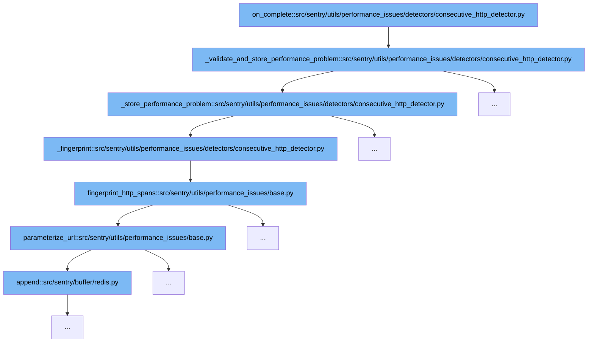

This document outlines the flow of detecting and storing performance issues related to consecutive HTTP requests in Sentry. The steps include:

1. Completing the detection process.
2. Validating and storing the detected performance problem.
3. Storing the performance problem details.
4. Generating a fingerprint for the issue.
5. Parameterizing URLs for fingerprinting.



<SwmSnippet path="/src/sentry/utils/performance_issues/detectors/consecutive_http_detector.py" line="71">

---

# Completing the Detection Process

The `on_complete` function triggers the validation and potential storage of a performance problem if certain conditions are met, such as exceeding count thresholds and minimum time saved duration.

```python
    def _validate_and_store_performance_problem(self):
        exceeds_count_threshold = len(self.consecutive_http_spans) >= self.settings.get(
            "consecutive_count_threshold"
        )

        exceeds_min_time_saved_duration = False
        if self.consecutive_http_spans:
            exceeds_min_time_saved_duration = self._calculate_time_saved() >= self.settings.get(
                "min_time_saved"
            )

        subceeds_duration_between_spans_threshold = all(
            get_duration_between_spans(
                self.consecutive_http_spans[idx - 1], self.consecutive_http_spans[idx]
            )
            < self.settings.get("max_duration_between_spans")
            for idx in range(1, len(self.consecutive_http_spans))
        )

        if (
            exceeds_count_threshold
```

---

</SwmSnippet>

<SwmSnippet path="/src/sentry/utils/performance_issues/detectors/consecutive_http_detector.py" line="71">

---

# Validating and Storing the Detected Performance Problem

The `_validate_and_store_performance_problem` function checks if the detected HTTP requests exceed predefined thresholds and, if so, proceeds to store the performance problem.

```python
    def _validate_and_store_performance_problem(self):
        exceeds_count_threshold = len(self.consecutive_http_spans) >= self.settings.get(
            "consecutive_count_threshold"
        )

        exceeds_min_time_saved_duration = False
        if self.consecutive_http_spans:
            exceeds_min_time_saved_duration = self._calculate_time_saved() >= self.settings.get(
                "min_time_saved"
            )

        subceeds_duration_between_spans_threshold = all(
            get_duration_between_spans(
                self.consecutive_http_spans[idx - 1], self.consecutive_http_spans[idx]
            )
            < self.settings.get("max_duration_between_spans")
            for idx in range(1, len(self.consecutive_http_spans))
        )

        if (
            exceeds_count_threshold
```

---

</SwmSnippet>

<SwmSnippet path="/src/sentry/utils/performance_issues/detectors/consecutive_http_detector.py" line="103">

---

# Storing the Performance Problem Details

The `_store_performance_problem` function stores the details of the performance problem, including a fingerprint, description, and span IDs related to the issue.

```python
    def _store_performance_problem(self) -> None:
        fingerprint = self._fingerprint()
        offender_span_ids = [span.get("span_id", None) for span in self.consecutive_http_spans]
        desc: str = self.consecutive_http_spans[0].get("description", None)

        self.stored_problems[fingerprint] = PerformanceProblem(
            fingerprint,
            "http",
            desc=desc,
            type=PerformanceConsecutiveHTTPQueriesGroupType,
            cause_span_ids=[],
            parent_span_ids=None,
            offender_span_ids=offender_span_ids,
            evidence_display=[
                IssueEvidence(
                    name="Offending Spans",
                    value=get_notification_attachment_body(
                        "http",
                        desc,
                    ),
                    # Has to be marked important to be displayed in the notifications
```

---

</SwmSnippet>

<SwmSnippet path="/src/sentry/utils/performance_issues/detectors/consecutive_http_detector.py" line="171">

---

# Generating a Fingerprint for the Issue

The `_fingerprint` function generates a unique identifier for the performance issue based on the hashed URL paths of the HTTP requests.

```python
    def _fingerprint(self) -> str:
        hashed_url_paths = fingerprint_http_spans(self.consecutive_http_spans)
        return f"1-{PerformanceConsecutiveHTTPQueriesGroupType.type_id}-{hashed_url_paths}"
```

---

</SwmSnippet>

<SwmSnippet path="/src/sentry/utils/performance_issues/base.py" line="329">

---

# Parameterizing URLs for Fingerprinting

The `parameterize_url` function modifies URLs to a standardized format to ensure consistent fingerprinting of HTTP requests.

```python
def parameterize_url(url: str) -> str:
    parsed_url = urlparse(str(url))

    protocol_fragments = []
    if parsed_url.scheme:
        protocol_fragments.append(parsed_url.scheme)
        protocol_fragments.append("://")

    host_fragments = []
    for fragment in parsed_url.netloc.split("."):
        host_fragments.append(str(fragment))

    path_fragments = []
    for fragment in parsed_url.path.split("/"):
        if PARAMETERIZED_URL_REGEX.search(fragment):
            path_fragments.append("*")
        else:
            path_fragments.append(str(fragment))

    query = parse_qs(parsed_url.query)

```

---

</SwmSnippet>

&nbsp;

*This is an auto-generated document by Swimm AI 🌊 and has not yet been verified by a human*

<SwmMeta version="3.0.0" repo-id="Z2l0aHViJTNBJTNBc2VudHJ5JTNBJTNBZ2V0c2VudHJ5" repo-name="sentry"><sup>Powered by [Swimm](/)</sup></SwmMeta>
