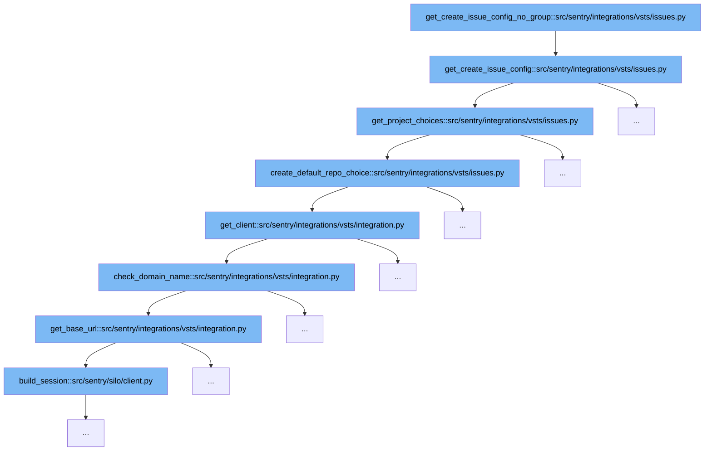

This document will explain the code flow initiated by the function `get_create_issue_config_no_group` in the context of VSTS integration within Sentry. The flow involves several steps to configure issue creation without a specific group context. We'll cover:

1. Initialization of issue configuration
2. Project and repository choices setup
3. Client and domain verification
4. Session building for API requests



<SwmSnippet path="/src/sentry/integrations/vsts/issues.py" line="113">

---

# Initialization of issue configuration

The function `get_create_issue_config` initializes the configuration for creating an issue. It sets up necessary fields and defaults based on whether a group is provided or not, and retrieves project and work item choices.

```python
    def get_create_issue_config(
        self, group: Optional["Group"], user: RpcUser | None, **kwargs: Any
    ) -> Sequence[Mapping[str, Any]]:
        kwargs["link_referrer"] = "vsts_integration"
        fields = []
        if group:
            fields = super().get_create_issue_config(group, user, **kwargs)
            # Azure/VSTS has BOTH projects and repositories. A project can have many repositories.
            # Workitems (issues) are associated with the project not the repository.
        default_project, project_choices = self.get_project_choices(group, **kwargs)

        work_item_choices: Sequence[tuple[str, str]] = []
        default_work_item: str | None = None
        if default_project:
            default_work_item, work_item_choices = self.get_work_item_choices(
                default_project, group
            )

        return [
            {
                "name": "project",
```

---

</SwmSnippet>

<SwmSnippet path="/src/sentry/integrations/vsts/issues.py" line="38">

---

# Project and repository choices setup

In `get_project_choices`, the function fetches project options from VSTS and handles default selections. It also ensures that if a project is not in the default list, it is added to ensure it can be selected, using `create_default_repo_choice` to fetch default repository details.

```python
    def get_project_choices(
        self, group: Optional["Group"] = None, **kwargs: Any
    ) -> tuple[str | None, Sequence[tuple[str, str]]]:
        client = self.get_client(base_url=self.instance)
        try:
            projects = client.get_projects()
        except (ApiError, ApiUnauthorized, KeyError) as e:
            self.raise_error(e)

        project_choices = [(project["id"], project["name"]) for project in projects]

        params = kwargs.get("params", {})
        project = kwargs.get("project")
        if group:
            default_project_id = group.project_id
        elif project:
            default_project_id = project.id
        else:
            default_project_id = projects[0]["id"]
        defaults = self.get_project_defaults(default_project_id)
        try:
```

---

</SwmSnippet>

<SwmSnippet path="/src/sentry/integrations/vsts/integration.py" line="170">

---

# Client and domain verification

The `get_client` function retrieves or creates a VSTS API client, ensuring the domain name is verified through `check_domain_name` which also sets up the base URL for subsequent API requests.

```python
    def get_client(self, base_url: str | None = None) -> VstsApiClient:
        if base_url is None:
            base_url = self.instance
        if SiloMode.get_current_mode() != SiloMode.REGION:
            if self.default_identity is None:
                self.default_identity = self.get_default_identity()
            self.check_domain_name(self.default_identity)

        if self.org_integration is None:
            raise Exception("self.org_integration is not defined")
        if self.org_integration.default_auth_id is None:
            raise Exception("self.org_integration.default_auth_id is not defined")
        return VstsApiClient(
            base_url=base_url,
            oauth_redirect_url=VstsIntegrationProvider.oauth_redirect_url,
            org_integration_id=self.org_integration.id,
            identity_id=self.org_integration.default_auth_id,
        )
```

---

</SwmSnippet>

<SwmSnippet path="/src/sentry/silo/client.py" line="1">

---

# Session building for API requests

The `build_session` function from `silo/client.py` is used to create a session for HTTP requests, which is essential for interacting with the VSTS API to fetch or manipulate project data.

```python
from __future__ import annotations

import ipaddress
import socket
from collections.abc import Iterable, Mapping
from hashlib import sha256
from typing import TYPE_CHECKING, Any

import sentry_sdk
import urllib3
from django.core.cache import cache
from django.http import HttpResponse
from django.http.request import HttpRequest
from django.utils.encoding import force_str
from requests import Request
from requests.adapters import Retry

from sentry import options
from sentry.http import build_session
from sentry.net.http import SafeSession
```

---

</SwmSnippet>

&nbsp;

*This is an auto-generated document by Swimm AI 🌊 and has not yet been verified by a human*

<SwmMeta version="3.0.0" repo-id="Z2l0aHViJTNBJTNBc2VudHJ5JTNBJTNBZ2V0c2VudHJ5" repo-name="sentry"><sup>Powered by [Swimm](/)</sup></SwmMeta>
