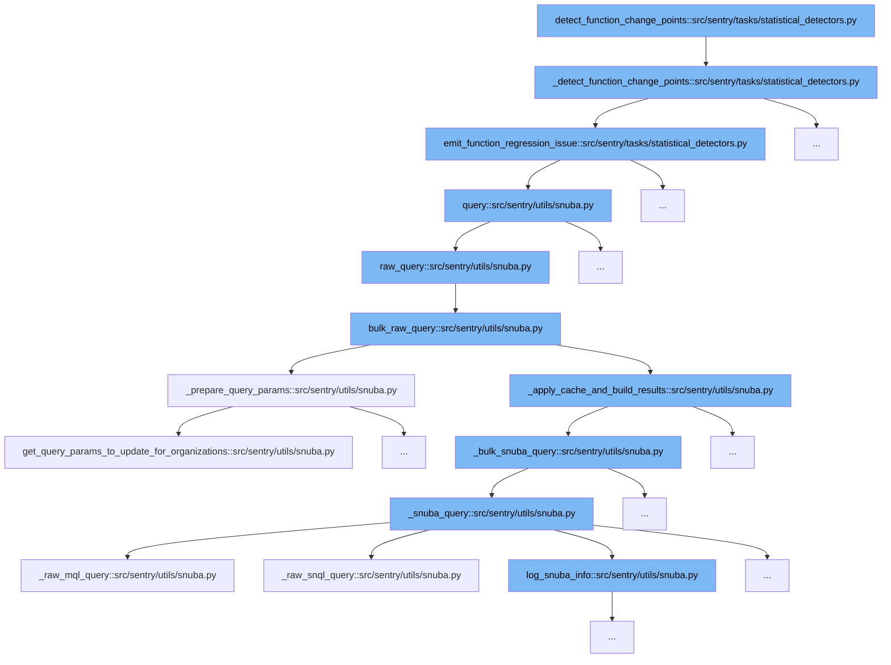

This document will explore the function `detect_function_change_points` and its role within the codebase. We'll cover:

1. The purpose of the `detect_function_change_points` function.
2. The sequence of function calls initiated by `detect_function_change_points`.
3. How each function in the sequence contributes to the overall goal of detecting function change points.



<SwmSnippet path="/src/sentry/tasks/statistical_detectors.py" line="449">

---

# Purpose of `detect_function_change_points`

The `detect_function_change_points` function is designed to detect significant changes in function performance over time. It filters projects, detects regressions, and emits issues if regressions are found.

```python
def _detect_function_change_points(
    functions_list: list[tuple[int, int]], start: datetime, *args, **kwargs
) -> None:
    if not options.get("statistical_detectors.enable"):
        return

    FunctionRegressionDetector.configure_tags()

    projects_by_id = {
        project.id: project
        for project in get_detector_enabled_projects(
            [project_id for project_id, _ in functions_list],
        )
    }

    function_pairs: list[tuple[Project, int | str]] = [
        (projects_by_id[item[0]], item[1]) for item in functions_list if item[0] in projects_by_id
    ]

    regressions = FunctionRegressionDetector.detect_regressions(
        function_pairs, start, "p95()", TIMESERIES_PER_BATCH
```

---

</SwmSnippet>

# Function Call Sequence

The function `detect_function_change_points` initiates a sequence of calls to `_detect_function_change_points`, `emit_function_regression_issue`, and several functions within `src/sentry/utils/snuba.py` to handle data querying and processing.

<SwmSnippet path="/src/sentry/tasks/statistical_detectors.py" line="449">

---

# Step 1: `_detect_function_change_points`

This function is called by `detect_function_change_points` to process the list of functions and detect any statistical anomalies or regressions based on performance metrics.

```python
def _detect_function_change_points(
    functions_list: list[tuple[int, int]], start: datetime, *args, **kwargs
) -> None:
    if not options.get("statistical_detectors.enable"):
        return

    FunctionRegressionDetector.configure_tags()

    projects_by_id = {
        project.id: project
        for project in get_detector_enabled_projects(
            [project_id for project_id, _ in functions_list],
        )
    }

    function_pairs: list[tuple[Project, int | str]] = [
        (projects_by_id[item[0]], item[1]) for item in functions_list if item[0] in projects_by_id
    ]

    regressions = FunctionRegressionDetector.detect_regressions(
        function_pairs, start, "p95()", TIMESERIES_PER_BATCH
```

---

</SwmSnippet>

<SwmSnippet path="/src/sentry/tasks/statistical_detectors.py" line="495">

---

# Step 2: `emit_function_regression_issue`

After detecting regressions, this function is responsible for emitting issues for each regression detected. It formats the data and sends it to the profiling service.

```python
def emit_function_regression_issue(
    projects_by_id: dict[int, Project],
    regressions: list[BreakpointData],
    start: datetime,
) -> int:
    start = start - timedelta(hours=1)
    start = start.replace(minute=0, second=0, microsecond=0)

    project_ids = [int(regression["project"]) for regression in regressions]
    projects = [projects_by_id[project_id] for project_id in project_ids]

    params: ParamsType = {
        "start": start,
        "end": start + timedelta(minutes=1),
        "project_id": project_ids,
        "project_objects": projects,
    }

    conditions = [
        And(
            [
```

---

</SwmSnippet>

<SwmSnippet path="/src/sentry/utils/snuba.py" line="1129">

---

# Step 3: Data Querying and Processing in `snuba.py`

Functions in this file are called to perform complex data queries and aggregations to fetch necessary data for detecting function change points. This includes functions like `query`, `raw_query`, and `bulk_raw_query`.

```python
def query(
    dataset=None,
    start=None,
    end=None,
    groupby=None,
    conditions=None,
    filter_keys=None,
    aggregations=None,
    selected_columns=None,
    totals=None,
    use_cache=False,
    **kwargs,
):
    aggregations = aggregations or [["count()", "", "aggregate"]]
    filter_keys = filter_keys or {}
    selected_columns = selected_columns or []
    groupby = groupby or []

    try:
        body = raw_query(
            dataset=dataset,
```

---

</SwmSnippet>

&nbsp;

*This is an auto-generated document by Swimm AI 🌊 and has not yet been verified by a human*

<SwmMeta version="3.0.0" repo-id="Z2l0aHViJTNBJTNBc2VudHJ5JTNBJTNBZ2V0c2VudHJ5" repo-name="sentry"><sup>Powered by [Swimm](/)</sup></SwmMeta>
