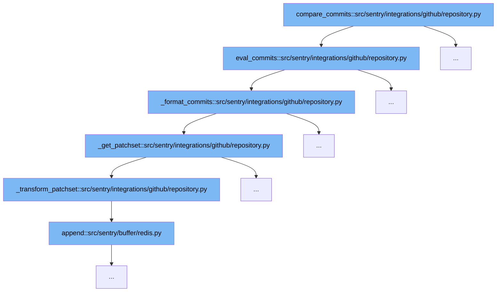

This document outlines the process of comparing commits in GitHub repositories using Sentry's integration code. It will cover the following steps:

1. Initiating the commit comparison
2. Evaluating commits
3. Formatting commit data
4. Fetching and transforming patch data
5. Appending transformed data to the buffer



<SwmSnippet path="/src/sentry/integrations/github/repository.py" line="68">

---

# Initiating the Commit Comparison

The `compare_commits` function initiates the process by either fetching the last commits up to a specified SHA or comparing two specific commits based on the SHAs provided. This is the entry point for the commit comparison flow.

```python
        def eval_commits(client: Any) -> Sequence[Mapping[str, Any]]:
            # use config name because that is kept in sync via webhooks
            name = repo.config["name"]
            if start_sha is None:
                res = client.get_last_commits(name, end_sha)
                return self._format_commits(client, name, res[:20])
            else:
                res = client.compare_commits(name, start_sha, end_sha)
                return self._format_commits(client, name, res["commits"])
```

---

</SwmSnippet>

<SwmSnippet path="/src/sentry/integrations/github/repository.py" line="68">

---

# Evaluating Commits

After initiating the commit comparison, the `eval_commits` function processes the results from GitHub's API. It decides whether to fetch the last commits or to compare specific commits, then passes the data to `_format_commits` for further processing.

```python
        def eval_commits(client: Any) -> Sequence[Mapping[str, Any]]:
            # use config name because that is kept in sync via webhooks
            name = repo.config["name"]
            if start_sha is None:
                res = client.get_last_commits(name, end_sha)
                return self._format_commits(client, name, res[:20])
            else:
                res = client.compare_commits(name, start_sha, end_sha)
                return self._format_commits(client, name, res["commits"])
```

---

</SwmSnippet>

<SwmSnippet path="/src/sentry/integrations/github/repository.py" line="91">

---

# Formatting Commit Data

The `_format_commits` function takes the raw commit data from GitHub and formats each commit into Sentry's internal structure. This includes fetching additional patch data for each commit to determine the exact changes made.

```python
    def _format_commits(
        self,
        client: Any,
        repo_name: str,
        commit_list: JSONData,
    ) -> Sequence[Mapping[str, Any]]:
        """Convert GitHub commits into our internal format

        For each commit in the list we have to fetch patch data, as the
        compare API gives us all of the files changed in the commit
        range but not which files changed in each commit. Without this
        we cannot know which specific commit changed a given file.

        See sentry.models.Release.set_commits
        """
        return [
            {
                "id": c["sha"],
                "repository": repo_name,
                "author_email": c["commit"]["author"].get("email"),
                "author_name": c["commit"]["author"].get("name"),
```

---

</SwmSnippet>

<SwmSnippet path="/src/sentry/integrations/github/repository.py" line="119">

---

# Fetching and Transforming Patch Data

The `_get_patchset` function fetches the patch data for each commit, which includes detailed file changes. This data is then passed to `_transform_patchset` to convert it into a format that Sentry can use internally.

```python
    def _get_patchset(self, client: Any, repo_name: str, sha: str) -> Sequence[Mapping[str, Any]]:
        """Get the modified files for a commit"""
        commit = client.get_commit(repo_name, sha)
        return self._transform_patchset(commit["files"])
```

---

</SwmSnippet>

<SwmSnippet path="/src/sentry/buffer/redis.py" line="1">

---

# Appending Transformed Data to the Buffer

Finally, the transformed patch data is appended to Sentry's buffer system for processing. This step integrates the formatted commit data into Sentry's workflow, allowing for further actions based on the commit changes.

```python
from __future__ import annotations
```

---

</SwmSnippet>

&nbsp;

*This is an auto-generated document by Swimm AI 🌊 and has not yet been verified by a human*

<SwmMeta version="3.0.0" repo-id="Z2l0aHViJTNBJTNBc2VudHJ5JTNBJTNBZ2V0c2VudHJ5" repo-name="sentry"><sup>Powered by [Swimm](/)</sup></SwmMeta>
