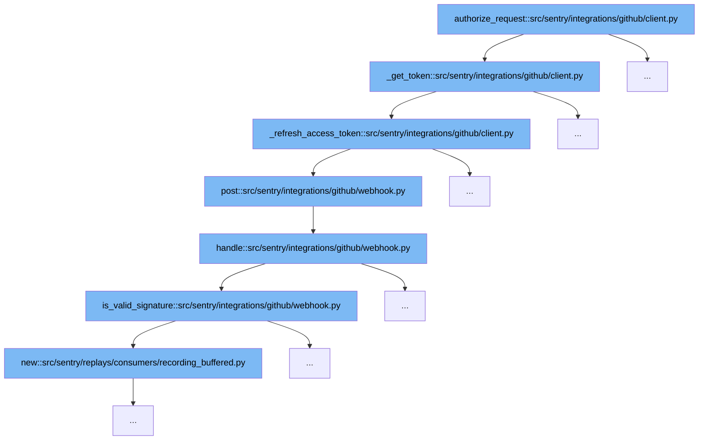

This document outlines the authorization request flow in Sentry's GitHub integration, specifically focusing on the `authorize_request` function. We'll explore:

1. How the authorization request is initiated.
2. The process of token retrieval and refresh.
3. The validation of GitHub webhook requests.



<SwmSnippet path="/src/sentry/integrations/github/client.py" line="108">

---

# Authorization Request Initiation

The `authorize_request` function starts the authorization process by attempting to retrieve a token using `_get_token`. Depending on the route, it decides whether to use a JWT or an access token.

```python
    def _get_token(self, prepared_request: PreparedRequest) -> str | None:
        """
        Get token retrieves the active access token from the integration model.
        Should the token have expired, a new token will be generated and
        automatically persisted into the integration.
        """

        if not self.integration:
            return None

        logger_extra = {
            "path_url": prepared_request.path_url,
            "integration_id": getattr(self.integration, "id", "unknown"),
        }

        # Only certain routes are authenticated with JWTs....
        should_use_jwt = (
            "/app/installations" in prepared_request.path_url
            or "access_tokens" in prepared_request.path_url
        )
        if should_use_jwt:
```

---

</SwmSnippet>

<SwmSnippet path="/src/sentry/integrations/github/client.py" line="79">

---

# Token Retrieval and Refresh

If the existing token is expired or missing, `_get_token` calls `_refresh_access_token` to obtain a new access token from GitHub. This involves sending a POST request to GitHub's API and updating the integration's metadata with the new token and expiration time.

```python
    def _refresh_access_token(self) -> str | None:
        integration = Integration.objects.filter(id=self.integration.id).first()
        if not integration:
            return None

        logger.info(
            "token.refresh_start",
            extra={
                "old_expires_at": self.integration.metadata.get("expires_at"),
                "integration_id": self.integration.id,
            },
        )
        data = self.post(f"/app/installations/{self._get_installation_id()}/access_tokens")
        access_token = cast(str, data["token"])
        expires_at = datetime.strptime(data["expires_at"], "%Y-%m-%dT%H:%M:%SZ").isoformat()
        integration.metadata.update({"access_token": access_token, "expires_at": expires_at})
        integration.save()
        logger.info(
            "token.refresh_end",
            extra={
                "new_expires_at": integration.metadata.get("expires_at"),
```

---

</SwmSnippet>

<SwmSnippet path="/src/sentry/integrations/github/webhook.py" line="603">

---

# GitHub Webhook Request Validation

After obtaining the token, the `post` function in `webhook.py` is called, which internally calls `handle` to process the webhook request. This includes validating the request's signature using `is_valid_signature` to ensure it's a legitimate request from GitHub.

```python
        return options.get("github-app.webhook-secret")

    def post(self, request: Request) -> HttpResponse:
        return self.handle(request)

    def handle(self, request: Request) -> HttpResponse:
        clear_tags_and_context()
        secret = self.get_secret()

        if secret is None:
            logger.error("github.webhook.missing-secret", extra=self.get_logging_data())
            return HttpResponse(status=401)

        body = bytes(request.body)
        if not body:
            logger.error("github.webhook.missing-body", extra=self.get_logging_data())
            return HttpResponse(status=400)

        try:
            handler = self.get_handler(request.META["HTTP_X_GITHUB_EVENT"])
        except KeyError:
```

---

</SwmSnippet>

&nbsp;

*This is an auto-generated document by Swimm AI 🌊 and has not yet been verified by a human*

<SwmMeta version="3.0.0" repo-id="Z2l0aHViJTNBJTNBc2VudHJ5JTNBJTNBZ2V0c2VudHJ5" repo-name="sentry"><sup>Powered by [Swimm](/)</sup></SwmMeta>
