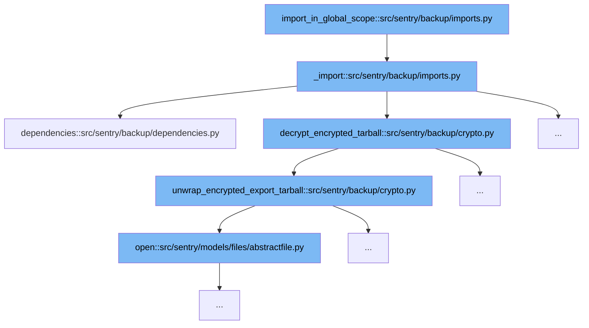

This document will cover the flow of importing data in a global scope within Sentry's backup system. We'll explore:

1. How the `import_in_global_scope` function initiates the import process.
2. The role of the `_import` function in handling the import logic.
3. The decryption and preparation of data for import.
4. The extraction of data from the encrypted tarball.



<SwmSnippet path="/src/sentry/backup/imports.py" line="101">

---

# Initiating the Import Process

The `import_in_global_scope` function serves as the entry point for the import process. It sets up the necessary parameters and delegates the core import tasks to the `_import` function.

```python
def _import(
    src: IO[bytes],
    scope: ImportScope,
    *,
    decryptor: Decryptor | None = None,
    flags: ImportFlags | None = None,
    filter_by: Filter | None = None,
    printer: Printer,
):
```

---

</SwmSnippet>

<SwmSnippet path="/src/sentry/backup/imports.py" line="101">

---

# Handling the Import Logic

The `_import` function is central to the import process. It handles the decryption of data, resolves dependencies, and ensures that the data is imported correctly according to the specified scope and flags.

```python
def _import(
    src: IO[bytes],
    scope: ImportScope,
    *,
    decryptor: Decryptor | None = None,
    flags: ImportFlags | None = None,
    filter_by: Filter | None = None,
    printer: Printer,
):
    """
    Imports core data for a Sentry installation.

    It is generally preferable to avoid calling this function directly, as there are certain
    combinations of input parameters that should not be used together. Instead, use one of the other
    wrapper functions in this file, named `import_in_XXX_scope()`.
    """

    # Import here to prevent circular module resolutions.
    from sentry.models.email import Email
    from sentry.models.organization import Organization
    from sentry.models.organizationmember import OrganizationMember
```

---

</SwmSnippet>

<SwmSnippet path="/src/sentry/backup/crypto.py" line="181">

---

# Decrypting and Preparing Data

The `decrypt_encrypted_tarball` function is responsible for decrypting the data contained in the encrypted tarball. It prepares the data by unwrapping the encrypted export tarball, which is essential for the subsequent import steps.

```python
def unwrap_encrypted_export_tarball(tarball: IO[bytes]) -> UnwrappedEncryptedExportTarball:
    export = None
    encrypted_dek = None
    public_key_pem = None
    with tarfile.open(fileobj=tarball, mode="r") as tar:
        for member in tar.getmembers():
            if member.isfile():
                file = tar.extractfile(member)
                if file is None:
                    raise ValueError(f"Could not extract file for {member.name}")

                content = file.read()
                if member.name == "export.json":
                    export = content.decode("utf-8")
                elif member.name == "data.key":
                    encrypted_dek = content
                elif member.name == "key.pub":
                    public_key_pem = content
                else:
                    raise ValueError(f"Unknown tarball entity {member.name}")

```

---

</SwmSnippet>

<SwmSnippet path="/src/sentry/backup/crypto.py" line="181">

---

# Extracting Data from the Encrypted Tarball

The `unwrap_encrypted_export_tarball` function extracts files from the tarball, specifically looking for the `export.json`, `data.key`, and `key.pub` files. This step is crucial for obtaining the necessary data to proceed with the import.

```python
def unwrap_encrypted_export_tarball(tarball: IO[bytes]) -> UnwrappedEncryptedExportTarball:
    export = None
    encrypted_dek = None
    public_key_pem = None
    with tarfile.open(fileobj=tarball, mode="r") as tar:
        for member in tar.getmembers():
            if member.isfile():
                file = tar.extractfile(member)
                if file is None:
                    raise ValueError(f"Could not extract file for {member.name}")

                content = file.read()
                if member.name == "export.json":
                    export = content.decode("utf-8")
                elif member.name == "data.key":
                    encrypted_dek = content
                elif member.name == "key.pub":
                    public_key_pem = content
                else:
                    raise ValueError(f"Unknown tarball entity {member.name}")

```

---

</SwmSnippet>

&nbsp;

*This is an auto-generated document by Swimm AI 🌊 and has not yet been verified by a human*

<SwmMeta version="3.0.0" repo-id="Z2l0aHViJTNBJTNBc2VudHJ5JTNBJTNBZ2V0c2VudHJ5" repo-name="sentry"><sup>Powered by [Swimm](/)</sup></SwmMeta>
