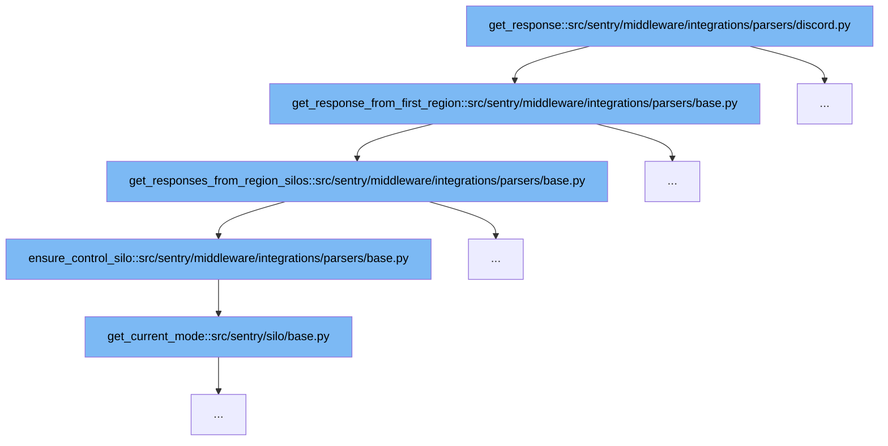

This document outlines the flow of handling Discord integration responses in Sentry. We'll explore:

1. How the initial response is fetched.
2. The process of gathering responses from regional silos.
3. Ensuring operations are controlled within the correct silo context.
4. Retrieving the current operational mode of the silo.



<SwmSnippet path="/src/sentry/middleware/integrations/parsers/discord.py" line="228">

---

# Initial Response Fetching

The `get_response` function in the Discord parser initiates the process by calling `get_response_from_first_region`. This function is crucial as it determines the first region to handle the request, setting the stage for subsequent operations.

```python

```

---

</SwmSnippet>

<SwmSnippet path="/src/sentry/middleware/integrations/parsers/base.py" line="110">

---

# Gathering Responses from Regional Silos

Following the initial region determination, `get_responses_from_region_silos` is invoked to handle requests across specified regions. This function manages the parallel processing of requests, ensuring efficient handling of responses or exceptions from different regional silos.

```python
    def get_responses_from_region_silos(
        self, regions: Sequence[Region]
    ) -> Mapping[str, RegionResult]:
        """
        Used to handle the requests on a given list of regions (synchronously).
        Returns a mapping of region name to response/exception.
        """
        self.ensure_control_silo()

        region_to_response_map = {}

        with ThreadPoolExecutor(max_workers=len(regions)) as executor:
            future_to_region = {
                executor.submit(self.get_response_from_region_silo, region): region
                for region in regions
            }
            for future in as_completed(future_to_region):
                region = future_to_region[future]
                try:
                    region_response = future.result()
                # This will capture errors from this silo and any 4xx/5xx responses from others
```

---

</SwmSnippet>

<SwmSnippet path="/src/sentry/middleware/integrations/parsers/base.py" line="75">

---

# Ensuring Control Silo Operation

The `ensure_control_silo` function is a safeguard to ensure that the integration request parsers operate only within the control silo. This step is vital for maintaining the integrity and isolation of operations within designated silos.

```python
    # Common Helpers

    def ensure_control_silo(self):
        if SiloMode.get_current_mode() != SiloMode.CONTROL:
            logger.error(
                "silo_error",
                extra={"path": self.request.path, "silo": SiloMode.get_current_mode()},
            )
            raise SiloLimit.AvailabilityError(
                "Integration Request Parsers should only be run on the control silo."
            )
```

---

</SwmSnippet>

<SwmSnippet path="/src/sentry/silo/base.py" line="10">

---

# Retrieving Current Operational Mode

Finally, `get_current_mode` from the silo base module is called to ascertain the current mode of the silo. This information is crucial for the `ensure_control_silo` function to validate the operational context.

```python
from enum import Enum
from typing import Any

if typing.TYPE_CHECKING:
    from sentry.types.region import Region


class SiloMode(Enum):
    """Defines which "silo" component the application is acting as.

    The default choice is "monolith", which assumes that the server is the only
```

---

</SwmSnippet>

&nbsp;

*This is an auto-generated document by Swimm AI 🌊 and has not yet been verified by a human*

<SwmMeta version="3.0.0" repo-id="Z2l0aHViJTNBJTNBc2VudHJ5JTNBJTNBZ2V0c2VudHJ5" repo-name="sentry"><sup>Powered by [Swimm](/)</sup></SwmMeta>
