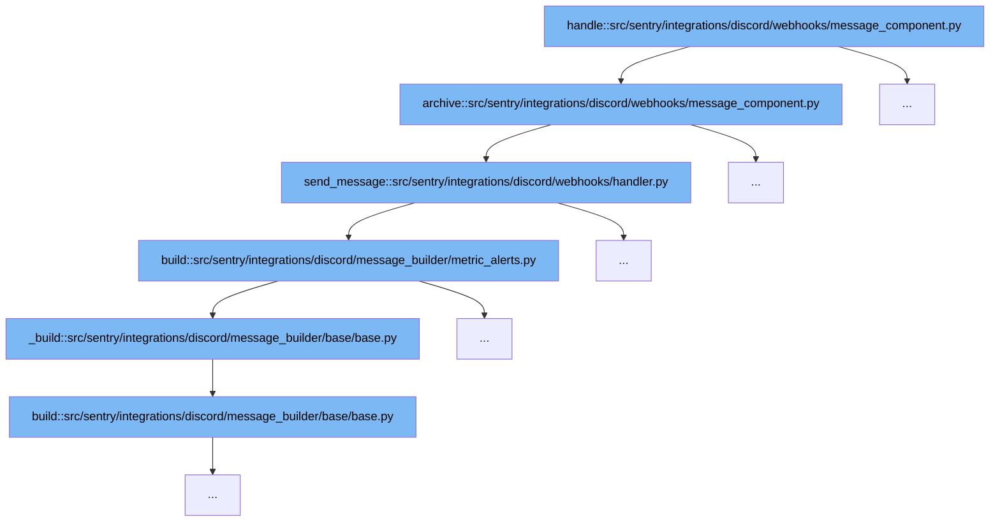

This document outlines the flow of handling Discord webhook messages in Sentry's integration system. The flow involves several steps, each contributing to the process of sending a structured message to Discord based on Sentry's alert data. We'll cover:

1. Handling incoming webhook triggers.
2. Archiving specific group statuses.
3. Sending messages to Discord.
4. Building message content for Discord.
5. Constructing the final message structure.



<SwmSnippet path="/src/sentry/integrations/discord/webhooks/message_component.py" line="212">

---

# Handling Incoming Webhook Triggers

The `handle` function in `message_component.py` is the entry point for processing incoming webhook triggers. It determines the type of action to be taken, such as archiving a group, based on the incoming request.

```python
    def archive(self) -> Response:
        self.update_group(
            {
                "status": STATUS_TO_STRING_LOOKUP[GroupHistoryStatus.IGNORED],
                "substatus": SUBSTATUS_TO_STR[GroupSubStatus.UNTIL_ESCALATING],
            }
        )
        return self.send_message(ARCHIVE_UNTIL_ESCALATES)
```

---

</SwmSnippet>

<SwmSnippet path="/src/sentry/integrations/discord/webhooks/message_component.py" line="212">

---

# Archiving Specific Group Statuses

The `archive` function updates the status of a group to 'ignored' until a specific condition escalates. This is a crucial step in managing how alerts are handled and ensuring that only relevant alerts trigger user notifications.

```python
    def archive(self) -> Response:
        self.update_group(
            {
                "status": STATUS_TO_STRING_LOOKUP[GroupHistoryStatus.IGNORED],
                "substatus": SUBSTATUS_TO_STR[GroupSubStatus.UNTIL_ESCALATING],
            }
        )
        return self.send_message(ARCHIVE_UNTIL_ESCALATES)
```

---

</SwmSnippet>

<SwmSnippet path="/src/sentry/integrations/discord/webhooks/handler.py" line="24">

---

# Sending Messages to Discord

The `send_message` function in `handler.py` is responsible for sending constructed messages to Discord. It uses the Discord API to send messages and handles different types of messages, such as updates or new alerts.

```python
    def send_message(self, message: str | DiscordMessageBuilder, update: bool = False) -> Response:
        """Sends a new follow up message."""
        response_type = DiscordResponseTypes.UPDATE if update else DiscordResponseTypes.MESSAGE

        if isinstance(message, str):
            message = DiscordMessageBuilder(
                content=message, flags=DiscordMessageFlags().set_ephemeral()
            )
        return Response(
            {
                "type": response_type,
                "data": message.build(),
            },
            status=200,
        )
```

---

</SwmSnippet>

<SwmSnippet path="/src/sentry/integrations/discord/message_builder/metric_alerts.py" line="30">

---

# Building Message Content for Discord

The `build` function in `metric_alerts.py` constructs the content of the message based on the alert's data. It formats the message with relevant alert information, making it understandable and actionable for the recipient.

```python
    def build(self, notification_uuid: str | None = None) -> dict[str, object]:
        data = metric_alert_attachment_info(
            self.alert_rule, self.incident, self.new_status, self.metric_value
        )
        url = f"{data['title_link']}&referrer=discord"
        if notification_uuid:
            url += f"&notification_uuid={notification_uuid}"

        embeds = [
            DiscordMessageEmbed(
                title=data["title"],
                url=url,
                description=f"{data['text']}{get_started_at(data['date_started'])}",
                color=LEVEL_TO_COLOR[INCIDENT_COLOR_MAPPING.get(data["status"], "")],
                image=DiscordMessageEmbedImage(url=self.chart_url) if self.chart_url else None,
            )
        ]

        return self._build(embeds=embeds)
```

---

</SwmSnippet>

<SwmSnippet path="/src/sentry/integrations/discord/message_builder/base/base.py" line="36">

---

# Constructing the Final Message Structure

The `_build` function in `base.py` finalizes the structure of the Discord message. It assembles various components of the message, such as content, embeds, and components, ensuring that the message adheres to Discord's formatting requirements.

```python
    def _build(
        self,
        content: str = "",
        embeds: list[DiscordMessageEmbed] | None = None,
        components: list[DiscordMessageComponent] | None = None,
        flags: DiscordMessageFlags | None = None,
    ) -> dict[str, object]:
        """
        Helper method for building arbitrary Discord messages.
        """
        message: dict[str, object] = {}
        message["content"] = content
        message["embeds"] = [] if embeds is None else [embed.build() for embed in embeds]
        message["components"] = (
            [] if components is None else [component.build() for component in components]
        )
        if flags is not None:
            message["flags"] = flags.value
        return message
```

---

</SwmSnippet>

&nbsp;

*This is an auto-generated document by Swimm AI 🌊 and has not yet been verified by a human*

<SwmMeta version="3.0.0" repo-id="Z2l0aHViJTNBJTNBc2VudHJ5JTNBJTNBZ2V0c2VudHJ5" repo-name="sentry"><sup>Powered by [Swimm](/)</sup></SwmMeta>
