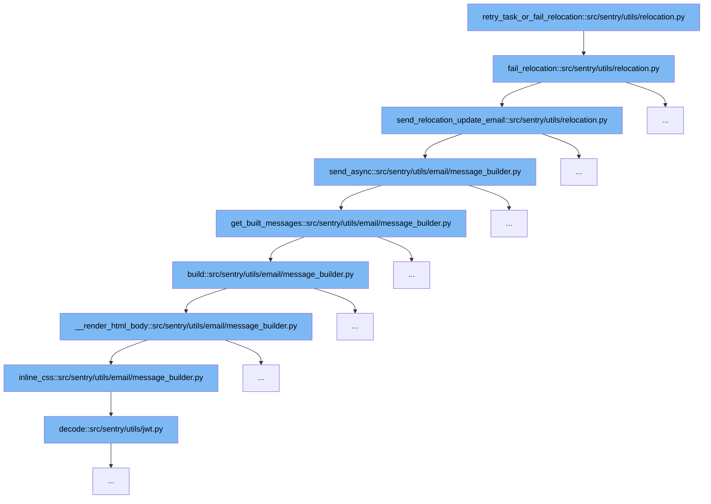

This document outlines the flow of handling a failed relocation task in Sentry, specifically through the function `retry_task_or_fail_relocation`. The flow involves several steps to ensure that a failure is handled appropriately, notifying relevant parties and updating system states accordingly. We will cover:

1. Initiating the failure process for a relocation task.
2. Sending an update email regarding the relocation status.
3. Building and sending the email asynchronously.



<SwmSnippet path="/src/sentry/utils/relocation.py" line="459">

---

# Initiating the Failure Process

The function `fail_relocation` is triggered when a relocation task needs to be marked as failed. It sets the relocation status to 'FAILURE', logs the failure, and initiates the process to send an update email. This step is crucial for stopping further retries and informing the system of the task's failure state.

```python
def fail_relocation(relocation: Relocation, task: OrderedTask, reason: str = "") -> None:
    """
    Helper function that conveniently fails a relocation celery task in such a way that the failure
    reason is recorded for the user and no further retries occur. It should be used like:

    >>> relocation = Relocation.objects.get(...)
    >>> if failure_condition:
    >>>     fail_relocation(relocation, "Some user-friendly reason why this failed.")
    >>>     return  # Always exit the task immediately upon failure

    This function is ideal for non-transient failures, where we know there is no need to retry
    because the result won't change, like invalid input data or conclusive validation results. For
    transient failures where retrying at a later time may be useful, use
    `retry_task_or_fail_relocation` instead.
    """

    # Another nested exception handler could have already failed this relocation - in this case, do
    # nothing.
    if relocation.status == Relocation.Status.FAILURE.value:
        return

```

---

</SwmSnippet>

<SwmSnippet path="/src/sentry/utils/relocation.py" line="333">

---

# Sending an Update Email

After marking the relocation as failed, `send_relocation_update_email` is called. This function constructs an email with details about the failure and sends it asynchronously to the affected users. This step ensures that all stakeholders are informed about the failure and the reasons behind it.

```python
def send_relocation_update_email(
    relocation: Relocation, email_kind: Relocation.EmailKind, args: dict[str, Any]
) -> None:
    name = str(email_kind.name)
    name_lower = name.lower()
    msg = MessageBuilder(
        subject=f"{options.get('mail.subject-prefix')} Your Relocation has {name.capitalize()}",
        template=f"sentry/emails/relocation_{name_lower}.txt",
        html_template=f"sentry/emails/relocation_{name_lower}.html",
        type=f"relocation.{name_lower}",
        context={"domain": get_server_hostname(), "datetime": timezone.now(), **args},
    )
    email_to = []
    owner = user_service.get_user(user_id=relocation.owner_id)
    if owner is not None:
        email_to.append(owner.email)

    if relocation.owner_id != relocation.creator_id:
        creator = user_service.get_user(user_id=relocation.creator_id)
        if creator is not None:
            email_to.append(creator.email)
```

---

</SwmSnippet>

<SwmSnippet path="/src/sentry/utils/email/message_builder.py" line="232">

---

# Building and Sending the Email Asynchronously

The `send_async` function in the `MessageBuilder` class handles the asynchronous sending of emails. It builds the email message, logs the email queueing, and dispatches the email. This final step in the flow ensures that the failure notification is delivered efficiently without blocking other processes.

```python
    def send_async(
        self,
        to: Iterable[str] | None = None,
        cc: Sequence[str] | None = None,
        bcc: Sequence[str] | None = None,
    ) -> None:
        from sentry.tasks.email import send_email, send_email_control

        fmt = options.get("system.logging-format")
        messages = self.get_built_messages(to, cc=cc, bcc=bcc)
        extra: MutableMapping[str, str | tuple[str]] = {"message_type": self.type}
        loggable = [v for k, v in self.context.items() if hasattr(v, "id")]
        for context in loggable:
            extra[f"{type(context).__name__.lower()}_id"] = context.id

        log_mail_queued = partial(logger.info, "mail.queued", extra=extra)
        for message in messages:
            send_email_task = send_email.delay
            if SiloMode.get_current_mode() == SiloMode.CONTROL:
                send_email_task = send_email_control.delay
            safe_execute(send_email_task, message=message, _with_transaction=False)
```

---

</SwmSnippet>

&nbsp;

*This is an auto-generated document by Swimm AI 🌊 and has not yet been verified by a human*

<SwmMeta version="3.0.0" repo-id="Z2l0aHViJTNBJTNBc2VudHJ5JTNBJTNBZ2V0c2VudHJ5" repo-name="sentry"><sup>Powered by [Swimm](/)</sup></SwmMeta>
