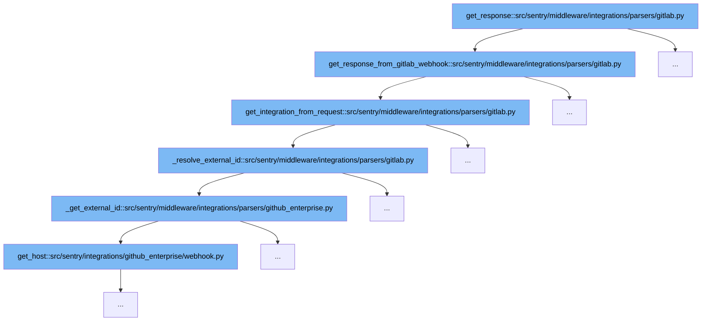

This document will explain the flow of handling GitLab webhook requests in Sentry, specifically starting from the `get_response` function. We'll cover:

1. How the initial response is determined from a GitLab webhook.
2. The process of resolving and verifying the integration from the request.
3. How external IDs are resolved and used to fetch integration details.



<SwmSnippet path="/src/sentry/middleware/integrations/parsers/gitlab.py" line="68">

---

# Initial Response Determination

The function `get_response_from_gitlab_webhook` starts by attempting to resolve an external ID. If this resolution directly returns an HTTP response, it is returned immediately. Otherwise, it proceeds to verify and fetch the integration based on the request details.

```python
    def get_response_from_gitlab_webhook(self):
        maybe_http_response = self._resolve_external_id()
        if isinstance(maybe_http_response, HttpResponseBase):
            return maybe_http_response

        try:
            integration = self.get_integration_from_request()
            if not integration:
                return self.get_default_missing_integration_response()

            regions = self.get_regions_from_organizations()
        except (Integration.DoesNotExist, OrganizationIntegration.DoesNotExist):
            return self.get_default_missing_integration_response()

        try:
            data = json.loads(self.request.body)
        except ValueError:
            data = {}

        return self.get_response_from_webhookpayload(
            regions=regions,
```

---

</SwmSnippet>

<SwmSnippet path="/src/sentry/middleware/integrations/parsers/gitlab.py" line="40">

---

# Integration Verification and Fetching

In `get_integration_from_request`, the function checks if the request is a JSON request and attempts to resolve the integration using parameters from the request path or by resolving an external ID. If an integration is found, it is returned; otherwise, it returns None.

```python
    def get_integration_from_request(self) -> Integration | None:
        if self._integration:
            return self._integration
        if not self.is_json_request():
            return None
        try:
            _view, _args, kwargs = resolve(self.request.path)
            # Non-webhook endpoints
            if "integration_id" in kwargs and "organization_slug" in kwargs:
                self._integration = Integration.objects.filter(
                    id=kwargs["integration_id"],
                    organization_slug=kwargs["organization_slug"],
                ).first()
                return self._integration

            # Webhook endpoints
            result = self._resolve_external_id()
            if isinstance(result, tuple):
                (external_id, _secret) = result
                self._integration = Integration.objects.filter(
                    external_id=external_id, provider=self.provider
```

---

</SwmSnippet>

<SwmSnippet path="/src/sentry/middleware/integrations/parsers/gitlab.py" line="28">

---

# External ID Resolution

The `_resolve_external_id` function is called to fetch the external ID from the request. It uses the user-agent and event-type headers to assist in resolving the external ID by calling `_get_external_id`.

```python
    def _resolve_external_id(self) -> tuple[str, str] | HttpResponseBase:
        clear_tags_and_context()
        extra = {
            # This tells us the Gitlab version being used (e.g. current gitlab.com version -> GitLab/15.4.0-pre)
            "user-agent": self.request.META.get("HTTP_USER_AGENT"),
            # Gitlab does not seem to be the only host sending events
            # AppPlatformEvents also hit this API
            "event-type": self.request.META.get("HTTP_X_GITLAB_EVENT"),
        }
        return super()._get_external_id(request=self.request, extra=extra)
```

---

</SwmSnippet>

&nbsp;

*This is an auto-generated document by Swimm AI 🌊 and has not yet been verified by a human*

<SwmMeta version="3.0.0" repo-id="Z2l0aHViJTNBJTNBc2VudHJ5JTNBJTNBZ2V0c2VudHJ5" repo-name="sentry"><sup>Powered by [Swimm](/)</sup></SwmMeta>
