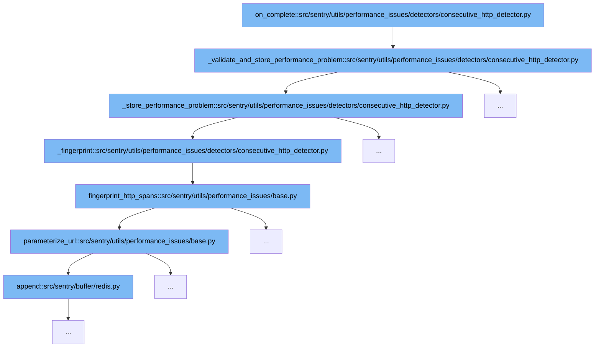

This document will explore the flow of detecting and storing performance issues related to consecutive HTTP requests in Sentry. We'll cover:

1. The initiation of the detection process.
2. Validation and storage of identified performance problems.
3. The generation of a unique fingerprint for the issue.
4. Finalizing the storage process with detailed evidence.



<SwmSnippet path="/src/sentry/utils/performance_issues/detectors/consecutive_http_detector.py" line="71">

---

# Initiation of Detection

The `on_complete` function initiates the detection process for performance issues by calling `_validate_and_store_performance_problem`. This function checks if the detected HTTP requests exceed certain thresholds and criteria set for identifying performance issues.

```python
    def _validate_and_store_performance_problem(self):
        exceeds_count_threshold = len(self.consecutive_http_spans) >= self.settings.get(
            "consecutive_count_threshold"
        )

        exceeds_min_time_saved_duration = False
        if self.consecutive_http_spans:
            exceeds_min_time_saved_duration = self._calculate_time_saved() >= self.settings.get(
                "min_time_saved"
            )

        subceeds_duration_between_spans_threshold = all(
            get_duration_between_spans(
                self.consecutive_http_spans[idx - 1], self.consecutive_http_spans[idx]
            )
            < self.settings.get("max_duration_between_spans")
            for idx in range(1, len(self.consecutive_http_spans))
        )

        if (
            exceeds_count_threshold
```

---

</SwmSnippet>

<SwmSnippet path="/src/sentry/utils/performance_issues/detectors/consecutive_http_detector.py" line="71">

---

# Validation and Storage of Performance Problems

Within `_validate_and_store_performance_problem`, the function evaluates if the consecutive HTTP requests meet the defined thresholds for count, duration, and time saved. If all conditions are met, it proceeds to store the performance problem by calling `_store_performance_problem`.

```python
    def _validate_and_store_performance_problem(self):
        exceeds_count_threshold = len(self.consecutive_http_spans) >= self.settings.get(
            "consecutive_count_threshold"
        )

        exceeds_min_time_saved_duration = False
        if self.consecutive_http_spans:
            exceeds_min_time_saved_duration = self._calculate_time_saved() >= self.settings.get(
                "min_time_saved"
            )

        subceeds_duration_between_spans_threshold = all(
            get_duration_between_spans(
                self.consecutive_http_spans[idx - 1], self.consecutive_http_spans[idx]
            )
            < self.settings.get("max_duration_between_spans")
            for idx in range(1, len(self.consecutive_http_spans))
        )

        if (
            exceeds_count_threshold
```

---

</SwmSnippet>

<SwmSnippet path="/src/sentry/utils/performance_issues/detectors/consecutive_http_detector.py" line="171">

---

# Fingerprint Generation

The `_fingerprint` function is called within `_store_performance_problem` to generate a unique identifier for the performance issue. This fingerprint is created based on the hashed URL paths of the HTTP requests, ensuring each detected issue can be uniquely identified and grouped.

```python
    def _fingerprint(self) -> str:
        hashed_url_paths = fingerprint_http_spans(self.consecutive_http_spans)
        return f"1-{PerformanceConsecutiveHTTPQueriesGroupType.type_id}-{hashed_url_paths}"
```

---

</SwmSnippet>

<SwmSnippet path="/src/sentry/utils/performance_issues/detectors/consecutive_http_detector.py" line="103">

---

# Finalizing the Storage Process

After generating the fingerprint, `_store_performance_problem` finalizes the storage of the performance issue. It includes detailed evidence such as the offending spans and transaction names, which are crucial for debugging and resolving the performance issues effectively.

```python
    def _store_performance_problem(self) -> None:
        fingerprint = self._fingerprint()
        offender_span_ids = [span.get("span_id", None) for span in self.consecutive_http_spans]
        desc: str = self.consecutive_http_spans[0].get("description", None)

        self.stored_problems[fingerprint] = PerformanceProblem(
            fingerprint,
            "http",
            desc=desc,
            type=PerformanceConsecutiveHTTPQueriesGroupType,
            cause_span_ids=[],
            parent_span_ids=None,
            offender_span_ids=offender_span_ids,
            evidence_display=[
                IssueEvidence(
                    name="Offending Spans",
                    value=get_notification_attachment_body(
                        "http",
                        desc,
                    ),
                    # Has to be marked important to be displayed in the notifications
```

---

</SwmSnippet>

&nbsp;

*This is an auto-generated document by Swimm AI 🌊 and has not yet been verified by a human*

<SwmMeta version="3.0.0" repo-id="Z2l0aHViJTNBJTNBc2VudHJ5JTNBJTNBZ2V0c2VudHJ5" repo-name="sentry"><sup>Powered by [Swimm](/)</sup></SwmMeta>
