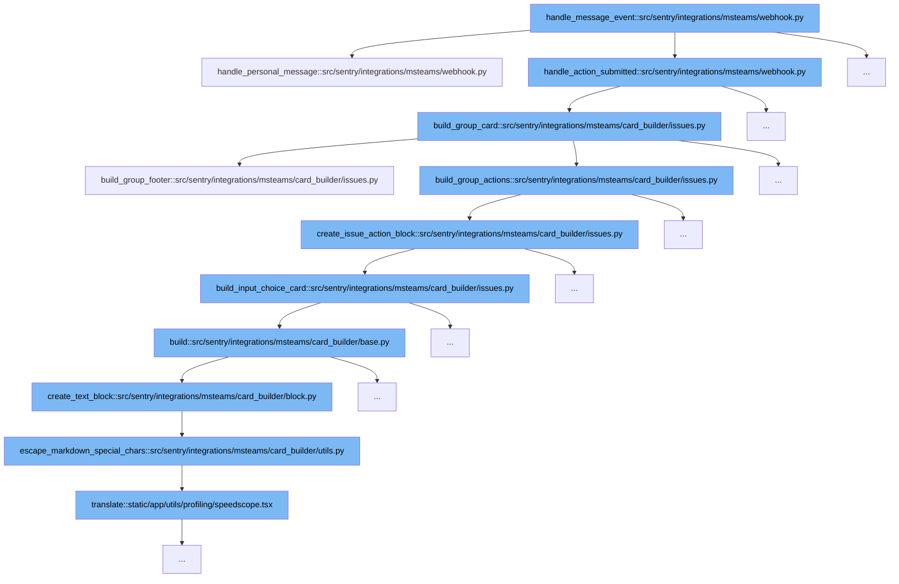

This document will explore the message handling flow in the Microsoft Teams integration within Sentry. We'll cover:

1. How messages are initially processed.
2. The decision-making process based on message content.
3. Building and sending response cards.



<SwmSnippet path="/src/sentry/integrations/msteams/webhook.py" line="677">

---

# Initial Message Processing

The `handle_message_event` function serves as the entry point for processing messages from Microsoft Teams. It determines the type of message (personal or action submitted) and routes it to the appropriate handler function.

```python
    def handle_personal_message(self, request: HttpRequest):
        data = request.data
        command_text = data.get("text", "").strip()
        lowercase_command = command_text.lower()
        conversation_id = data["conversation"]["id"]
        teams_user_id = data["from"]["id"]

        # only supporting unlink for now
        if "unlink" in lowercase_command:
            unlink_url = build_unlinking_url(conversation_id, data["serviceUrl"], teams_user_id)
            card = build_unlink_identity_card(unlink_url)
        elif "help" in lowercase_command:
            card = build_help_command_card()
        elif "link" == lowercase_command:  # don't to match other types of link commands
            has_linked_identity = (
                identity_service.get_identity(filter={"identity_ext_id": teams_user_id}) is not None
            )
            if has_linked_identity:
                card = build_already_linked_identity_command_card()
            else:
                card = build_link_identity_command_card()
```

---

</SwmSnippet>

<SwmSnippet path="/src/sentry/integrations/msteams/webhook.py" line="677">

---

# Decision Making Based on Message Content

Depending on the content of the message, different actions are taken. For instance, if the message contains 'unlink', 'link', or 'help', specific functions are called to handle these commands, leading to the creation of different types of response cards.

```python
    def handle_personal_message(self, request: HttpRequest):
        data = request.data
        command_text = data.get("text", "").strip()
        lowercase_command = command_text.lower()
        conversation_id = data["conversation"]["id"]
        teams_user_id = data["from"]["id"]

        # only supporting unlink for now
        if "unlink" in lowercase_command:
            unlink_url = build_unlinking_url(conversation_id, data["serviceUrl"], teams_user_id)
            card = build_unlink_identity_card(unlink_url)
        elif "help" in lowercase_command:
            card = build_help_command_card()
        elif "link" == lowercase_command:  # don't to match other types of link commands
            has_linked_identity = (
                identity_service.get_identity(filter={"identity_ext_id": teams_user_id}) is not None
            )
            if has_linked_identity:
                card = build_already_linked_identity_command_card()
            else:
                card = build_link_identity_command_card()
```

---

</SwmSnippet>

<SwmSnippet path="/src/sentry/integrations/msteams/card_builder/issues.py" line="276">

---

# Building and Sending Response Cards

After processing the message content, response cards are built using various helper functions like `build_group_card`, which assembles different components of the card such as the issue title, description, and actions.

```python
    def build_group_card(self, notification_uuid: str | None = None) -> AdaptiveCard:
        """
        The issue (group) card has the following components stacked vertically,
        1. The issue title which links to the issue.
        2. A description of the issue if it is available. (Optional)
        3. A footer block, which again has 3 components stacked horizontally,
            3a. The short id of the group.
            3b. The alert rule(s) that fired this notification.
            3c. The date and time of the event.
        4. Details of the assignee if the issue is assigned to an actor. (Optional)
        5. A set of three actions, resolve, ignore and assign which can
            futher reveal cards with dropdowns for selecting options.
        """
        # Explicit typing to satisfy mypy.
        fields: list[Block | None] = [
            self.build_group_descr(),
            self.build_group_footer(),
            self.build_assignee_note(),
            self.build_group_actions(),
        ]

```

---

</SwmSnippet>

&nbsp;

*This is an auto-generated document by Swimm AI 🌊 and has not yet been verified by a human*

<SwmMeta version="3.0.0" repo-id="Z2l0aHViJTNBJTNBc2VudHJ5JTNBJTNBZ2V0c2VudHJ5" repo-name="sentry"><sup>Powered by [Swimm](/)</sup></SwmMeta>
