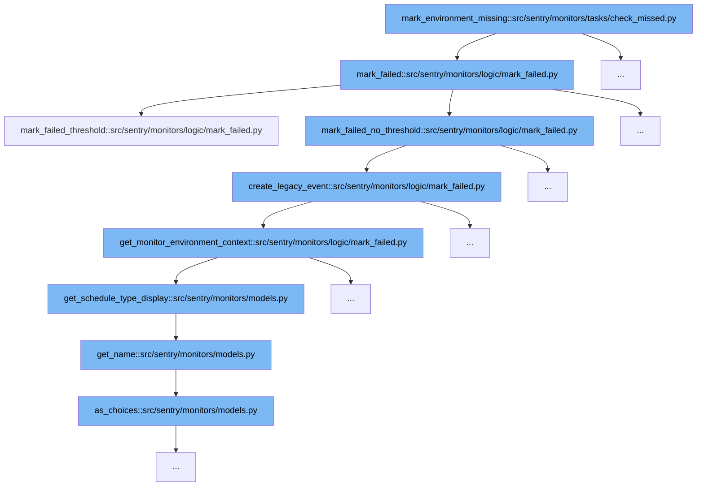

This document outlines the flow of marking environments as missing or failed within Sentry's monitoring system. The process involves several steps and functions to handle different scenarios based on the check-in status of a monitor. Here's what we'll cover:

1. Initiating the process with `mark_environment_missing`
2. Determining the failure type and handling with `mark_failed`
3. Handling threshold-based failures with `mark_failed_threshold`
4. Handling non-threshold failures with `mark_failed_no_threshold`
5. Creating legacy events for monitoring failures
6. Retrieving and setting the monitoring environment context



<SwmSnippet path="/src/sentry/monitors/tasks/check_missed.py" line="1">

---

# Initiating the process with `mark_environment_missing`

The function `mark_environment_missing` initiates the process of checking for missed check-ins and determining if an environment should be marked as missing. This is the entry point for the monitoring failure handling flow.

```python
from __future__ import annotations
```

---

</SwmSnippet>

<SwmSnippet path="/src/sentry/monitors/logic/mark_failed.py" line="28">

---

# Determining the failure type and handling with `mark_failed`

The `mark_failed` function is called next. It determines the type of failure (missed, timed out, etc.) and handles it by either updating the monitor's status directly or delegating to other functions like `mark_failed_threshold` or `mark_failed_no_threshold` based on the configured thresholds.

```python
def mark_failed(
    failed_checkin: MonitorCheckIn,
    ts: datetime,
    received: datetime | None = None,
):
    """
    Given a failing check-in, mark the monitor environment as failed and trigger
    side effects for creating monitor incidents and issues.

    The provided `ts` is the reference time for when the next check-in time is
    calculated from. This typically would be the failed check-in's `date_added`
    or completion time. Though for the missed and timedout tasks this may be
    computed based on the tasks reference time.
    """
    monitor_env = failed_checkin.monitor_environment
    failure_issue_threshold = monitor_env.monitor.config.get("failure_issue_threshold", 1)
    if not failure_issue_threshold:
        failure_issue_threshold = 1

    # Compute the next check-in time from our reference time
    next_checkin = monitor_env.monitor.get_next_expected_checkin(ts)
```

---

</SwmSnippet>

<SwmSnippet path="/src/sentry/monitors/logic/mark_failed.py" line="101">

---

# Handling threshold-based failures with `mark_failed_threshold`

For failures that meet certain thresholds, `mark_failed_threshold` is invoked. This function checks previous check-ins against the threshold and decides whether to escalate the failure to an incident.

```python
def mark_failed_threshold(
    failed_checkin: MonitorCheckIn, failure_issue_threshold: int, received: datetime | None
):
    from sentry.signals import monitor_environment_failed

    monitor_env = failed_checkin.monitor_environment

    # check to see if we need to update the status
    if monitor_env.status in [MonitorStatus.OK, MonitorStatus.ACTIVE]:
        if failure_issue_threshold == 1:
            previous_checkins = [
                {
                    "id": failed_checkin.id,
                    "date_added": failed_checkin.date_added,
                    "status": failed_checkin.status,
                }
            ]
        else:
            previous_checkins = (
                # Using .values for performance reasons
                MonitorCheckIn.objects.filter(
```

---

</SwmSnippet>

<SwmSnippet path="/src/sentry/monitors/logic/mark_failed.py" line="200">

---

# Handling non-threshold failures with `mark_failed_no_threshold`

If the failure does not meet the threshold criteria, `mark_failed_no_threshold` is used. This function handles the failure without considering previous check-ins, typically leading to immediate actions like creating incidents.

```python
def create_legacy_event(failed_checkin: MonitorCheckIn):
    from sentry.coreapi import insert_data_to_database_legacy
    from sentry.event_manager import EventManager
    from sentry.models.project import Project

    monitor_env = failed_checkin.monitor_environment
    context = get_monitor_environment_context(monitor_env)

    # XXX(epurkhiser): This matches up with the occurrence_data reason
    reason_map = {
        CheckInStatus.MISSED: "missed_checkin",
        CheckInStatus.TIMEOUT: "duration",
    }
    reason = reason_map.get(failed_checkin.status, "unknown")

    event_manager = EventManager(
        {
            "logentry": {"message": f"Monitor failure: {monitor_env.monitor.name} ({reason})"},
            "contexts": {"monitor": context},
            "fingerprint": ["monitor", str(monitor_env.monitor.guid), reason],
            "environment": monitor_env.get_environment().name,
```

---

</SwmSnippet>

<SwmSnippet path="/src/sentry/monitors/logic/mark_failed.py" line="200">

---

# Creating legacy events for monitoring failures

The `create_legacy_event` function is responsible for creating legacy events in the system. These events log the failure details for historical and debugging purposes.

```python
def create_legacy_event(failed_checkin: MonitorCheckIn):
    from sentry.coreapi import insert_data_to_database_legacy
    from sentry.event_manager import EventManager
    from sentry.models.project import Project

    monitor_env = failed_checkin.monitor_environment
    context = get_monitor_environment_context(monitor_env)

    # XXX(epurkhiser): This matches up with the occurrence_data reason
    reason_map = {
        CheckInStatus.MISSED: "missed_checkin",
        CheckInStatus.TIMEOUT: "duration",
    }
    reason = reason_map.get(failed_checkin.status, "unknown")

    event_manager = EventManager(
        {
            "logentry": {"message": f"Monitor failure: {monitor_env.monitor.name} ({reason})"},
            "contexts": {"monitor": context},
            "fingerprint": ["monitor", str(monitor_env.monitor.guid), reason],
            "environment": monitor_env.get_environment().name,
```

---

</SwmSnippet>

<SwmSnippet path="/src/sentry/monitors/logic/mark_failed.py" line="314">

---

# Retrieving and setting the monitoring environment context

Finally, `get_monitor_environment_context` retrieves and sets the context for the monitoring environment. This includes details like the monitor's configuration and status, which are essential for the correct handling of the event.

```python
def get_monitor_environment_context(monitor_environment: MonitorEnvironment):
    config = monitor_environment.monitor.config.copy()
    if "schedule_type" in config:
        config["schedule_type"] = monitor_environment.monitor.get_schedule_type_display()

    return {
        "id": str(monitor_environment.monitor.guid),
        "slug": str(monitor_environment.monitor.slug),
        "name": monitor_environment.monitor.name,
        "config": monitor_environment.monitor.config,
        "status": monitor_environment.get_status_display(),
        "type": monitor_environment.monitor.get_type_display(),
    }
```

---

</SwmSnippet>

&nbsp;

*This is an auto-generated document by Swimm AI 🌊 and has not yet been verified by a human*

<SwmMeta version="3.0.0" repo-id="Z2l0aHViJTNBJTNBc2VudHJ5JTNBJTNBZ2V0c2VudHJ5" repo-name="sentry"><sup>Powered by [Swimm](/)</sup></SwmMeta>
