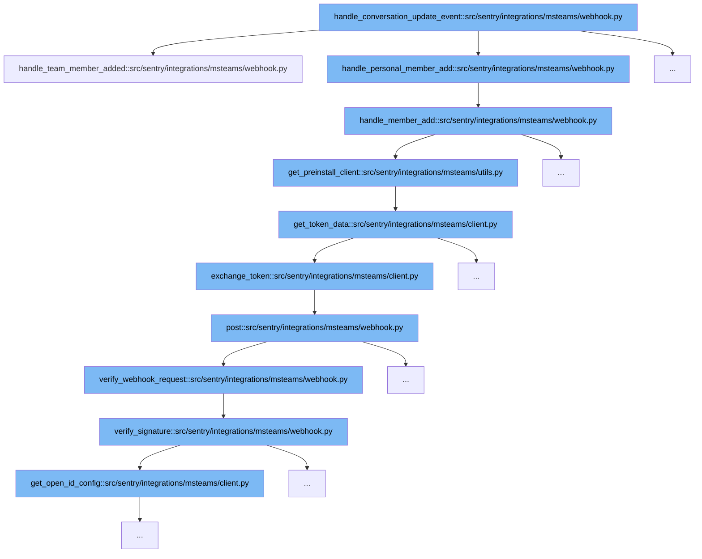

This document will explain the flow initiated by the `handle_conversation_update_event` function in the MS Teams integration of Sentry. The flow involves several steps to handle new member additions and authenticate requests:



<SwmSnippet path="/src/sentry/integrations/msteams/webhook.py" line="393">

---

# Initial Event Handling

The `handle_conversation_update_event` function starts by determining the type of update event (team or personal member addition) and delegates to the appropriate handler function. This step is crucial for routing the event correctly based on its context.

```python
    def handle_team_member_added(self, request: HttpRequest):
        data = request.data
        team = data["channelData"]["team"]
        data["conversation_id"] = team["id"]

        params = {
            "external_id": team["id"],
            "external_name": team["name"],
            "installation_type": "team",
        }

        return self.handle_member_add(data, params, build_team_installation_message)
```

---

</SwmSnippet>

<SwmSnippet path="/src/sentry/integrations/msteams/webhook.py" line="406">

---

# Member Addition Handling

In the `handle_member_add` function, the event details are used to construct parameters for the new member, which include IDs and service URLs. These parameters are essential for the subsequent API calls and for ensuring that the new member is added to the correct team or personal account.

```python
    def handle_member_add(
        self,
        data: Mapping[str, str],
        params: Mapping[str, str],
        build_installation_card: Callable[[str], AdaptiveCard],
    ) -> HttpResponse:
        # only care if our bot is the new member added
        matches = list(filter(lambda x: x["id"] == data["recipient"]["id"], data["membersAdded"]))
        if not matches:
            return self.respond(status=204)

        # need to keep track of the service url since we won't get it later
        params.update(
            {
                "service_url": data["serviceUrl"],
                "user_id": data["from"]["id"],
                "conversation_id": data["conversation_id"],
                "tenant_id": data["channelData"]["tenant"]["id"],
            }
        )

```

---

</SwmSnippet>

<SwmSnippet path="/src/sentry/integrations/msteams/utils.py" line="121">

---

# API Client Preparation

The `get_preinstall_client` function retrieves an access token and initializes an API client with it. This client is used to interact with the MS Teams service, which is necessary for sending messages or making further API requests.

```python
def get_preinstall_client(service_url):
    # may want try/catch here since this makes an external API call
    access_token = get_token_data()["access_token"]
    return MsTeamsPreInstallClient(access_token, service_url)
```

---

</SwmSnippet>

<SwmSnippet path="/src/sentry/integrations/msteams/client.py" line="148">

---

# Token Exchange

The `exchange_token` function is responsible for exchanging client credentials for an access token. This token is critical for authenticating the requests made by the API client to the MS Teams service.

```python
    def exchange_token(self):
        headers = {"Content-Type": "application/x-www-form-urlencoded"}
        data = {
            "client_id": self.client_id,
            "client_secret": self.client_secret,
            "grant_type": "client_credentials",
            "scope": "https://api.botframework.com/.default",
        }
        return self.post(self.TOKEN_URL, data=urlencode(data), headers=headers, json=False)
```

---

</SwmSnippet>

<SwmSnippet path="/src/sentry/integrations/msteams/webhook.py" line="376">

---

# Webhook Request Verification

The `verify_webhook_request` function ensures that the incoming webhook request is valid. It uses the `verify_signature` function to check the authenticity of the request, which is vital for security and preventing unauthorized access.

```python
        return self.respond(status=204)

    def verify_webhook_request(self, request: HttpRequest) -> bool:
```

---

</SwmSnippet>

&nbsp;

*This is an auto-generated document by Swimm AI 🌊 and has not yet been verified by a human*

<SwmMeta version="3.0.0" repo-id="Z2l0aHViJTNBJTNBc2VudHJ5JTNBJTNBZ2V0c2VudHJ5" repo-name="sentry"><sup>Powered by [Swimm](/)</sup></SwmMeta>
