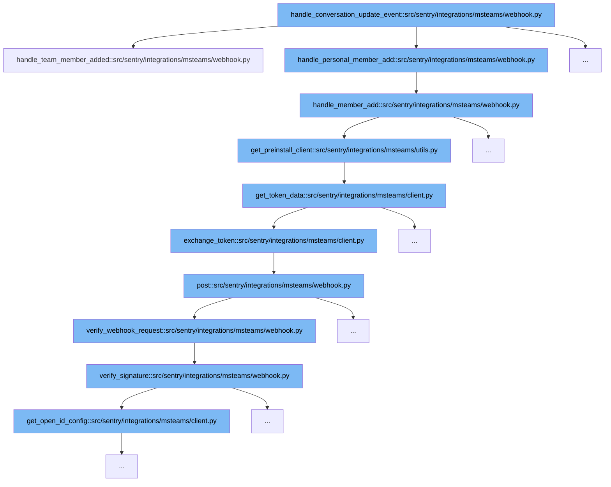

This document will explain the code flow initiated by the `handle_conversation_update_event` function in the MS Teams integration of Sentry. The flow involves several steps to handle new member additions and authenticate webhook requests. We'll cover:

1. Handling team member additions.
2. Handling personal member additions.
3. Pre-install client setup and token exchange.
4. Webhook request verification.



<SwmSnippet path="/src/sentry/integrations/msteams/webhook.py" line="393">

---

# Handling Team Member Additions

This function processes the addition of a new team member by extracting team data from the request and preparing parameters for further processing. It then delegates to `handle_member_add` to continue the flow.

```python
    def handle_team_member_added(self, request: HttpRequest):
        data = request.data
        team = data["channelData"]["team"]
        data["conversation_id"] = team["id"]

        params = {
            "external_id": team["id"],
            "external_name": team["name"],
            "installation_type": "team",
        }

        return self.handle_member_add(data, params, build_team_installation_message)
```

---

</SwmSnippet>

<SwmSnippet path="/src/sentry/integrations/msteams/webhook.py" line="406">

---

# Handling Personal Member Additions

After a team member is added, this function is called to handle personal member additions. It filters to check if the bot is the member added, updates parameters with service and user details, and sends a welcome message using a pre-install client.

```python
    def handle_member_add(
        self,
        data: Mapping[str, str],
        params: Mapping[str, str],
        build_installation_card: Callable[[str], AdaptiveCard],
    ) -> HttpResponse:
        # only care if our bot is the new member added
        matches = list(filter(lambda x: x["id"] == data["recipient"]["id"], data["membersAdded"]))
        if not matches:
            return self.respond(status=204)

        # need to keep track of the service url since we won't get it later
        params.update(
            {
                "service_url": data["serviceUrl"],
                "user_id": data["from"]["id"],
                "conversation_id": data["conversation_id"],
                "tenant_id": data["channelData"]["tenant"]["id"],
            }
        )

```

---

</SwmSnippet>

<SwmSnippet path="/src/sentry/integrations/msteams/utils.py" line="121">

---

# Pre-install Client Setup and Token Exchange

This function sets up a pre-install client by fetching an access token using `get_token_data`, which internally calls `exchange_token` to retrieve the token from MS Teams.

```python
def get_preinstall_client(service_url):
    # may want try/catch here since this makes an external API call
    access_token = get_token_data()["access_token"]
    return MsTeamsPreInstallClient(access_token, service_url)
```

---

</SwmSnippet>

<SwmSnippet path="/src/sentry/integrations/msteams/webhook.py" line="376">

---

# Webhook Request Verification

This function verifies the webhook request by checking the signature. It ensures the request is authenticated and valid, using JWT and other security checks, before allowing further processing.

```python
        return self.respond(status=204)

    def verify_webhook_request(self, request: HttpRequest) -> bool:
```

---

</SwmSnippet>

&nbsp;

*This is an auto-generated document by Swimm AI 🌊 and has not yet been verified by a human*

<SwmMeta version="3.0.0" repo-id="Z2l0aHViJTNBJTNBc2VudHJ5JTNBJTNBZ2V0c2VudHJ5" repo-name="sentry"><sup>Powered by [Swimm](/)</sup></SwmMeta>
