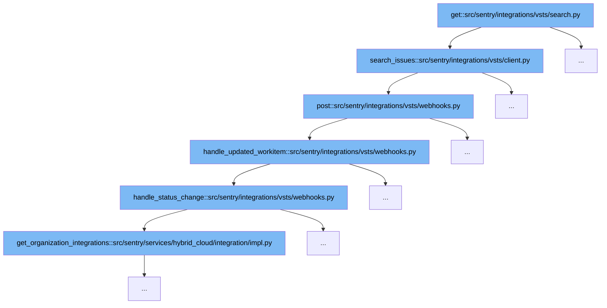

This document outlines the flow of handling VSTS integration updates in Sentry, specifically focusing on the search and update of work items. The flow involves several steps:

1. Initiating a search for issues.
2. Posting updates to VSTS.
3. Handling updated work items.
4. Managing status changes in work items.



<SwmSnippet path="/src/sentry/integrations/vsts/search.py" line="1">

---

# Initiating a Search for Issues

The function `get` in `search.py` initiates the search process by calling `search_issues` to query VSTS for specific issues based on provided criteria.

```python
from typing import Any
```

---

</SwmSnippet>

<SwmSnippet path="/src/sentry/integrations/vsts/client.py" line="415">

---

# Posting Updates to VSTS

The `search_issues` function constructs a POST request to the VSTS API to search for work items. This is a critical step as it interfaces directly with VSTS to fetch the necessary data.

```python
    def search_issues(self, account_name: str, query: str | None = None) -> Response:
        return self.post(
            VstsApiPath.work_item_search.format(account_name=account_name),
            data={"searchText": query, "$top": 1000},
            api_preview=True,
        )
```

---

</SwmSnippet>

<SwmSnippet path="/src/sentry/integrations/vsts/webhooks.py" line="151">

---

# Handling Updated Work Items

Once updates are received from VSTS, `handle_updated_workitem` processes the data, checking for necessary fields and handling any exceptions. This function is pivotal in ensuring that the updates are processed correctly within Sentry.

```python
def handle_updated_workitem(data: Mapping[str, Any], integration: RpcIntegration) -> None:
    project: str | None = None
    try:
        external_issue_key = data["resource"]["workItemId"]
    except KeyError as e:
        logger.info(
            "vsts.updating-workitem-does-not-have-necessary-information",
            extra={"error": str(e), "integration_id": integration.id},
        )
        return

    try:
        project = data["resourceContainers"]["project"]["id"]
    except KeyError as e:
        logger.info(
            "vsts.updating-workitem-does-not-have-necessary-information",
            extra={"error": str(e), "integration_id": integration.id},
        )

    try:
        assigned_to = data["resource"]["fields"].get("System.AssignedTo")
```

---

</SwmSnippet>

<SwmSnippet path="/src/sentry/integrations/vsts/webhooks.py" line="124">

---

# Managing Status Changes in Work Items

The `handle_status_change` function takes the updated work item and synchronizes the status changes with Sentry's internal systems. This includes updating the state of linked issues and ensuring that the Sentry integration reflects the current state of the work item in VSTS.

```python
def handle_status_change(
    integration: RpcIntegration,
    external_issue_key: str,
    status_change: Mapping[str, str] | None,
    project: str | None,
) -> None:
    if status_change is None:
        return

    org_integrations = integration_service.get_organization_integrations(
        integration_id=integration.id
    )

    for org_integration in org_integrations:
        installation = integration.get_installation(organization_id=org_integration.organization_id)
        if isinstance(installation, IssueSyncMixin):
            installation.sync_status_inbound(
                external_issue_key,
                {
                    "new_state": status_change["newValue"],
                    # old_state is None when the issue is New
```

---

</SwmSnippet>

&nbsp;

*This is an auto-generated document by Swimm AI 🌊 and has not yet been verified by a human*

<SwmMeta version="3.0.0" repo-id="Z2l0aHViJTNBJTNBc2VudHJ5JTNBJTNBZ2V0c2VudHJ5" repo-name="sentry"><sup>Powered by [Swimm](/)</sup></SwmMeta>
