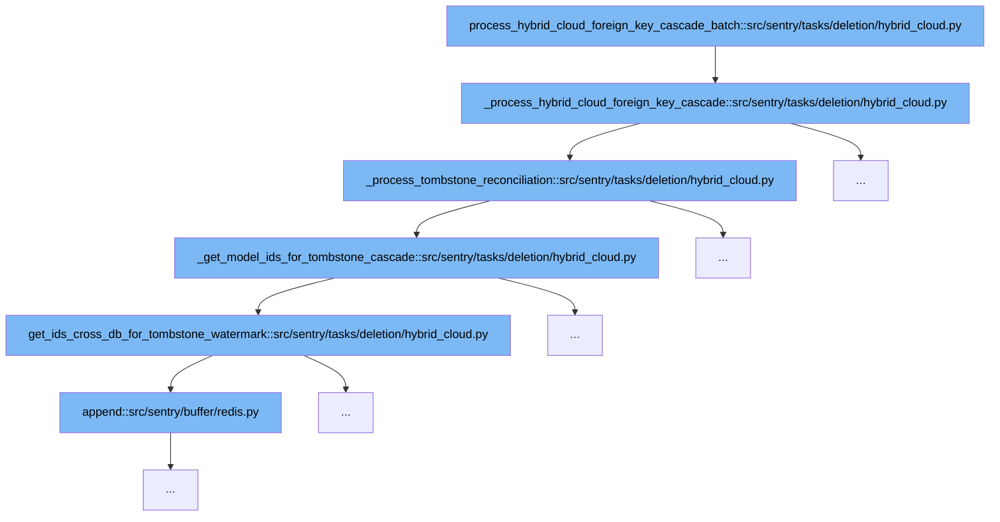

This document outlines the process involved in the deletion task for hybrid cloud environments within Sentry's codebase. The process is designed to handle foreign key cascades and tombstone reconciliation efficiently across different database setups. The key steps include:



<SwmSnippet path="/src/sentry/tasks/deletion/hybrid_cloud.py" line="180">

---

# Initial Function Invocation

The `process_hybrid_cloud_foreign_key_cascade_batch` function initiates the deletion process. It sets up the context and calls `_process_hybrid_cloud_foreign_key_cascade` to handle the deletion of records linked through foreign keys in a hybrid cloud setup.

```python
def _process_hybrid_cloud_foreign_key_cascade(
    app_name: str, model_name: str, field_name: str, process_task: Task, silo_mode: SiloMode
) -> None:
    """
    Called by the silo bound tasks above.
    """
    try:
        model = apps.get_model(app_label=app_name, model_name=model_name)
        try:
            field = model._meta.get_field(field_name)
            if not isinstance(field, HybridCloudForeignKey):
                raise Exception(f"The {field_name} field is not a HybridCloudForeignKey")
        except Exception as err:
            sentry_sdk.capture_exception(err)
            raise LookupError(f"Could not find field {field_name} on model {app_name}.{model_name}")

        tombstone_cls = TombstoneBase.class_for_silo_mode(silo_mode)
        assert tombstone_cls, "A tombstone class is required"

        # We rely on the return value of _process_tombstone_reconciliation
        # to short circuit the second half of this `or` so that the terminal batch
```

---

</SwmSnippet>

<SwmSnippet path="/src/sentry/tasks/deletion/hybrid_cloud.py" line="180">

---

# Processing Foreign Key Cascade

The `_process_hybrid_cloud_foreign_key_cascade` function is responsible for managing the cascade deletion process. It checks the type of foreign key and triggers the tombstone reconciliation process if necessary, ensuring that deletions are correctly propagated across related records.

```python
def _process_hybrid_cloud_foreign_key_cascade(
    app_name: str, model_name: str, field_name: str, process_task: Task, silo_mode: SiloMode
) -> None:
    """
    Called by the silo bound tasks above.
    """
    try:
        model = apps.get_model(app_label=app_name, model_name=model_name)
        try:
            field = model._meta.get_field(field_name)
            if not isinstance(field, HybridCloudForeignKey):
                raise Exception(f"The {field_name} field is not a HybridCloudForeignKey")
        except Exception as err:
            sentry_sdk.capture_exception(err)
            raise LookupError(f"Could not find field {field_name} on model {app_name}.{model_name}")

        tombstone_cls = TombstoneBase.class_for_silo_mode(silo_mode)
        assert tombstone_cls, "A tombstone class is required"

        # We rely on the return value of _process_tombstone_reconciliation
        # to short circuit the second half of this `or` so that the terminal batch
```

---

</SwmSnippet>

<SwmSnippet path="/src/sentry/tasks/deletion/hybrid_cloud.py" line="233">

---

# Tombstone Reconciliation

The `_process_tombstone_reconciliation` function manages the reconciliation of tombstones, which are markers for deleted records. It determines whether more records need to be processed and handles the batch deletion or update operations based on the type of foreign key action (CASCADE, SET_NULL, DO_NOTHING).

```python
def _process_tombstone_reconciliation(
    field: HybridCloudForeignKey,
    model: Any,
    tombstone_cls: type[TombstoneBase],
    row_after_tombstone: bool,
) -> bool:
    from sentry import deletions

    prefix = "tombstone"
    watermark_manager: BaseManager = tombstone_cls.objects
    if row_after_tombstone:
        prefix = "row"
        watermark_manager = field.model.objects

    watermark_batch = _chunk_watermark_batch(
        prefix, field, watermark_manager, batch_size=get_batch_size()
    )
    has_more = watermark_batch.has_more
    if watermark_batch.low < watermark_batch.up:
        to_delete_ids, oldest_seen = _get_model_ids_for_tombstone_cascade(
            tombstone_cls=tombstone_cls,
```

---

</SwmSnippet>

<SwmSnippet path="/src/sentry/tasks/deletion/hybrid_cloud.py" line="296">

---

# Retrieving Model IDs for Tombstone Cascade

The `_get_model_ids_for_tombstone_cascade` function fetches the IDs of the models that need to be deleted or updated. This function is crucial for maintaining data integrity across the database by ensuring that all related records are considered during the deletion process.

```python
def _get_model_ids_for_tombstone_cascade(
    tombstone_cls: type[TombstoneBase],
    model: type[Model],
    field: HybridCloudForeignKey,
    row_after_tombstone: bool,
    watermark_batch: WatermarkBatch,
) -> tuple[list[int], datetime.datetime]:
    """
    Queries the database or databases if spanning multiple, and returns
     a tuple with a list of row IDs to delete, and the oldest
     tombstone timestamp for the batch.

    :param tombstone_cls: Either a RegionTombstone or ControlTombstone, depending on
     which silo the tombstone process is running.
    :param model: The model with a HybridCloudForeignKey to process.
    :param field: The HybridCloudForeignKey field from the model to process.
    :param row_after_tombstone: Determines which table is bound by the
     watermark batch. When set to true, the model's IDs are used as the
     bounds, otherwise, the tombstone's IDs are used.
    :param watermark_batch: The batch information containing ID bounds for the
     watermark query.
```

---

</SwmSnippet>

<SwmSnippet path="/src/sentry/tasks/deletion/hybrid_cloud.py" line="409">

---

# Cross-Database ID Retrieval for Tombstones

The `get_ids_cross_db_for_tombstone_watermark` function handles the retrieval of model IDs across different databases, which is essential for operations in a hybrid cloud environment where data might be distributed across multiple databases.

```python
def get_ids_cross_db_for_tombstone_watermark(
    tombstone_cls: type[TombstoneBase],
    model: type[Model],
    field: HybridCloudForeignKey,
    tombstone_watermark_batch: WatermarkBatch,
) -> tuple[list[int], datetime.datetime]:
    oldest_seen = timezone.now()

    tombstone_entries = tombstone_cls.objects.filter(
        id__lte=tombstone_watermark_batch.up,
        id__gt=tombstone_watermark_batch.low,
        table_name=field.foreign_table_name,
    ).values_list("object_identifier", "created_at")

    ids_to_check = []
    for object_id, created_at in tombstone_entries:
        ids_to_check.append(object_id)
        oldest_seen = min(oldest_seen, created_at)

    field_name = f"{field.name}__in"
    query_kwargs = {field_name: ids_to_check}
```

---

</SwmSnippet>

&nbsp;

*This is an auto-generated document by Swimm AI 🌊 and has not yet been verified by a human*

<SwmMeta version="3.0.0" repo-id="Z2l0aHViJTNBJTNBc2VudHJ5JTNBJTNBZ2V0c2VudHJ5" repo-name="sentry"><sup>Powered by [Swimm](/)</sup></SwmMeta>
