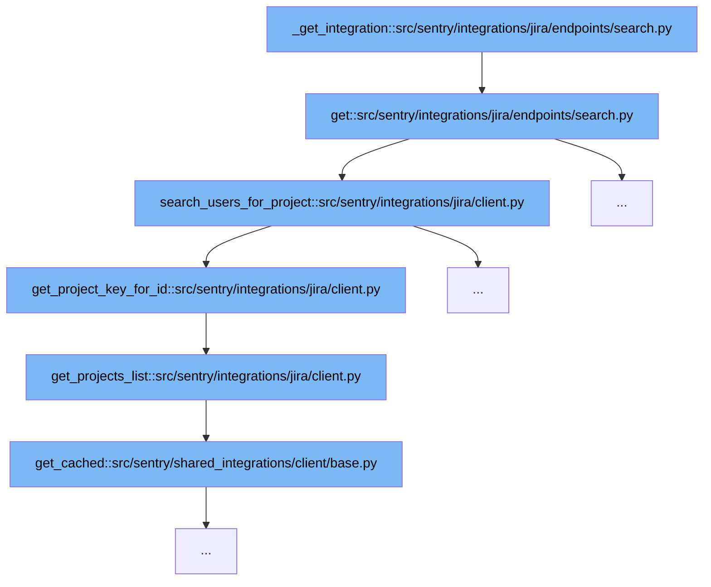

This document outlines the flow of Jira integration for searching and handling user queries within Sentry. The flow involves several steps, each crucial for handling different aspects of a user's search query in Jira through Sentry's integration system. We'll cover:

1. Initialization of the integration and handling of the search query.
2. Searching for users within a Jira project based on the query.
3. Retrieving project keys for a given project ID.
4. Fetching a list of all projects from Jira.
5. Caching the results to optimize performance.



<SwmSnippet path="/src/sentry/integrations/jira/endpoints/search.py" line="39">

---

# Initialization and Handling Search Query

The `get` function initializes the integration by fetching the Jira integration instance and preparing the Jira client for subsequent operations. It handles different search fields such as 'externalIssue', 'assignee', and 'reporter', and constructs appropriate responses based on the field and query provided by the user.

```python
    def get(
        self, request: Request, organization: RpcOrganization, integration_id: int, **kwds: Any
    ) -> Response:
        try:
            integration = self._get_integration(organization, integration_id)
        except Integration.DoesNotExist:
            return Response(status=404)
        installation = integration.get_installation(organization.id)
        if not isinstance(installation, JiraIntegration):
            raise NotFound("Integration by that id is not a JiraIntegration.")
        jira_client = installation.get_client()

        field = request.GET.get("field")
        query = request.GET.get("query")

        if field is None:
            return Response({"detail": "field is a required parameter"}, status=400)
        if not query:
            return Response({"detail": "query is a required parameter"}, status=400)

        if field in ("externalIssue", "parent"):
```

---

</SwmSnippet>

<SwmSnippet path="/src/sentry/integrations/jira/client.py" line="169">

---

# Searching Users for Project

The `search_users_for_project` function is called with a project key and a username. It utilizes the project key obtained from `get_project_key_for_id` to perform a user search specific to the project, leveraging cached results for efficiency.

```python
    def search_users_for_project(self, project, username):
        # Jira Server wants a project key, while cloud is indifferent.
        project_key = self.get_project_key_for_id(project)
        return self.get_cached(
            self.USERS_URL, params={"project": project_key, self.user_query_param(): username}
        )
```

---

</SwmSnippet>

<SwmSnippet path="/src/sentry/integrations/jira/client.py" line="125">

---

# Retrieving Project Key

This function fetches the project key for a given project ID by iterating over all projects fetched from `get_projects_list`. The project key is essential for querying project-specific information such as user roles.

```python
    def get_project_key_for_id(self, project_id) -> str:
        if not project_id:
            return ""
        projects = self.get_projects_list()
        for project in projects:
            if project["id"] == project_id:
                return project["key"]
        return ""
```

---

</SwmSnippet>

<SwmSnippet path="/src/sentry/integrations/jira/client.py" line="122">

---

# Fetching Projects List

The `get_projects_list` function retrieves a list of all projects from Jira. This list is used to support other functions like `get_project_key_for_id` by providing necessary project details.

```python
    def get_projects_list(self):
        return self.get_cached(self.PROJECT_URL)
```

---

</SwmSnippet>

<SwmSnippet path="/src/sentry/shared_integrations/client/base.py" line="1">

---

# Caching Results

The `get_cached` function in the shared integrations client is used extensively in the Jira client to cache responses from Jira. This reduces the number of API calls made to Jira, improving performance and reducing latency.

```python
from __future__ import annotations
```

---

</SwmSnippet>

&nbsp;

*This is an auto-generated document by Swimm AI 🌊 and has not yet been verified by a human*

<SwmMeta version="3.0.0" repo-id="Z2l0aHViJTNBJTNBc2VudHJ5JTNBJTNBZ2V0c2VudHJ5" repo-name="sentry"><sup>Powered by [Swimm](/)</sup></SwmMeta>
