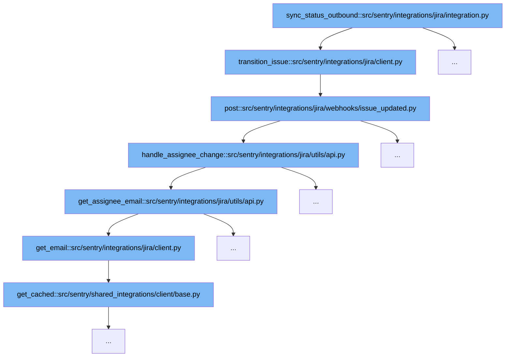

This document outlines the flow of outbound status synchronization with JIRA in Sentry. It will cover:

1. Initiating the status transition in JIRA.
2. Handling the webhook response for issue updates.
3. Processing assignee changes and updating email information.



<SwmSnippet path="/src/sentry/integrations/jira/client.py" line="198">

---

# Initiating the Status Transition in JIRA

The function `transition_issue` in `src/sentry/integrations/jira/client.py` is responsible for initiating a status transition in JIRA. It sends a POST request to the JIRA API with the transition details.

```python
    def transition_issue(self, issue_key, transition_id):
        return self.post(
            self.TRANSITION_URL % issue_key, data={"transition": {"id": transition_id}}
        )
```

---

</SwmSnippet>

<SwmSnippet path="/src/sentry/integrations/jira/webhooks/issue_updated.py" line="50">

---

# Handling the Webhook Response for Issue Updates

The `post` method in `src/sentry/integrations/jira/webhooks/issue_updated.py` handles the webhook response from JIRA when an issue is updated. It processes the response to determine if there are changes related to the assignee or the status of the issue.

```python
    def post(self, request: Request, *args, **kwargs) -> Response:
        token = self.get_token(request)
        rpc_integration = get_integration_from_jwt(
            token=token,
            path=request.path,
            provider=self.provider,
            query_params=request.GET,
            method="POST",
        )
        # Integrations and their corresponding RpcIntegrations share the same id,
        # so we don't need to first convert this to a full Integration object
        bind_org_context_from_integration(rpc_integration.id, {"webhook": "issue_updated"})
        sentry_sdk.set_tag("integration_id", rpc_integration.id)

        data = request.data
        if not data.get("changelog"):
            logger.info("jira.missing-changelog", extra={"integration_id": rpc_integration.id})
            return self.respond()

        handle_assignee_change(rpc_integration, data, use_email_scope=settings.JIRA_USE_EMAIL_SCOPE)
        handle_status_change(rpc_integration, data)
```

---

</SwmSnippet>

<SwmSnippet path="/src/sentry/integrations/jira/utils/api.py" line="47">

---

# Processing Assignee Changes and Updating Email Information

The `handle_assignee_change` function in `src/sentry/integrations/jira/utils/api.py` processes any changes to the assignee of an issue. It retrieves the assignee's email, either from the provided data or by querying the JIRA API, and updates the relevant Sentry group.

```python
def handle_assignee_change(
    integration: RpcIntegration,
    data: Mapping[str, Any],
    use_email_scope: bool = False,
) -> None:
    issue_key = data["issue"]["key"]

    log_context = {"issue_key": issue_key, "integration_id": integration.id}
    assignee_changed = any(
        item for item in data["changelog"]["items"] if item["field"] == "assignee"
    )
    if not assignee_changed:
        logger.info("jira.assignee-not-in-changelog", extra=log_context)
        return

    # If there is no assignee, assume it was unassigned.
    fields = data["issue"]["fields"]
    assignee = fields.get("assignee")

    if assignee is None:
        sync_group_assignee_inbound(integration, None, issue_key, assign=False)
```

---

</SwmSnippet>

&nbsp;

*This is an auto-generated document by Swimm AI 🌊 and has not yet been verified by a human*

<SwmMeta version="3.0.0" repo-id="Z2l0aHViJTNBJTNBc2VudHJ5JTNBJTNBZ2V0c2VudHJ5" repo-name="sentry"><sup>Powered by [Swimm](/)</sup></SwmMeta>
