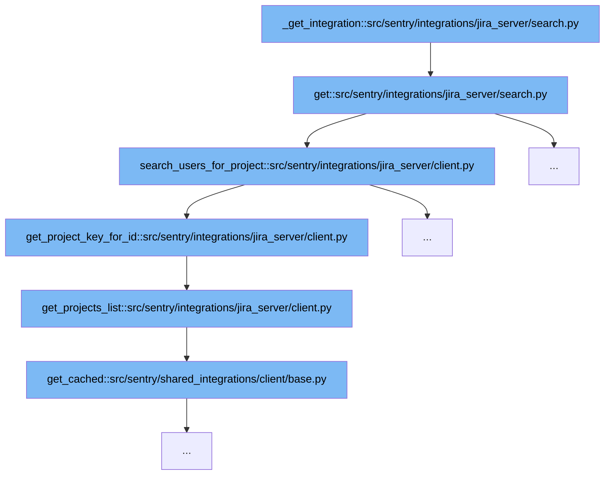

This document outlines the flow of integrating with Jira Server to fetch user data based on project and field criteria. The flow is named 'Jira Server Integration for User Data Retrieval'. We'll cover:

1. Initialization of the integration and fetching the Jira client.
2. Handling user queries based on project and field parameters.



<SwmSnippet path="/src/sentry/integrations/jira_server/search.py" line="33">

---

# Initialization of the Integration and Fetching the Jira Client

The `get` function initializes the integration with Jira Server. It retrieves the integration details and sets up the Jira client for further operations. This is the first step in the flow where the system prepares to handle user queries by setting up necessary configurations and clients.

```python
    def get(
        self, request: Request, organization: RpcOrganization, integration_id: int, **kwds: Any
    ) -> Response:
        try:
            integration = self._get_integration(organization, integration_id)
        except Integration.DoesNotExist:
            return Response(status=404)
        installation = integration.get_installation(organization.id)
        jira_client = installation.get_client()
```

---

</SwmSnippet>

<SwmSnippet path="/src/sentry/integrations/jira_server/search.py" line="65">

---

# Handling User Queries Based on Project and Field Parameters

Based on the user's input for 'field' and 'query', this step uses the Jira client to fetch user data. If the field is 'assignee' or 'reporter', it calls `search_users_for_project` which further processes the project key and fetches the user list from Jira Server. This step directly relates to the goal of the flow by utilizing the initialized client to retrieve specific data based on user input.

```python
        if field in ("assignee", "reporter"):
            try:
                response = jira_client.search_users_for_project(
                    request.GET.get("project", ""), query
                )
            except (ApiUnauthorized, ApiError):
                return Response({"detail": "Unable to fetch users from Jira"}, status=400)

            user_tuples = filter(
                None, [build_user_choice(user, jira_client.user_id_field()) for user in response]
            )
            users = [{"value": user_id, "label": display} for user_id, display in user_tuples]
            return Response(users)
```

---

</SwmSnippet>

&nbsp;

*This is an auto-generated document by Swimm AI 🌊 and has not yet been verified by a human*

<SwmMeta version="3.0.0" repo-id="Z2l0aHViJTNBJTNBc2VudHJ5JTNBJTNBZ2V0c2VudHJ5" repo-name="sentry"><sup>Powered by [Swimm](/)</sup></SwmMeta>
