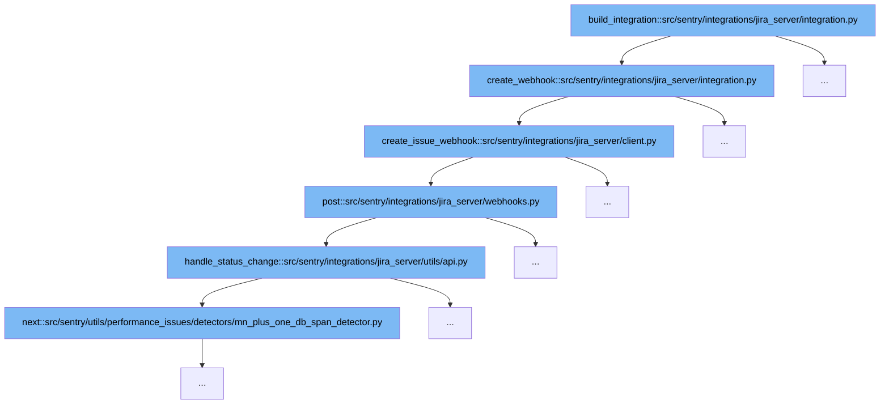

This document outlines the process involved in building a Jira Server integration within Sentry, specifically focusing on the creation and management of webhooks for issue synchronization. The steps include:

1. Initiating the webhook creation process.
2. Creating an issue webhook on the Jira server.
3. Posting the webhook data.
4. Handling status changes from Jira.



<SwmSnippet path="/src/sentry/integrations/jira_server/integration.py" line="1217">

---

# Initiating the Webhook Creation Process

The `create_webhook` function initializes the webhook creation process by setting up a client with necessary credentials and then attempting to create an issue webhook. This is the first step in integrating with Jira Server to synchronize issue statuses.

```python
    def create_webhook(self, external_id, webhook_secret, install, credentials):
        client = JiraServerSetupClient(
            install["url"], install["consumer_key"], install["private_key"], install["verify_ssl"]
        )
        try:
            client.create_issue_webhook(external_id, webhook_secret, credentials)
        except ApiError as err:
            logger.info(
                "jira-server.webhook.failed",
                extra={"error": str(err), "external_id": external_id},
            )
            try:
                details = next(x for x in err.json["messages"][0].values())
            except (KeyError, TypeError, StopIteration):
                details = ""
            message = f"Could not create issue webhook in Jira. {details}"
            raise IntegrationError(message)
```

---

</SwmSnippet>

<SwmSnippet path="/src/sentry/integrations/jira_server/client.py" line="279">

---

# Creating an Issue Webhook on Jira Server

In this step, the `create_issue_webhook` function is called to actually create the webhook on Jira Server. It constructs the necessary authentication and data payload which includes the webhook URL and the events it should listen to.

```python
    def create_issue_webhook(self, external_id, secret, credentials):
        auth = OAuth1(
            client_key=credentials["consumer_key"],
            rsa_key=credentials["private_key"],
            resource_owner_key=credentials["access_token"],
            resource_owner_secret=credentials["access_token_secret"],
            signature_method=SIGNATURE_RSA,
            signature_type="auth_header",
            decoding=None,
        )

        # Create a JWT token that we can add to the webhook URL
        # so we can locate the matching integration later.
        token = jwt.encode({"id": external_id}, secret)
        path = reverse("sentry-extensions-jiraserver-issue-updated", kwargs={"token": token})
        data = {
            "name": "Sentry Issue Sync",
            "url": absolute_uri(path),
            "events": ["jira:issue_created", "jira:issue_updated"],
        }
        return self.post("/rest/webhooks/1.0/webhook", auth=auth, data=data)
```

---

</SwmSnippet>

<SwmSnippet path="/src/sentry/integrations/jira_server/webhooks.py" line="63">

---

# Posting the Webhook Data

The `post` function handles the sending of the webhook data to Jira Server. It includes error handling and logging, ensuring that the webhook data is correctly processed or providing feedback if an error occurs.

```python
    def post(self, request: Request, token, *args, **kwargs) -> Response:
        clear_tags_and_context()
        extra = {}
        try:
            integration = get_integration_from_token(token)
            extra["integration_id"] = integration.id
        except ValueError as err:
            extra.update({"token": token, "error": str(err)})
            logger.warning("token-validation-error", extra=extra)
            metrics.incr("jira_server.webhook.invalid_token")
            return self.respond(status=400)

        data = request.data

        # Note: If we ever process more webhooks from jira server
        # we also need to update JiraServerRequestParser
        if not data.get("changelog"):
            logger.info("missing-changelog", extra=extra)
            return self.respond()

        try:
```

---

</SwmSnippet>

<SwmSnippet path="/src/sentry/integrations/jira_server/utils/api.py" line="56">

---

# Handling Status Changes from Jira

The `handle_status_change` function processes any status changes received from Jira. It checks for changes in the issue status and synchronizes them with Sentry's internal systems, ensuring that the issue statuses are up-to-date.

```python
def handle_status_change(
    integration: RpcIntegration | Integration, data: Mapping[str, Any]
) -> None:
    status_changed = any(item for item in data["changelog"]["items"] if item["field"] == "status")
    if not status_changed:
        return

    issue_key = data["issue"]["key"]

    try:
        changelog = next(item for item in data["changelog"]["items"] if item["field"] == "status")
    except StopIteration:
        logger.info(
            "missing-changelog-status",
            extra={"issue_key": issue_key, "integration_id": integration.id},
        )
        return

    org_integrations = integration_service.get_organization_integrations(
        integration_id=integration.id,
        providers=[integration.provider],
```

---

</SwmSnippet>

&nbsp;

*This is an auto-generated document by Swimm AI 🌊 and has not yet been verified by a human*

<SwmMeta version="3.0.0" repo-id="Z2l0aHViJTNBJTNBc2VudHJ5JTNBJTNBZ2V0c2VudHJ5" repo-name="sentry"><sup>Powered by [Swimm](/)</sup></SwmMeta>
