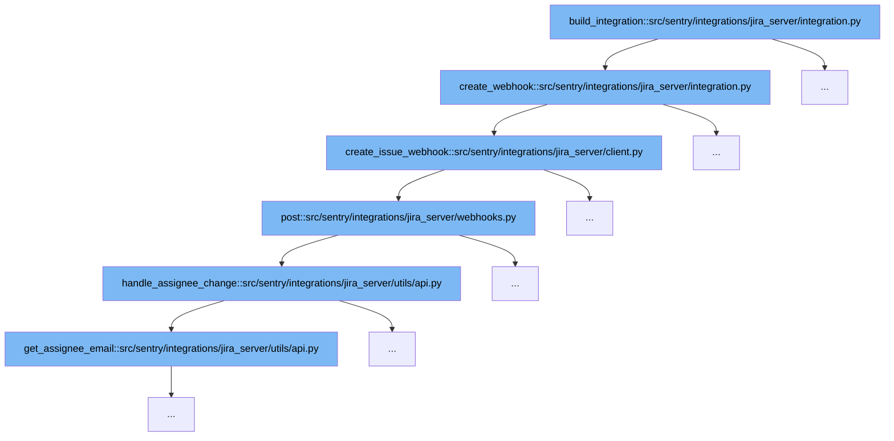

This document outlines the process involved in building a Jira Server integration within Sentry, specifically focusing on the creation and handling of webhooks for issue tracking. The steps include:

1. Initiating the webhook creation process.
2. Creating an issue webhook in Jira Server.
3. Posting the webhook data.
4. Handling changes in issue assignee.



<SwmSnippet path="/src/sentry/integrations/jira_server/integration.py" line="1217">

---

# Initiating the Webhook Creation Process

The `create_webhook` function initiates the process of creating a webhook in Jira Server. It sets up a client with necessary credentials and attempts to create an issue webhook, handling any potential errors that might occur during the process.

```python
    def create_webhook(self, external_id, webhook_secret, install, credentials):
        client = JiraServerSetupClient(
            install["url"], install["consumer_key"], install["private_key"], install["verify_ssl"]
        )
        try:
            client.create_issue_webhook(external_id, webhook_secret, credentials)
        except ApiError as err:
            logger.info(
                "jira-server.webhook.failed",
                extra={"error": str(err), "external_id": external_id},
            )
            try:
                details = next(x for x in err.json["messages"][0].values())
            except (KeyError, TypeError, StopIteration):
                details = ""
            message = f"Could not create issue webhook in Jira. {details}"
            raise IntegrationError(message)
```

---

</SwmSnippet>

<SwmSnippet path="/src/sentry/integrations/jira_server/client.py" line="279">

---

# Creating an Issue Webhook in Jira Server

Within the `create_issue_webhook` function, a webhook is configured and sent to Jira Server. This includes setting up authentication, generating a JWT token for the webhook URL, and defining the webhook's properties such as events to listen for.

```python
    def create_issue_webhook(self, external_id, secret, credentials):
        auth = OAuth1(
            client_key=credentials["consumer_key"],
            rsa_key=credentials["private_key"],
            resource_owner_key=credentials["access_token"],
            resource_owner_secret=credentials["access_token_secret"],
            signature_method=SIGNATURE_RSA,
            signature_type="auth_header",
            decoding=None,
        )

        # Create a JWT token that we can add to the webhook URL
        # so we can locate the matching integration later.
        token = jwt.encode({"id": external_id}, secret)
        path = reverse("sentry-extensions-jiraserver-issue-updated", kwargs={"token": token})
        data = {
            "name": "Sentry Issue Sync",
            "url": absolute_uri(path),
            "events": ["jira:issue_created", "jira:issue_updated"],
        }
        return self.post("/rest/webhooks/1.0/webhook", auth=auth, data=data)
```

---

</SwmSnippet>

<SwmSnippet path="/src/sentry/integrations/jira_server/webhooks.py" line="63">

---

# Posting the Webhook Data

The `post` function handles the incoming request to the webhook URL. It validates the token, extracts integration details, and processes the webhook data, specifically looking for changes in issue assignees and statuses.

```python
    def post(self, request: Request, token, *args, **kwargs) -> Response:
        clear_tags_and_context()
        extra = {}
        try:
            integration = get_integration_from_token(token)
            extra["integration_id"] = integration.id
        except ValueError as err:
            extra.update({"token": token, "error": str(err)})
            logger.warning("token-validation-error", extra=extra)
            metrics.incr("jira_server.webhook.invalid_token")
            return self.respond(status=400)

        data = request.data

        # Note: If we ever process more webhooks from jira server
        # we also need to update JiraServerRequestParser
        if not data.get("changelog"):
            logger.info("missing-changelog", extra=extra)
            return self.respond()

        try:
```

---

</SwmSnippet>

<SwmSnippet path="/src/sentry/integrations/jira_server/utils/api.py" line="25">

---

# Handling Changes in Issue Assignee

The `handle_assignee_change` function checks for changes in the issue's assignee from the webhook data. If a change is detected, it syncs this change within Sentry, updating the issue's assignee based on the new data provided by Jira.

```python
def handle_assignee_change(
    integration: RpcIntegration | Integration,
    data: Mapping[str, Any],
) -> None:
    assignee_changed = any(
        item for item in data["changelog"]["items"] if item["field"] == "assignee"
    )
    if not assignee_changed:
        return

    fields = data["issue"]["fields"]

    # If there is no assignee, assume it was unassigned.
    assignee = fields.get("assignee")
    issue_key = data["issue"]["key"]

    if assignee is None:
        sync_group_assignee_inbound(integration, None, issue_key, assign=False)
        return

    email = get_assignee_email(integration, assignee)
```

---

</SwmSnippet>

&nbsp;

*This is an auto-generated document by Swimm AI 🌊 and has not yet been verified by a human*

<SwmMeta version="3.0.0" repo-id="Z2l0aHViJTNBJTNBc2VudHJ5JTNBJTNBZ2V0c2VudHJ5" repo-name="sentry"><sup>Powered by [Swimm](/)</sup></SwmMeta>
