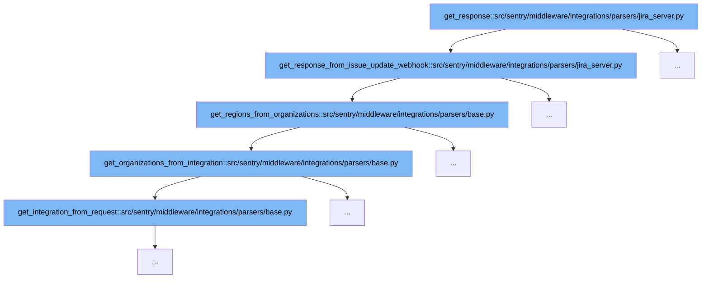

This document will explore the flow of handling JIRA server webhook responses in Sentry's middleware. We'll cover:

1. How the initial response is generated from a JIRA server webhook.
2. The process of fetching integration details from a webhook token.
3. Retrieval of organizations associated with the integration.
4. Determination of regions based on the organizations.



<SwmSnippet path="/src/sentry/middleware/integrations/parsers/jira_server.py" line="24">

---

# Initial Response Generation

The `get_response_from_issue_update_webhook` function initiates the response process by extracting the token and attempting to fetch integration details. If the token is invalid, it logs the error and returns an HTTP response with status 200.

```python
    def get_response_from_issue_update_webhook(self):
        token = self.match.kwargs.get("token")
        try:
            integration = get_integration_from_token(token)
        except ValueError as e:
            logger.info("%s.no_integration", self.provider, extra={"error": str(e)})
            return HttpResponse(status=200)

        organizations = self.get_organizations_from_integration(integration=integration)
        regions = self.get_regions_from_organizations(organizations=organizations)

        try:
            data = json.loads(self.request.body)
        except ValueError:
            data = {}

        # We only process webhooks with changelogs
        if not data.get("changelog"):
            logger.info("missing-changelog", extra={"integration_id": integration.id})
            return HttpResponse(status=200)

```

---

</SwmSnippet>

<SwmSnippet path="/src/sentry/middleware/integrations/parsers/base.py" line="260">

---

# Fetching Integration Details

The `get_integration_from_request` function is called to parse the request and retrieve the integration details necessary for further processing. This step is crucial for identifying the correct integration context.

```python
    def get_integration_from_request(self) -> Integration | None:
        """
        Parse the request to retreive organizations to forward the request to.
        Should be overwritten by implementation.
        """
        return None
```

---

</SwmSnippet>

<SwmSnippet path="/src/sentry/middleware/integrations/parsers/base.py" line="267">

---

# Retrieving Organizations

Once the integration is identified, `get_organizations_from_integration` fetches the organizations associated with the integration. This information is used to determine the scope of the webhook's effect.

```python
    # Optional Overrides

    def get_organizations_from_integration(
        self, integration: Integration | RpcIntegration | None = None
    ) -> Sequence[RpcOrganizationSummary]:
        """
        Use the get_integration_from_request() method to identify organizations associated with
        the integration request.
        """
        if not integration:
            integration = self.get_integration_from_request()
        if not integration:
            logger.info("%s.no_integration", self.provider, extra={"path": self.request.path})
            raise Integration.DoesNotExist()
        organization_integrations = OrganizationIntegration.objects.filter(
            integration_id=integration.id
        )

        if organization_integrations.count() == 0:
            logger.info(
                "%s.no_organization_integrations", self.provider, extra={"path": self.request.path}
```

---

</SwmSnippet>

<SwmSnippet path="/src/sentry/middleware/integrations/parsers/base.py" line="293">

---

# Determining Regions

The `get_regions_from_organizations` function uses the list of organizations to find relevant regions. This step is essential for routing the webhook data to the appropriate geographical areas.

```python
    def get_regions_from_organizations(
        self, organizations: Sequence[RpcOrganizationSummary] | None = None
    ) -> Sequence[Region]:
        """
        Use the get_organizations_from_integration() method to identify forwarding regions.
        """
        if not organizations:
            organizations = self.get_organizations_from_integration()

        region_names = find_regions_for_orgs([org.id for org in organizations])
        return sorted([get_region_by_name(name) for name in region_names], key=lambda r: r.name)
```

---

</SwmSnippet>

&nbsp;

*This is an auto-generated document by Swimm AI 🌊 and has not yet been verified by a human*

<SwmMeta version="3.0.0" repo-id="Z2l0aHViJTNBJTNBc2VudHJ5JTNBJTNBZ2V0c2VudHJ5" repo-name="sentry"><sup>Powered by [Swimm](/)</sup></SwmMeta>
