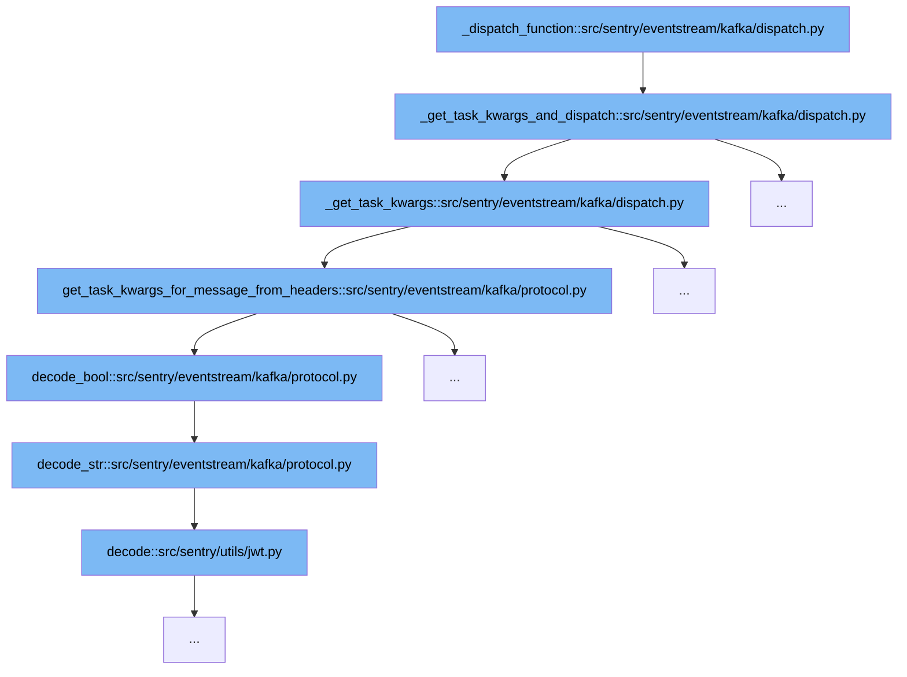

This document will explore the function `_dispatch_function` and its role in the Kafka event processing flow within Sentry. We'll cover:

1. The purpose of `_dispatch_function`.
2. The sequence of function calls initiated by `_dispatch_function`.
3. How each function contributes to processing Kafka events.



<SwmSnippet path="/src/sentry/eventstream/kafka/dispatch.py" line="86">

---

# Purpose of `_dispatch_function`

The `_dispatch_function` serves as the entry point for dispatching post-process tasks based on Kafka messages. It determines the appropriate task arguments and triggers the `dispatch_post_process_group_task` function if the arguments are valid.

```python
def _get_task_kwargs_and_dispatch(message: Message[KafkaPayload]) -> None:
    task_kwargs = _get_task_kwargs(message)
    if not task_kwargs:
        return None

    dispatch_post_process_group_task(**task_kwargs)
```

---

</SwmSnippet>

<SwmSnippet path="/src/sentry/eventstream/kafka/dispatch.py" line="86">

---

# Function Call Flow Initiated by `_dispatch_function`

After determining the task arguments, `_dispatch_function` checks if they are not null and proceeds to call `dispatch_post_process_group_task` with these arguments, effectively pushing the task to the processing queue.

```python
def _get_task_kwargs_and_dispatch(message: Message[KafkaPayload]) -> None:
    task_kwargs = _get_task_kwargs(message)
    if not task_kwargs:
        return None

    dispatch_post_process_group_task(**task_kwargs)
```

---

</SwmSnippet>

<SwmSnippet path="/src/sentry/eventstream/kafka/dispatch.py" line="86">

---

# Role of `_get_task_kwargs_and_dispatch`

`_get_task_kwargs_and_dispatch` is called by `_dispatch_function` to extract task arguments from the Kafka message. It uses `_get_task_kwargs` to parse the message and then decides whether to proceed based on the presence of valid arguments.

```python
def _get_task_kwargs_and_dispatch(message: Message[KafkaPayload]) -> None:
    task_kwargs = _get_task_kwargs(message)
    if not task_kwargs:
        return None

    dispatch_post_process_group_task(**task_kwargs)
```

---

</SwmSnippet>

<SwmSnippet path="/src/sentry/eventstream/kafka/dispatch.py" line="70">

---

# Extracting Task Arguments

`_get_task_kwargs` is responsible for extracting task arguments from the Kafka message. It checks if Kafka headers should be used and either fetches the task arguments from the headers or the message payload.

```python
def _get_task_kwargs(message: Message[KafkaPayload]) -> Mapping[str, Any] | None:
    use_kafka_headers = options.get("post-process-forwarder:kafka-headers")

    if use_kafka_headers:
        try:
            with _sampled_eventstream_timer(instance="get_task_kwargs_for_message_from_headers"):
                return get_task_kwargs_for_message_from_headers(message.payload.headers)
        except Exception as error:
            logger.warning("Could not forward message: %s", error, exc_info=True)
            with metrics.timer(_DURATION_METRIC, instance="get_task_kwargs_for_message"):
                return get_task_kwargs_for_message(message.payload.value)
    else:
        with metrics.timer(_DURATION_METRIC, instance="get_task_kwargs_for_message"):
            return get_task_kwargs_for_message(message.payload.value)
```

---

</SwmSnippet>

<SwmSnippet path="/src/sentry/eventstream/kafka/protocol.py" line="153">

---

# Decoding Message Headers

The function `get_task_kwargs_for_message_from_headers` decodes various task-related flags and identifiers from Kafka message headers, such as `is_new`, `is_regression`, and `project_id`, which are crucial for task execution logic.

```python
def get_task_kwargs_for_message_from_headers(
    headers: Sequence[tuple[str, bytes | None]]
) -> dict[str, Any] | None:
    """
    Same as get_task_kwargs_for_message but gets the required information from
    the kafka message headers.
    """
    try:
        header_data = {k: v for k, v in headers}

        def _required(k: str) -> bytes:
            v = header_data[k]
            if v is None:
                raise ValueError(f"expected {k!r} to be non-None")
            return v

        version = decode_int(_required("version"))
        operation = decode_str(_required("operation"))

        if operation == "insert":
            if "group_id" not in header_data:
```

---

</SwmSnippet>

&nbsp;

*This is an auto-generated document by Swimm AI 🌊 and has not yet been verified by a human*

<SwmMeta version="3.0.0" repo-id="Z2l0aHViJTNBJTNBc2VudHJ5JTNBJTNBZ2V0c2VudHJ5" repo-name="sentry"><sup>Powered by [Swimm](/)</sup></SwmMeta>
