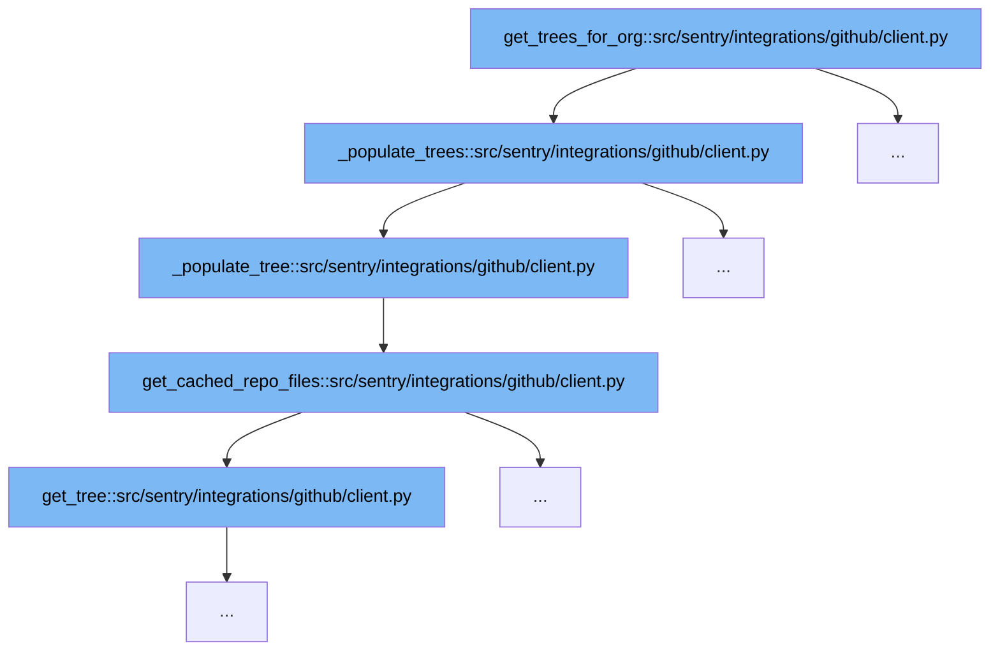

This document outlines the code flow for retrieving and caching GitHub repository trees in Sentry's GitHub integration. The flow is designed to efficiently manage API rate limits and ensure data availability even when direct API access is restricted. Key steps include:



<SwmSnippet path="/src/sentry/integrations/github/client.py" line="408">

---

# Initial Function Call: get_trees_for_org

The function `get_trees_for_org` initiates the process by calling `_populate_trees`, which orchestrates the fetching and caching of repository trees. It handles API rate limits and decides whether to fetch data from the cache or make a new API request based on the remaining rate limit.

```python
    def _populate_trees(self, repositories: list[dict[str, str]]) -> dict[str, RepoTree]:
        """
        For every repository, fetch the tree associated and cache it.
        This function takes API rate limits into consideration to prevent exhaustion.
        """
        trees: dict[str, RepoTree] = {}
        only_use_cache = False
        connection_error_count = 0

        remaining_requests = MINIMUM_REQUESTS
        try:
            rate_limit = self.get_rate_limit()
            remaining_requests = rate_limit.remaining
            logger.info("Current rate limit info.", extra={"rate_limit": rate_limit})
        except ApiError:
            only_use_cache = True
            # Report so we can investigate
            logger.exception("Loading trees from cache. Execution will continue. Check logs.")

        for index, repo_info in enumerate(repositories):
            repo_full_name = repo_info["full_name"]
```

---

</SwmSnippet>

<SwmSnippet path="/src/sentry/integrations/github/client.py" line="408">

---

# Fetching Repository Trees: \_populate_trees

Within `_populate_trees`, each repository's tree is fetched by calling `_populate_tree`. This function is responsible for individual repository processing, deciding on cache usage, and handling API errors effectively to ensure continuity in data retrieval.

```python
    def _populate_trees(self, repositories: list[dict[str, str]]) -> dict[str, RepoTree]:
        """
        For every repository, fetch the tree associated and cache it.
        This function takes API rate limits into consideration to prevent exhaustion.
        """
        trees: dict[str, RepoTree] = {}
        only_use_cache = False
        connection_error_count = 0

        remaining_requests = MINIMUM_REQUESTS
        try:
            rate_limit = self.get_rate_limit()
            remaining_requests = rate_limit.remaining
            logger.info("Current rate limit info.", extra={"rate_limit": rate_limit})
        except ApiError:
            only_use_cache = True
            # Report so we can investigate
            logger.exception("Loading trees from cache. Execution will continue. Check logs.")

        for index, repo_info in enumerate(repositories):
            repo_full_name = repo_info["full_name"]
```

---

</SwmSnippet>

<SwmSnippet path="/src/sentry/integrations/github/client.py" line="465">

---

# Individual Repository Processing: \_populate_tree

`_populate_tree` fetches or retrieves from cache the files of a single repository. It uses `get_cached_repo_files` to either fetch fresh data or use cached data based on the `only_use_cache` flag, which is influenced by the current API rate limit status.

```python
    def _populate_tree(
        self, repo_info: dict[str, str], only_use_cache: bool, cache_seconds: int
    ) -> RepoTree:
        full_name = repo_info["full_name"]
        branch = repo_info["default_branch"]
        repo_files = self.get_cached_repo_files(
            full_name, branch, only_use_cache=only_use_cache, cache_seconds=cache_seconds
        )
        return RepoTree(Repo(full_name, branch), repo_files)
```

---

</SwmSnippet>

<SwmSnippet path="/src/sentry/integrations/github/client.py" line="287">

---

# Caching Repository Files: get_cached_repo_files

The function `get_cached_repo_files` manages the caching mechanism. It checks if the required data is already in the cache and returns it; otherwise, it fetches data from GitHub using `get_tree` and caches it for future use, respecting the specified cache duration.

```python
    def get_cached_repo_files(
        self,
        repo_full_name: str,
        tree_sha: str,
        only_source_code_files: bool = True,
        only_use_cache: bool = False,
        cache_seconds: int = 3600 * 24,
    ) -> list[str]:
        """It return all files for a repo or just source code files.

        repo_full_name: e.g. getsentry/sentry
        tree_sha: A branch or a commit sha
        only_source_code_files: Include all files or just the source code files
        only_use_cache: Do not hit the network but use the value from the cache
            if any. This is useful if the remaining API requests are low
        cache_seconds: How long to cache a value for
        """
        key = f"github:repo:{repo_full_name}:{'source-code' if only_source_code_files else 'all'}"
        repo_files: list[str] = cache.get(key, [])
        if not repo_files and not only_use_cache:
            tree = self.get_tree(repo_full_name, tree_sha)
```

---

</SwmSnippet>

<SwmSnippet path="/src/sentry/integrations/github/client.py" line="264">

---

# Fetching Tree Data: get_tree

`get_tree` directly interacts with the GitHub API to fetch the tree data of a repository. It handles large data by checking if the response is truncated and logs a warning if so, suggesting a non-recursive fetch approach for complete data retrieval.

```python
    # https://docs.github.com/en/rest/git/trees#get-a-tree
    def get_tree(self, repo_full_name: str, tree_sha: str) -> JSONData:
        tree: JSONData = {}
        # We do not cache this call since it is a rather large object
        contents: dict[str, Any] = self.get(
            f"/repos/{repo_full_name}/git/trees/{tree_sha}",
            # Will cause all objects or subtrees referenced by the tree specified in :tree_sha
            params={"recursive": 1},
        )
        # If truncated is true in the response then the number of items in the tree array exceeded our maximum limit.
        # If you need to fetch more items, use the non-recursive method of fetching trees, and fetch one sub-tree at a time.
        # Note: The limit for the tree array is 100,000 entries with a maximum size of 7 MB when using the recursive parameter.
        # XXX: We will need to improve this by iterating through trees without using the recursive parameter
        if contents.get("truncated"):
            # e.g. getsentry/DataForThePeople
            logger.warning(
                "The tree for %s has been truncated. Use different a approach for retrieving contents of tree.",
                repo_full_name,
            )
        tree = contents["tree"]

```

---

</SwmSnippet>

&nbsp;

*This is an auto-generated document by Swimm AI 🌊 and has not yet been verified by a human*

<SwmMeta version="3.0.0" repo-id="Z2l0aHViJTNBJTNBc2VudHJ5JTNBJTNBZ2V0c2VudHJ5" repo-name="sentry"><sup>Powered by [Swimm](/)</sup></SwmMeta>
