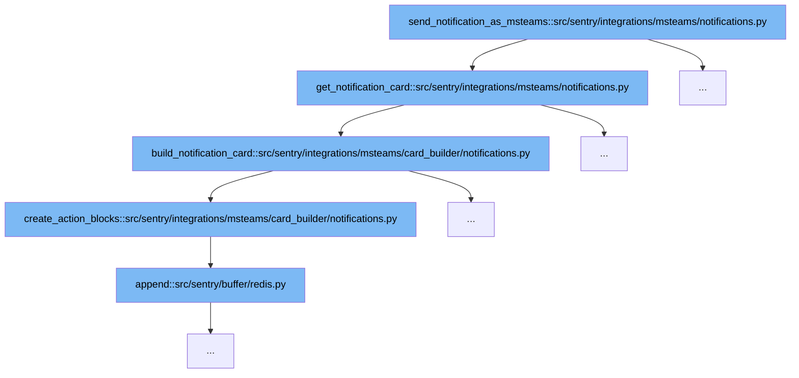

This document outlines the process involved in sending notifications via Microsoft Teams using Sentry's integration. The flow involves several key functions:



<SwmSnippet path="/src/sentry/integrations/msteams/notifications.py" line="1">

---

# Initiating Notification

The function `send_notification_as_msteams` serves as the entry point for sending notifications. It prepares the necessary data and calls `get_notification_card` to generate the notification card.

```python
from __future__ import annotations

import logging
from collections.abc import Iterable, Mapping
from typing import Any

import sentry_sdk

from sentry.integrations.msteams.card_builder.block import AdaptiveCard
from sentry.integrations.msteams.utils import get_user_conversation_id
```

---

</SwmSnippet>

<SwmSnippet path="/src/sentry/integrations/msteams/notifications.py" line="65">

---

# Generating Notification Card

The `get_notification_card` function retrieves the appropriate message builder based on the notification type and uses it to build the notification card.

```python
def get_notification_card(
    notification: BaseNotification, context: Mapping[str, Any], recipient: User | Team | RpcActor
) -> AdaptiveCard:
    cls = MESSAGE_BUILDERS[notification.message_builder]
    return cls(notification, context, recipient).build_notification_card()
```

---

</SwmSnippet>

<SwmSnippet path="/src/sentry/integrations/msteams/card_builder/notifications.py" line="108">

---

# Building Notification Card

In `build_notification_card`, various components of the card such as title, fields, and actions are assembled to form the complete notification card.

```python
    def build_notification_card(self):
        fields = [self.create_attachment_title_block(), self.create_description_block()]

        # TODO: Add support for notification actions.
        return super().build(
            title=self.create_title_block(),
            fields=fields,
            footer=self.create_footer_block(),
            actions=self.create_action_blocks(
                self.notification.get_message_actions(self.recipient, ExternalProviders.MSTEAMS)
            ),
        )
```

---

</SwmSnippet>

<SwmSnippet path="/src/sentry/integrations/msteams/card_builder/notifications.py" line="95">

---

# Creating Action Blocks

The `create_action_blocks` function generates actionable elements for the card, which are appended to the card structure in the previous step.

```python
    def create_action_blocks(actions: Sequence[MessageAction]) -> list[Action]:
        action_blocks: list[Action] = []
        for action in actions:
            if not action.name or not action.url:
                raise NotImplementedError(
                    "Only actions with 'name' and 'url' attributes are supported now."
                )
            action_blocks.append(
                OpenUrlAction(type=ActionType.OPEN_URL, title=action.name, url=action.url)
            )

        return action_blocks
```

---

</SwmSnippet>

&nbsp;

*This is an auto-generated document by Swimm AI 🌊 and has not yet been verified by a human*

<SwmMeta version="3.0.0" repo-id="Z2l0aHViJTNBJTNBc2VudHJ5JTNBJTNBZ2V0c2VudHJ5" repo-name="sentry"><sup>Powered by [Swimm](/)</sup></SwmMeta>
