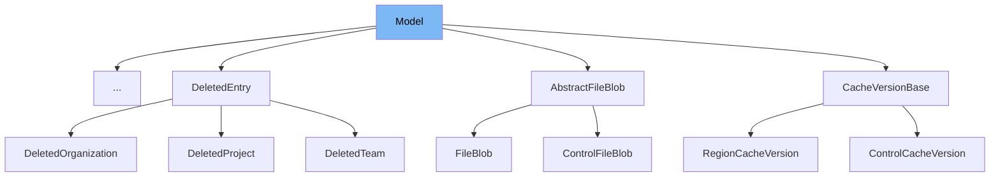

This document will cover the `Model` class located in `src/sentry/dynamic_sampling/models/base.py`. We'll explore:

1. What is `Model`
2. Variables and functions within `Model`
3. Usage example of `Model`



# What is Model

The `Model` class in `src/sentry/dynamic_sampling/models/base.py` is an abstract base class designed to define a generic model structure within the dynamic sampling system of Sentry. It uses Python's abstract base class (ABC) to enforce that subclasses implement specific methods, ensuring a consistent interface for all model types. The class is generic, parameterized by `Input` and `Output` types, which are bound to `ModelInput` and any output type respectively. This design allows for flexible yet consistent input validation and processing across different model implementations.

<SwmSnippet path="/src/sentry/dynamic_sampling/models/base.py" line="29">

---

# Variables and functions

The `Model` class defines two main methods: `_run` and `run`. The `_run` method is an abstract method meant to be implemented by subclasses to perform the model's main logic. The `run` method is a concrete implementation that first validates the input using `model_input.validate()` and then calls `_run` if the input is valid, handling any `InvalidModelInputError` by raising it.

```python
class Model(ABC, Generic[Input, Output]):
    @abstractmethod
    def _run(self, model_input: Input) -> Output:
        raise NotImplementedError()

    def run(self, model_input: Input) -> Output:
        if not model_input.validate():
            raise InvalidModelInputError()

        return self._run(model_input)
```

---

</SwmSnippet>

&nbsp;

*This is an auto-generated document by Swimm AI 🌊 and has not yet been verified by a human*

<SwmMeta version="3.0.0" repo-id="Z2l0aHViJTNBJTNBc2VudHJ5JTNBJTNBZ2V0c2VudHJ5" repo-name="sentry"><sup>Powered by [Swimm](/)</sup></SwmMeta>
