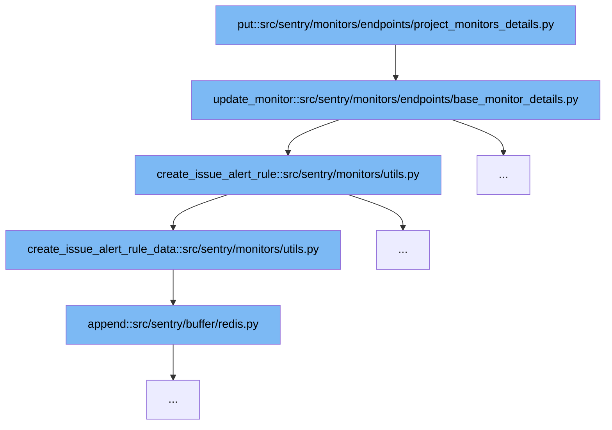

This document will cover the flow of updating a monitor and managing its associated issue alert rules in the Sentry application. We'll explore:

1. How the `put` function initiates the update process.
2. The role of `update_monitor` in modifying monitor details.
3. Creation and updating of issue alert rules through `create_issue_alert_rule`.



<SwmSnippet path="/src/sentry/monitors/endpoints/project_monitors_details.py" line="1">

---

# Initiating Monitor Update

The `put` function in `project_monitors_details.py` serves as the entry point for updating monitor details. It prepares and validates the data needed for the update process.

```python
from __future__ import annotations
```

---

</SwmSnippet>

<SwmSnippet path="/src/sentry/monitors/endpoints/base_monitor_details.py" line="56">

---

# Updating Monitor Details

The `update_monitor` function handles the core logic for updating the monitor's attributes such as name, slug, and configuration. It validates the incoming data and applies changes to the monitor object in the database.

```python
    def update_monitor(
        self, request: AuthenticatedHttpRequest, project: Project, monitor: Monitor
    ) -> Response:
        """
        Update a monitor.
        """
        # set existing values as validator will overwrite
        existing_config = monitor.config
        existing_margin = existing_config.get("checkin_margin")
        existing_max_runtime = existing_config.get("max_runtime")

        validator = MonitorValidator(
            data=request.data,
            partial=True,
            instance={
                "name": monitor.name,
                "slug": monitor.slug,
                "status": monitor.status,
                "type": monitor.type,
                "config": monitor.config,
                "project": project,
```

---

</SwmSnippet>

<SwmSnippet path="/src/sentry/monitors/utils.py" line="203">

---

# Managing Issue Alert Rules

The `create_issue_alert_rule` function is responsible for creating or updating issue alert rules associated with the monitor. It uses the validated data to either create a new rule or update an existing one, ensuring that the monitor's operational parameters trigger alerts appropriately.

```python
def create_issue_alert_rule(
    request: AuthenticatedHttpRequest,
    project: Project,
    monitor: Monitor,
    validated_issue_alert_rule: dict,
) -> int | None:
    """
    Creates an Issue Alert `Rule` instance from a request with the given data
    :param request: Request object
    :param project: Project object
    :param monitor: Monitor object being created
    :param validated_issue_alert_rule: Dictionary of configurations for an associated Rule
    :return: dict
    """
    issue_alert_rule_data = create_issue_alert_rule_data(
        project, request.user, monitor, validated_issue_alert_rule
    )
    serializer = RuleSerializer(
        context={"project": project, "organization": project.organization},
        data=issue_alert_rule_data,
    )
```

---

</SwmSnippet>

&nbsp;

*This is an auto-generated document by Swimm AI 🌊 and has not yet been verified by a human*

<SwmMeta version="3.0.0" repo-id="Z2l0aHViJTNBJTNBc2VudHJ5JTNBJTNBZ2V0c2VudHJ5" repo-name="sentry"><sup>Powered by [Swimm](/)</sup></SwmMeta>
