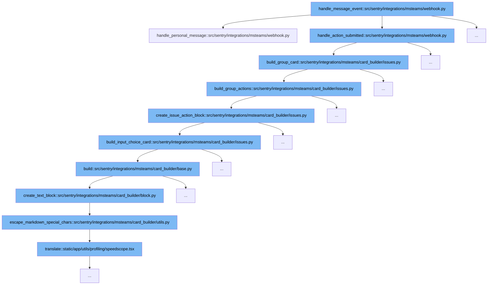

This document will explore the function `handle_message_event` and its role within the MS Teams integration in Sentry. We'll cover:

1. The purpose of `handle_message_event`.
2. The flow of function calls initiated by `handle_message_event`.



<SwmSnippet path="/src/sentry/integrations/msteams/webhook.py" line="677">

---

# Purpose of `handle_message_event`

The `handle_message_event` function processes incoming webhook events from MS Teams. It determines the type of command (e.g., link, unlink, help) received in the message and responds appropriately by constructing and sending different types of response cards.

```python
    def handle_personal_message(self, request: HttpRequest):
        data = request.data
        command_text = data.get("text", "").strip()
        lowercase_command = command_text.lower()
        conversation_id = data["conversation"]["id"]
        teams_user_id = data["from"]["id"]

        # only supporting unlink for now
        if "unlink" in lowercase_command:
            unlink_url = build_unlinking_url(conversation_id, data["serviceUrl"], teams_user_id)
            card = build_unlink_identity_card(unlink_url)
        elif "help" in lowercase_command:
            card = build_help_command_card()
        elif "link" == lowercase_command:  # don't to match other types of link commands
            has_linked_identity = (
                identity_service.get_identity(filter={"identity_ext_id": teams_user_id}) is not None
            )
            if has_linked_identity:
                card = build_already_linked_identity_command_card()
            else:
                card = build_link_identity_command_card()
```

---

</SwmSnippet>

# Function Call Flow Initiated by `handle_message_event`

The function `handle_message_event` initiates a series of function calls to handle different types of messages and actions within the MS Teams integration.

<SwmSnippet path="/src/sentry/integrations/msteams/webhook.py" line="677">

---

## Handling Personal Messages

When a personal message is detected, `handle_message_event` calls `handle_personal_message`. This function processes commands like 'link', 'unlink', and 'help', and prepares the appropriate response card based on the command.

```python
    def handle_personal_message(self, request: HttpRequest):
        data = request.data
        command_text = data.get("text", "").strip()
        lowercase_command = command_text.lower()
        conversation_id = data["conversation"]["id"]
        teams_user_id = data["from"]["id"]

        # only supporting unlink for now
        if "unlink" in lowercase_command:
            unlink_url = build_unlinking_url(conversation_id, data["serviceUrl"], teams_user_id)
            card = build_unlink_identity_card(unlink_url)
        elif "help" in lowercase_command:
            card = build_help_command_card()
        elif "link" == lowercase_command:  # don't to match other types of link commands
            has_linked_identity = (
                identity_service.get_identity(filter={"identity_ext_id": teams_user_id}) is not None
            )
            if has_linked_identity:
                card = build_already_linked_identity_command_card()
            else:
                card = build_link_identity_command_card()
```

---

</SwmSnippet>

<SwmSnippet path="/src/sentry/integrations/msteams/webhook.py" line="677">

---

## Handling Action Submissions

For action submissions, `handle_message_event` calls `handle_action_submitted`. This function is responsible for handling user interactions with the cards, such as resolving or ignoring issues.

```python
    def handle_personal_message(self, request: HttpRequest):
        data = request.data
        command_text = data.get("text", "").strip()
        lowercase_command = command_text.lower()
        conversation_id = data["conversation"]["id"]
        teams_user_id = data["from"]["id"]

        # only supporting unlink for now
        if "unlink" in lowercase_command:
            unlink_url = build_unlinking_url(conversation_id, data["serviceUrl"], teams_user_id)
            card = build_unlink_identity_card(unlink_url)
        elif "help" in lowercase_command:
            card = build_help_command_card()
        elif "link" == lowercase_command:  # don't to match other types of link commands
            has_linked_identity = (
                identity_service.get_identity(filter={"identity_ext_id": teams_user_id}) is not None
            )
            if has_linked_identity:
                card = build_already_linked_identity_command_card()
            else:
                card = build_link_identity_command_card()
```

---

</SwmSnippet>

<SwmSnippet path="/src/sentry/integrations/msteams/card_builder/issues.py" line="276">

---

## Building Group Card

The `build_group_card` function is called to construct a detailed card for an issue group, which includes actions like resolve, ignore, and assign.

```python
    def build_group_card(self, notification_uuid: str | None = None) -> AdaptiveCard:
        """
        The issue (group) card has the following components stacked vertically,
        1. The issue title which links to the issue.
        2. A description of the issue if it is available. (Optional)
        3. A footer block, which again has 3 components stacked horizontally,
            3a. The short id of the group.
            3b. The alert rule(s) that fired this notification.
            3c. The date and time of the event.
        4. Details of the assignee if the issue is assigned to an actor. (Optional)
        5. A set of three actions, resolve, ignore and assign which can
            futher reveal cards with dropdowns for selecting options.
        """
        # Explicit typing to satisfy mypy.
        fields: list[Block | None] = [
            self.build_group_descr(),
            self.build_group_footer(),
            self.build_assignee_note(),
            self.build_group_actions(),
        ]

```

---

</SwmSnippet>

<SwmSnippet path="/src/sentry/integrations/msteams/card_builder/issues.py" line="191">

---

## Building Group Actions

Within the group card, `build_group_actions` is used to create specific action blocks for resolving, ignoring, or assigning issues, which are then included in the group card.

```python
    def build_group_actions(self) -> ContainerBlock:
        status = self.group.get_status()
        has_escalating = features.has(
            "organizations:escalating-issues-msteams", self.group.project.organization
        )

        resolve_action = self.create_issue_action_block(
            toggled=GroupStatus.RESOLVED == status,
            action=ACTION_TYPE.RESOLVE,
            action_title=IssueConstants.RESOLVE,
            reverse_action=ACTION_TYPE.UNRESOLVE,
            reverse_action_title=IssueConstants.UNRESOLVE,
            # card_kwargs
            card_title=IssueConstants.RESOLVE,
            submit_button_title=IssueConstants.RESOLVE,
            input_id=IssueConstants.RESOLVE_INPUT_ID,
            choices=IssueConstants.RESOLVE_INPUT_CHOICES,
        )

        ignore_action = self.create_issue_action_block(
            toggled=GroupStatus.IGNORED == status,
```

---

</SwmSnippet>

<SwmSnippet path="/src/sentry/integrations/msteams/card_builder/issues.py" line="161">

---

## Creating Issue Action Block

The `create_issue_action_block` function generates individual action blocks based on the issue's current status, which are used in the group actions.

```python
    def create_issue_action_block(
        self,
        toggled: bool,
        action: ACTION_TYPE,
        action_title: str,
        reverse_action: ACTION_TYPE,
        reverse_action_title: str,
        **card_kwargs: Any,
    ) -> Action:
        """
        Build an action block for a particular `action` (Resolve).
        It could be one of the following depending on if the state is `toggled` (Resolved issue).
        If the issue is `toggled` then present a button with the `reverse_action` (Unresolve).
        If it is not `toggled` then present a button which reveals a card with options to
        perform the action ([Immediately, In current release, ...])
        """
        if toggled:
            data = self.generate_action_payload(reverse_action)
            return SubmitAction(type=ActionType.SUBMIT, title=reverse_action_title, data=data)

        data = self.generate_action_payload(action)
```

---

</SwmSnippet>

<SwmSnippet path="/src/sentry/integrations/msteams/card_builder/issues.py" line="145">

---

## Building Input Choice Card

For actions requiring user input, `build_input_choice_card` creates a card with input options, which is shown when a user interacts with an action block.

```python
    def build_input_choice_card(
        data: Any,
        card_title: str,
        input_id: str,
        submit_button_title: str,
        choices: Sequence[tuple[str, Any]],
        default_choice: Any = None,
    ) -> AdaptiveCard:
        return MSTeamsMessageBuilder().build(
            title=create_text_block(card_title, weight=TextWeight.BOLDER),
            text=create_input_choice_set_block(
                id=input_id, choices=choices, default_choice=default_choice
            ),
            actions=[SubmitAction(type=ActionType.SUBMIT, title=submit_button_title, data=data)],
        )
```

---

</SwmSnippet>

<SwmSnippet path="/src/sentry/integrations/msteams/card_builder/base.py" line="15">

---

## Final Card Construction

The `build` function in the base card builder module compiles all parts of the card, including text blocks and action sets, into a final AdaptiveCard object.

```python
    def build(
        self,
        text: str | Block | None = None,
        title: str | Block | None = None,
        fields: Sequence[str | Block | None] | None = None,
        footer: str | Block | None = None,
        actions: list[Action] | None = None,
        **kwargs: Any,
    ) -> AdaptiveCard:
        """
        Helper to DRY up MS Teams specific fields.
        :param string text: Body text.
        :param [string] title: Title text.
        :param [string] footer: Footer text.
        :param kwargs: Everything else.
        """
        body = []

        fields = fields or []

        items = [title, text, *fields, footer]
```

---

</SwmSnippet>

<SwmSnippet path="/src/sentry/integrations/msteams/card_builder/block.py" line="164">

---

## Text Block Creation

Text blocks within the cards are created using `create_text_block`, which formats text content and handles markdown escaping.

```python
def create_text_block(text: str | None, **kwargs: Unpack[_TextBlockNotRequired]) -> TextBlock:
    kwargs.setdefault("wrap", True)
    return {
        "type": "TextBlock",
        "text": escape_markdown_special_chars(text) if text else "",
        **kwargs,
    }
```

---

</SwmSnippet>

<SwmSnippet path="/src/sentry/integrations/msteams/card_builder/utils.py" line="135">

---

## Markdown Escaping

The `escape_markdown_special_chars` function is used to escape markdown special characters in text content, ensuring proper formatting in MS Teams.

```python
def escape_markdown_special_chars(text: str) -> str:
    """
    Convert markdown special characters to markdown friendly alternatives.
    docs - https://docs.microsoft.com/en-us/adaptive-cards/authoring-cards/text-features
    """
    return text.translate(translator)
```

---

</SwmSnippet>

&nbsp;

*This is an auto-generated document by Swimm AI 🌊 and has not yet been verified by a human*

<SwmMeta version="3.0.0" repo-id="Z2l0aHViJTNBJTNBc2VudHJ5JTNBJTNBZ2V0c2VudHJ5" repo-name="sentry"><sup>Powered by [Swimm](/)</sup></SwmMeta>
