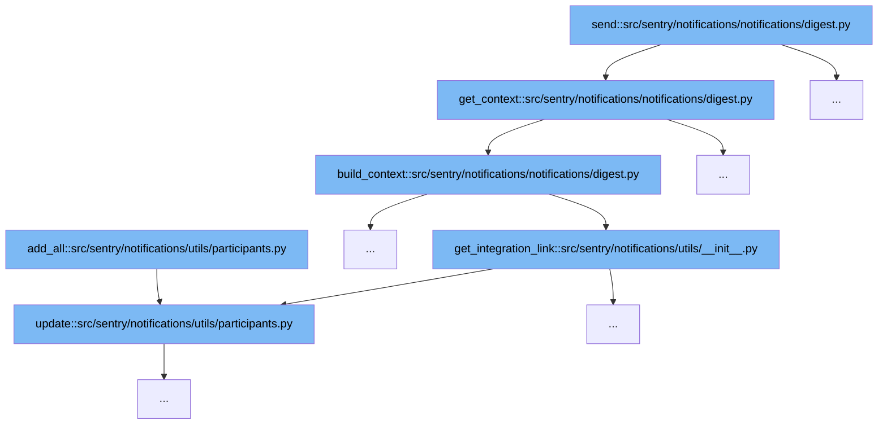

This document will explore the notification digest sending process in Sentry, specifically focusing on the `send` function within `src/sentry/notifications/notifications/digest.py`. We'll cover:

1. How the `send` function initiates the notification digest process.
2. The role of `get_context` in gathering necessary data.
3. The construction of context in `build_context`.
4. Integration link retrieval in `get_integration_link`.
5. The update process in `update` function.



<SwmSnippet path="/src/sentry/notifications/notifications/digest.py" line="108">

---

# Notification Digest Sending Process

The `send` function in `digest.py` initiates the notification digest process by calling `get_context`, which gathers all necessary data for the notification.

```python
    def get_context(self) -> MutableMapping[str, Any]:
        rule_details = get_rules(list(self.digest.keys()), self.project.organization, self.project)
        context = DigestNotification.build_context(
            self.digest,
            self.project,
            self.project.organization,
            rule_details,
            notification_uuid=self.notification_uuid,
        )

        sentry_query_params = self.get_sentry_query_params(ExternalProviders.EMAIL)

        snooze_alert = len(rule_details) > 0
        snooze_alert_urls = {
            rule.id: f"{rule.status_url}{sentry_query_params}&{urlencode({'mute': '1'})}"
            for rule in rule_details
        }

        context["snooze_alert"] = snooze_alert
        context["snooze_alert_urls"] = snooze_alert_urls

```

---

</SwmSnippet>

<SwmSnippet path="/src/sentry/notifications/notifications/digest.py" line="108">

---

# Gathering Data for Notification

`get_context` function collects data such as project rules and notification details, which are essential for constructing the notification context.

```python
    def get_context(self) -> MutableMapping[str, Any]:
        rule_details = get_rules(list(self.digest.keys()), self.project.organization, self.project)
        context = DigestNotification.build_context(
            self.digest,
            self.project,
            self.project.organization,
            rule_details,
            notification_uuid=self.notification_uuid,
        )

        sentry_query_params = self.get_sentry_query_params(ExternalProviders.EMAIL)

        snooze_alert = len(rule_details) > 0
        snooze_alert_urls = {
            rule.id: f"{rule.status_url}{sentry_query_params}&{urlencode({'mute': '1'})}"
            for rule in rule_details
        }

        context["snooze_alert"] = snooze_alert
        context["snooze_alert_urls"] = snooze_alert_urls

```

---

</SwmSnippet>

<SwmSnippet path="/src/sentry/notifications/notifications/digest.py" line="132">

---

# Constructing Notification Context

`build_context` function constructs the notification context using the data collected by `get_context`, including project details and integration links.

```python
    def build_context(
        digest: Digest,
        project: Project,
        organization: Organization,
        rule_details: Sequence[NotificationRuleDetails],
        alert_timestamp: int | None = None,
        notification_uuid: str | None = None,
    ) -> MutableMapping[str, Any]:
        has_session_replay = features.has("organizations:session-replay", organization)
        show_replay_link = features.has("organizations:session-replay-issue-emails", organization)
        return {
            **get_digest_as_context(digest),
            "has_alert_integration": has_alert_integration(project),
            "project": project,
            "slack_link": get_integration_link(organization, "slack"),
            "rules_details": {rule.id: rule for rule in rule_details},
            "link_params_for_rule": get_email_link_extra_params(
                "digest_email",
                None,
                rule_details,
                alert_timestamp,
```

---

</SwmSnippet>

<SwmSnippet path="/src/sentry/notifications/utils/__init__.py" line="196">

---

# Retrieving Integration Links

`get_integration_link` function retrieves integration links for the notification, which are included in the notification context to provide direct access to project settings.

```python
def get_integration_link(
    organization: Organization, integration_slug: str, notification_uuid: str | None = None
) -> str:
    query_params = {"referrer": "alert_email"}
    if notification_uuid:
        query_params.update({"notification_uuid": notification_uuid})

    return organization.absolute_url(
        f"/settings/{organization.slug}/integrations/{integration_slug}/",
        query=urlencode(query_params),
    )
```

---

</SwmSnippet>

<SwmSnippet path="/src/sentry/notifications/utils/participants.py" line="73">

---

# Updating Participant Information

The `update` function updates participant information, ensuring that the notification is sent to all relevant users based on the latest data.

```python
    def update(self, other: ParticipantMap) -> None:
        for provider, actor_group in other._dict.items():
            self.add_all(provider, actor_group)
```

---

</SwmSnippet>

&nbsp;

*This is an auto-generated document by Swimm AI 🌊 and has not yet been verified by a human*

<SwmMeta version="3.0.0" repo-id="Z2l0aHViJTNBJTNBc2VudHJ5JTNBJTNBZ2V0c2VudHJ5" repo-name="sentry"><sup>Powered by [Swimm](/)</sup></SwmMeta>
