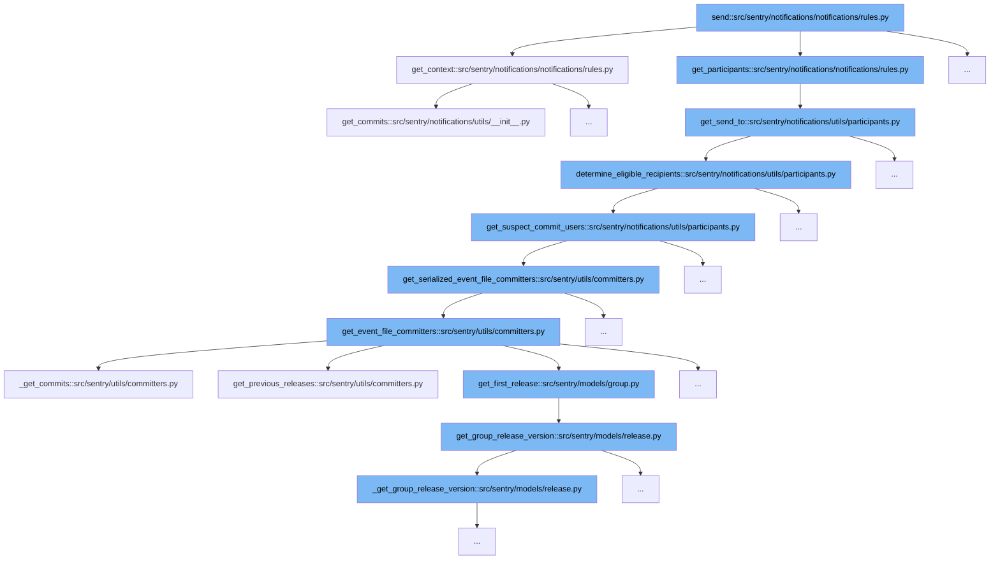

This document will cover the notification sending process in Sentry, specifically through the function `send` in `src/sentry/notifications/notifications/rules.py`. We'll explore:

1. How the notification context is prepared.
2. How participants for the notification are determined.
3. The process of identifying eligible recipients based on the notification context.



<SwmSnippet path="/src/sentry/notifications/notifications/rules.py" line="138">

---

# Preparing Notification Context

The `get_context` function prepares the notification context by gathering necessary details such as project, group, event, and rules. It also handles privacy settings and integrates various links and parameters required for the notification.

```python
    def get_context(self) -> MutableMapping[str, Any]:
        environment = self.event.get_tag("environment")
        enhanced_privacy = self.organization.flags.enhanced_privacy
        rule_details = get_rules(self.rules, self.organization, self.project)
        sentry_query_params = self.get_sentry_query_params(ExternalProviders.EMAIL)
        for rule in rule_details:
            rule.url = rule.url + sentry_query_params
            rule.status_url = rule.url + sentry_query_params

        notification_reason = get_owner_reason(
            project=self.project,
            target_type=self.target_type,
            event=self.event,
            fallthrough_choice=self.fallthrough_choice,
        )
        fallback_params: MutableMapping[str, str] = {}
        group_header = get_group_substatus_text(self.group)

        notification_uuid = self.notification_uuid if hasattr(self, "notification_uuid") else None
        context = {
            "project_label": self.project.get_full_name(),
```

---

</SwmSnippet>

<SwmSnippet path="/src/sentry/notifications/utils/participants.py" line="372">

---

# Determining Notification Participants

The `get_send_to` function determines the participants for the notification. It uses the `determine_eligible_recipients` function to filter users based on project settings, event details, and user preferences.

```python
def get_send_to(
    project: Project,
    target_type: ActionTargetType,
    target_identifier: int | None = None,
    event: Event | None = None,
    notification_type_enum: NotificationSettingEnum = NotificationSettingEnum.ISSUE_ALERTS,
    fallthrough_choice: FallthroughChoiceType | None = None,
    rules: Iterable[Rule] | None = None,
    notification_uuid: str | None = None,
) -> Mapping[ExternalProviders, set[RpcActor]]:
    recipients = determine_eligible_recipients(
        project, target_type, target_identifier, event, fallthrough_choice
    )

    if rules:
        rule_snoozes = RuleSnooze.objects.filter(Q(rule__in=rules))
        muted_user_ids = []
        for rule_snooze in rule_snoozes:
            if rule_snooze.user_id is None:
                return {}
            else:
```

---

</SwmSnippet>

<SwmSnippet path="/src/sentry/notifications/utils/participants.py" line="300">

---

# Identifying Eligible Recipients

The `determine_eligible_recipients` function identifies eligible recipients by evaluating the target type, event details, and specific rules. It also considers suspect commit users to enhance the accuracy of the notification targeting.

```python
def determine_eligible_recipients(
    project: Project,
    target_type: ActionTargetType,
    target_identifier: int | None = None,
    event: Event | None = None,
    fallthrough_choice: FallthroughChoiceType | None = None,
) -> Iterable[RpcActor]:
    """
    Either get the individual recipient from the target type/id or the
    owners as determined by rules for this project and event.
    """
    if not (project and project.teams.exists()):
        logger.debug("Tried to send notification to invalid project: %s", project)

    elif target_type == ActionTargetType.MEMBER:
        user = get_user_from_identifier(project, target_identifier)
        if user:
            return [RpcActor.from_object(user)]

    elif target_type == ActionTargetType.TEAM:
        team = get_team_from_identifier(project, target_identifier)
```

---

</SwmSnippet>

&nbsp;

*This is an auto-generated document by Swimm AI 🌊 and has not yet been verified by a human*

<SwmMeta version="3.0.0" repo-id="Z2l0aHViJTNBJTNBc2VudHJ5JTNBJTNBZ2V0c2VudHJ5" repo-name="sentry"><sup>Powered by [Swimm](/)</sup></SwmMeta>
