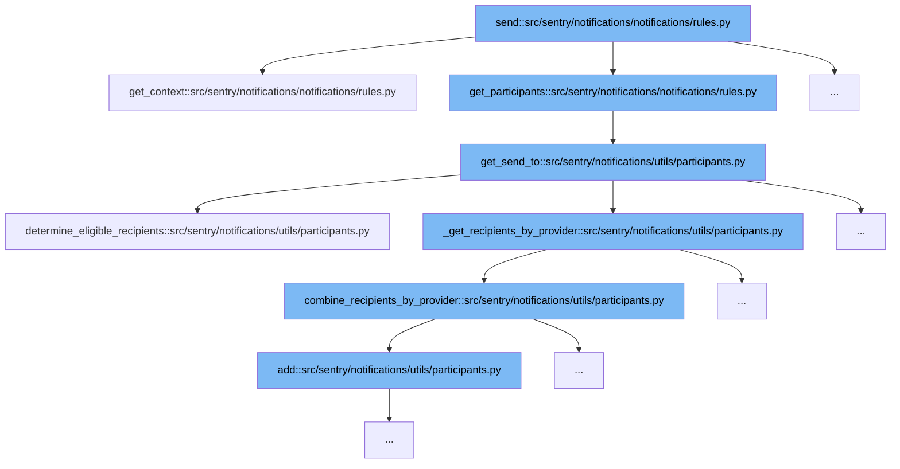

This document will explain the notification sending process in Sentry, specifically through the function `send` located in `src/sentry/notifications/notifications/rules.py`. The process involves several steps and functions to determine the context and recipients for notifications:



<SwmSnippet path="/src/sentry/notifications/notifications/rules.py" line="138">

---

# Notification Sending Process

The `send` function initiates the notification sending process. It first calls `get_context` to gather necessary data and settings for the notification based on the event, project, and organization details.

```python
    def get_context(self) -> MutableMapping[str, Any]:
        environment = self.event.get_tag("environment")
        enhanced_privacy = self.organization.flags.enhanced_privacy
        rule_details = get_rules(self.rules, self.organization, self.project)
        sentry_query_params = self.get_sentry_query_params(ExternalProviders.EMAIL)
        for rule in rule_details:
            rule.url = rule.url + sentry_query_params
            rule.status_url = rule.url + sentry_query_params

        notification_reason = get_owner_reason(
            project=self.project,
            target_type=self.target_type,
            event=self.event,
            fallthrough_choice=self.fallthrough_choice,
        )
        fallback_params: MutableMapping[str, str] = {}
        group_header = get_group_substatus_text(self.group)

        notification_uuid = self.notification_uuid if hasattr(self, "notification_uuid") else None
        context = {
            "project_label": self.project.get_full_name(),
```

---

</SwmSnippet>

<SwmSnippet path="/src/sentry/notifications/notifications/rules.py" line="138">

---

# Gathering Notification Context

The `get_context` function compiles a context dictionary with all relevant data needed for the notification, such as project details, event information, and user-specific settings.

```python
    def get_context(self) -> MutableMapping[str, Any]:
        environment = self.event.get_tag("environment")
        enhanced_privacy = self.organization.flags.enhanced_privacy
        rule_details = get_rules(self.rules, self.organization, self.project)
        sentry_query_params = self.get_sentry_query_params(ExternalProviders.EMAIL)
        for rule in rule_details:
            rule.url = rule.url + sentry_query_params
            rule.status_url = rule.url + sentry_query_params

        notification_reason = get_owner_reason(
            project=self.project,
            target_type=self.target_type,
            event=self.event,
            fallthrough_choice=self.fallthrough_choice,
        )
        fallback_params: MutableMapping[str, str] = {}
        group_header = get_group_substatus_text(self.group)

        notification_uuid = self.notification_uuid if hasattr(self, "notification_uuid") else None
        context = {
            "project_label": self.project.get_full_name(),
```

---

</SwmSnippet>

<SwmSnippet path="/src/sentry/notifications/utils/participants.py" line="372">

---

# Determining Notification Recipients

The `get_send_to` function is called to determine the eligible recipients for the notification. It uses the `determine_eligible_recipients` function to find users based on project settings and event details.

```python
def get_send_to(
    project: Project,
    target_type: ActionTargetType,
    target_identifier: int | None = None,
    event: Event | None = None,
    notification_type_enum: NotificationSettingEnum = NotificationSettingEnum.ISSUE_ALERTS,
    fallthrough_choice: FallthroughChoiceType | None = None,
    rules: Iterable[Rule] | None = None,
    notification_uuid: str | None = None,
) -> Mapping[ExternalProviders, set[RpcActor]]:
    recipients = determine_eligible_recipients(
        project, target_type, target_identifier, event, fallthrough_choice
    )

    if rules:
        rule_snoozes = RuleSnooze.objects.filter(Q(rule__in=rules))
        muted_user_ids = []
        for rule_snooze in rule_snoozes:
            if rule_snooze.user_id is None:
                return {}
            else:
```

---

</SwmSnippet>

<SwmSnippet path="/src/sentry/notifications/utils/participants.py" line="507">

---

# Combining Recipients by Provider

After determining individual recipients, `combine_recipients_by_provider` aggregates these users and teams into sets organized by notification provider (e.g., email, Slack).

```python
def combine_recipients_by_provider(
    teams_by_provider: Mapping[ExternalProviders, Iterable[RpcActor]],
    users_by_provider: Mapping[ExternalProviders, Iterable[RpcActor]],
) -> Mapping[ExternalProviders, set[RpcActor]]:
    """TODO(mgaeta): Make this more generic and move it to utils."""
    recipients_by_provider = defaultdict(set)
    for provider, teams in teams_by_provider.items():
        for team in teams:
            recipients_by_provider[provider].add(team)
    for provider, users in users_by_provider.items():
        for user in users:
            recipients_by_provider[provider].add(user)
    return recipients_by_provider
```

---

</SwmSnippet>

&nbsp;

*This is an auto-generated document by Swimm AI 🌊 and has not yet been verified by a human*

<SwmMeta version="3.0.0" repo-id="Z2l0aHViJTNBJTNBc2VudHJ5JTNBJTNBZ2V0c2VudHJ5" repo-name="sentry"><sup>Powered by [Swimm](/)</sup></SwmMeta>
