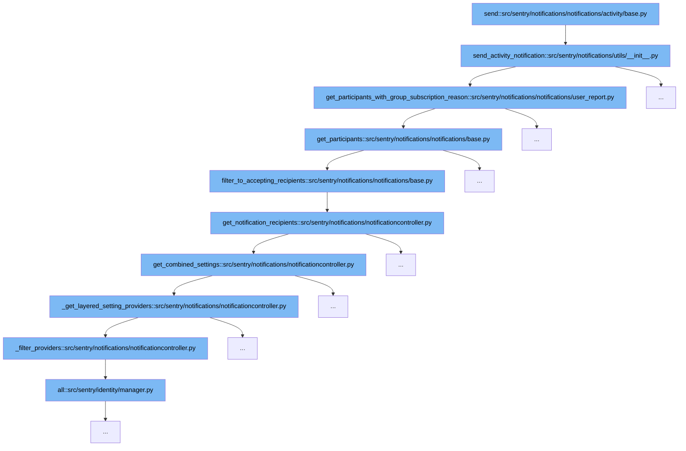

This document will cover the notification sending process in Sentry, specifically focusing on the `send` function within the `activity/base.py` module. We'll explore:

1. How the notification sending process is initiated.
2. The steps involved in determining the participants for the notification.
3. How the notification settings are applied to filter recipients.



<SwmSnippet path="/src/sentry/notifications/notifications/activity/base.py" line="412">

---

# Notification Sending Process Initiation

The `send` function in `activity/base.py` initiates the notification sending process by calling `send_activity_notification`. This function is responsible for orchestrating the flow of determining participants and sending notifications to them.

```python

```

---

</SwmSnippet>

<SwmSnippet path="/src/sentry/notifications/utils/__init__.py" line="415">

---

# Determining Notification Participants

Within `send_activity_notification`, the function `get_participants_with_group_subscription_reason` from `user_report.py` is called to determine the participants based on group subscription reasons. This is crucial for ensuring that notifications are sent to relevant users.

```python
    participants_by_provider = notification.get_participants_with_group_subscription_reason()
    if participants_by_provider.is_empty():
        return

    # Only calculate shared context once.
    shared_context = notification.get_context()

    split = participants_by_provider.split_participants_and_context()
    for provider, participants, extra_context in split:
        notify(provider, notification, participants, shared_context, extra_context)
```

---

</SwmSnippet>

<SwmSnippet path="/src/sentry/notifications/notificationcontroller.py" line="410">

---

# Applying Notification Settings

The `get_notification_recipients` function in `notificationcontroller.py` applies notification settings to filter the recipients. It ensures that notifications are sent only to those who have not opted out and are supposed to receive them according to their settings.

```python
    def get_notification_recipients(
        self,
        type: NotificationSettingEnum,
        actor_type: ActorType | None = None,
        project_id: int | None = None,
    ) -> Mapping[ExternalProviders, set[RpcActor]]:
        """
        Returns the recipients that should be notified for each provider,
        filtered by the given notification type.

        Args:
            type: The notification type to filter providers and recipients by.
        """
        combined_settings = self.get_combined_settings(
            type=type, actor_type=actor_type, project_id=project_id
        )
        recipients: Mapping[ExternalProviders, set[RpcActor]] = defaultdict(set)
        for recipient, type_map in combined_settings.items():
            actor = RpcActor.from_object(recipient)
            for type, provider_map in type_map.items():
                for provider, value in provider_map.items():
```

---

</SwmSnippet>

&nbsp;

*This is an auto-generated document by Swimm AI 🌊 and has not yet been verified by a human*

<SwmMeta version="3.0.0" repo-id="Z2l0aHViJTNBJTNBc2VudHJ5JTNBJTNBZ2V0c2VudHJ5" repo-name="sentry"><sup>Powered by [Swimm](/)</sup></SwmMeta>
